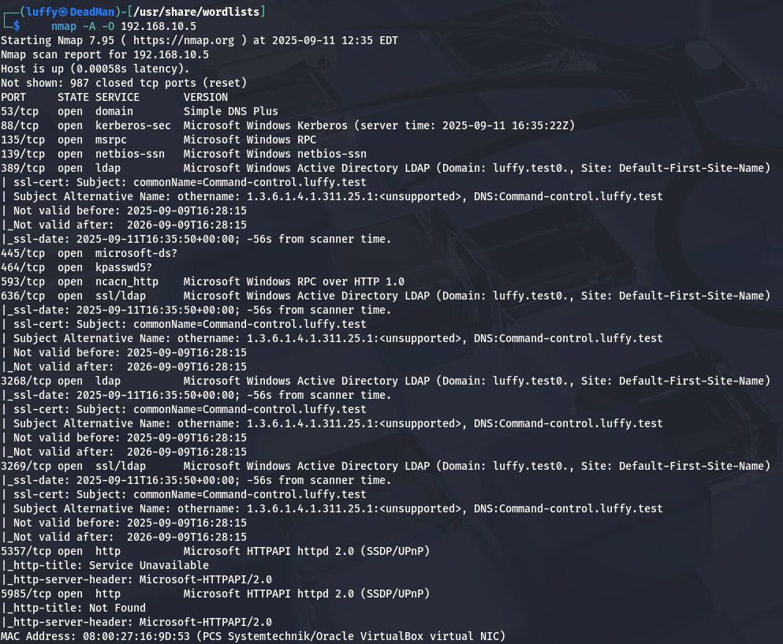

+++
date = '2025-09-12T00:55:36+03:00'
draft = false
title = 'LLMNR & NBT-NS Poisoning and Credential Access using Responder'
tags = ['attack', 'llmnr', 'demo', 'AD']
+++

## Name Resolution (**NR**)
 Is a way conducted by a machine to get a host’s IP address by its hostname. On Windows machines, This way can be summarized in:

1. Check if the name resolves to the computer itself (localhost).
2. The local hostfile will be checked for suitable records in (C:\Windows\System32\drivers\etc\**hosts**)
3. If no records were found, the machine will move on to the local DNS cache, which archives recently resolved names (it lives only in **RAM (system memory)** and is managed by the **DNS Client service (`Dnscache`)**.)
4. No local DNS record found? A query will be sent to the configured DNS server
5. If all else fails – the machine will send a multicast query, asking other machines in the network for _fileshare_‘s IP address


This is multicast query managed by three main protocols: **NBT-NS** (NetBIOS Name Service , old but maybe), **LLMNR** (Link-Local Multicast Name Resolution) and **mDNS** (multicast DNS). (old protocols are used for  legacy support and compatibility)

Link-Local Multicast Name Resolution (LLMNR) is the successor of NBT-NS. It performs the same task as its predecessor, name resolution for hosts on the same local network.

LLMNR allows for the resolution of both IPv4 and IPv6 addresses into hostnames without the need for a DNS server on the local network. If a request to a DNS server fails (e.g., if a DNS server is not available), an LLMNR query is made across the local network to attempt to resolve that request.

And that's used as a last resort to resolve the names of hosts running SMB services ( SMB runs generally on port 445 ) on the local network. When a host wants to access resources shared via SMB on another host,

## Why It's a Problem?

NBT-NS, LLMNR and mDNS broadcast a query to the entire intranet _aka private network_, but no measures are taken to verify the integrity of the responses. Attackers can exploit this mechanism by listening to such queries and spoofing responses – tricking the victim into trusting malicious servers.

**In other words** : no authentication mechanism. Anyone can respond to an LLMNR request

Usually this trust will be used to steal credentials.


### Common Abuse Cases

There are several situations where a computer might fall back (use) to **multicast Name Resolution (NR)**. These include:

- **Mistyping** – If a user accidentally types the wrong name of a host, the system usually won’t find a valid record. When that happens, it will try multicast NR. This is not a strong case for attackers because they have to wait until the victim makes a typing mistake.

- **Misconfiguration** – If the DNS server or the client is set up incorrectly, the client may not be able to resolve names normally and will switch to multicast name queries instead.

- **WPAD Protocol** – Some web browsers can automatically detect proxy settings using the **WPAD protocol**. WPAD does this by checking a series of possible URLs and hostnames to find the proxy configuration file. Each failed attempt exposes the system to spoofing risks.

	- By default, **Google Chrome** and **Firefox** do not use WPAD this way.
	- **Internet Explorer**, however, _does_ trigger this behavior.

- **Google Chrome** – When a user types a single word into Chrome’s search bar, the browser must figure out if it’s a **search query** or a **website address**.

    - First, Chrome sends it to the search engine (treating it as a search).
    - At the same time, it checks if the word is a hostname by trying to resolve it

## Now .... TATAKAi 

Our setup is Windows server with AD and shared folder named `hackme` on it and a kali vm on network

### ZERO : finding target
since we are on the network we use nmap to find the ip of AD server 


And so our target ip is `192.168.10.5`

Now running more intensive scan to get better view of server



and that can be summarized into :
#### 🎯 Host Overview

- **Hostname**: `COMMAND-CONTROL`
- **Domain**: `luffy.test` 
- **OS**: Microsoft Windows Server 2022 (Domain Controller)
- **Role**: Active Directory Domain Controller
- **Virtualization**: Oracle VirtualBox NIC (lab setup)

#### ✅ Open Ports / Services

- **53 (DNS)** → AD-integrated DNS (Simple DNS Plus)
- **88 (Kerberos)** → Domain authentication
- **135 (MSRPC)** → RPC services
- **139 (NetBIOS-SSN)** → Legacy NetBIOS
- **389 (LDAP)** → Directory access
- **445 (SMB)** → File sharing / AD communication
- **464 (Kerberos kpasswd)** → Password change service
- **593 (RPC over HTTP)** → Remote management
- **636 (LDAPS)** → LDAP over TLS
- **3268 (Global Catalog LDAP)** → Forest-wide LDAP search
- **3269 (Global Catalog LDAPS)** → Secure Global Catalog
- **5357 (HTTPAPI)** → Web Services for Devices (WSDAPI)
- **5985 (WinRM)** → Windows Remote Management (PowerShell remoting over HTTP

trying to enum the smb gets us nowhere cuz it's using v2 which is more secure 


---
### ichi : start of attack
On Win machine we mistyped a shared folder’s name (_\\hackmm_ instead of _\\hackme_), resulting in a series of mDNS, NBT-NS and LLMNR queries. Notice that all queries are sent to designated multicast addresses.

- **mDNS, LLMNR** → always **multicast** (never broadcast).
	-  **mDNS** → `224.0.0.251` (IPv4) or `FF02::FB` (IPv6)
	- **LLMNR** → `224.0.0.252` (IPv4) or `FF02::1:3` (IPv6)
- **NBT-NS** → can use **broadcast** or **multicast**, depending on whether the host is legacy or modern.


### ni : Poisoning with Responder

Responder is an open-source python-based LLMNR/NBT-NS/mDNS poisoner acting in two stages as described above:

1. First, it will listen to multicast NR queries (LLMNR – UDP/5355, NBT-NS – UDP/137) and, under the right conditions, spoof a response – directing the victim to the machine on which it is running.
2. Once a victim will try and connect to our machine, Responder will exploit the connection to steal credentials and other data.

When running responder make sure you are using the right interface if you have multiple i.e eth0, eth1 .... , and that the ip address is in the network


and this is the request done by Responder as explained above

###  san: Now the fun part

with that we have a nice NTLMv2 hash 
```NTLMv2
Administrator::LUFFY:06b3f9e6a5b41ddd:6DF80B1CDFD998FA14DF9C9D01219DB5:010100000000000080229EA12222DC01FE94261687E450AB0000000002000800530047003700520001001E00570049004E002D0042004D004900520033005200520046004A005000450004003400570049004E002D0042004D004900520033005200520046004A00500045002E0053004700370052002E004C004F00430041004C000300140053004700370052002E004C004F00430041004C000500140053004700370052002E004C004F00430041004C000700080080229EA12222DC0106000400020000000800300030000000000000000000000000300000D1641465513A58971CFEF965AF2E4E01F2253934AE97999EE02D3CDF78D083680A001000000000000000000000000000000000000900260063006900660073002F003100390032002E003100360038002E00310030002E003100300030000000000000000000
```


and with hash cracking tool like `hashcat` we get `admin1234!`

now we can do alot starting with something like seeing what all files shared with smb server 


## Mitigation

**Since multicast NR is a peer-to-peer behavior, most mitigation methods will focus on endpoint security, rather than relying on network security alone**:

- **Disabling LLMNR** – LLMNR can be turned-off through the group policy editor, under the “policy setting” menu under Local Computer Policy > Computer Configuration > Administrative Templates > Network > DNS Client.
- **Disabling NBT-NS** – NBT-NS can be turned off through the Network Connection Settings. Navigate to Network Connections > Internet Protocol Version 4 > Properties > General > Advanced > WINS, then select “Disable NetBIOS over TCP/IP”.
- **Network Traffic Filtration**– host-based security products can be used to block LLMNR, NBT-NS and mDNS traffic.
- **SMB Signing** – as mentioned above, SMB Signing can be used to prevent NTLM relay attacks by digitally signing the data transferred.
- **Monitoring** – hosts should be monitored for (1) traffic on LLMNR and NBT-NS ports (UDP 5355 and 137), (2) event logs with event IDs 4697 and 7045 (relevant to relay attacks)[[4]](https://www.cynet.com/attack-techniques-hands-on/llmnr-nbt-ns-poisoning-and-credential-access-using-responder/#post-32290-footnote-4) and (3) changes to registry DWORD _EnableMulticast_ under _HKLM\Software\Policies\Microsoft\Windows NT\DNSClient_.

### To disable:

1. Firstly, in the bottom left corner click on the Windows icon and type in “group policy management”. Alternatively, you can use the Windows shortcut win + r to open the run prompt and enter “gpedit.msc” to access the group policy management window.
2. Right-click on your domain in Active Directory and select “Create a GPO in this domain, and link it here.”
3. Name the new Group Policy Object (GPO) accordingly.
4. Right-click on the newly created GPO and select “Edit.”
5. In the Group Policy Management Editor, expand “Computer Configuration,” then “Policies,” followed by “Administrative Templates.”
6. Navigate to “Network” and then “DNS Client.”
7. Locate the policy named “Turn off Multicast Name Resolution.”
8. Double-click on the policy to edit its settings.
9. Select the “Enabled” option to disable LLMNR.
10. Click “Apply” to apply the changes.
11. Close the Group Policy Management Editor.

By following these steps, you have successfully disabled LLMNR (Link-Local Multicast Name Resolution) through Group Policy in your Active Directory environment. This helps enhance your network security by mitigating potential risks associated with the use of this protocol.

To disable NBT-NS click on the bottom left corner windows icon and type in ”PowerShell”. Right click on PowerShell and click Run as Admin and type the following:

```powershell
$regkey = "HKLM:SYSTEM\CurrentControlSet\services\NetBT\Parameters\Interfaces"Get-ChildItem $regkey |foreach { Set-ItemProperty -Path "$regkey\$($_.pschildname)" -Name NetbiosOptions -Value 2 -Verbose}
```

To disable NBT-NS, navigate to Network Connections > Network Adapter Properties > TCP/IPv4 Properties > Advanced tab > WINS tab and select “Disable NetBIOS over TCP/IP” in Active Directory. This only works locally.


### Confirming Our Mitigation

**We can confirm that we have mitigated LLMNR by running the following command in PowerShell and receiving a ‘0’ in return:**

```powershell
$(Get-ItemProperty -Path "HKLM:\Software\Policies\Microsoft\Windows NT\DNSClient" -name EnableMulticast).EnableMulticast
```

**We can confirm that we have mitigated NBT-NS by running the following command in cmd.exe and receiving a ‘2’ in return:**

```powershell
wmic nicconfig get caption,index,TcpipNetbiosOptions
```
# Resources

- [LLMNR & NBT-NS: What It Is and How to Disable It (DSU Blog)](https://blogs.dsu.edu/digforce/2023/08/04/llmnr-nbt-ns-what-it-is-and-how-to-disable-it/)
- [How to Disable LLMNR, NetBIOS, WPAD, and LM Hash (Blumira)](https://www.blumira.com/integration/disable-llmnr-netbios-wpad-lm-hash/)
- [LLMNR Poisoning and How to Prevent It (TCM Security)](https://tcm-sec.com/llmnr-poisoning-and-how-to-prevent-it/)
- [Nmap SMB Scripts & Enumeration (Infosecademy)](https://www.infosecademy.com/nmap-smb-scripts-enumeration/)

