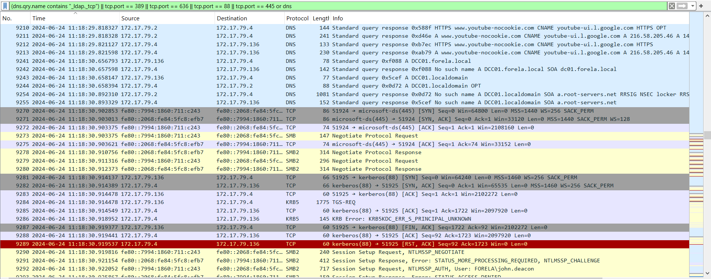
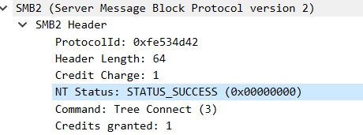
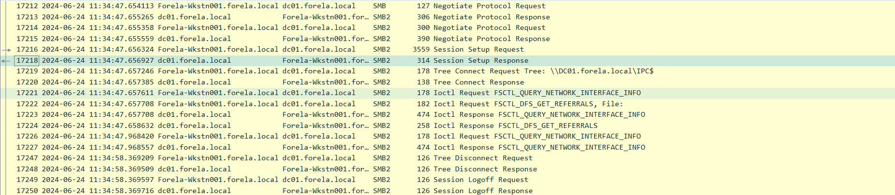
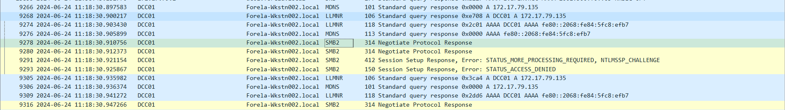
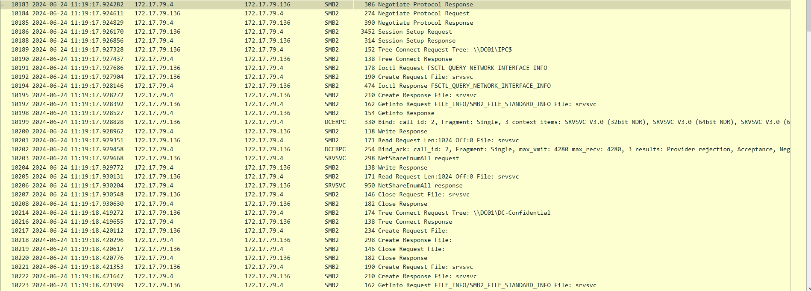
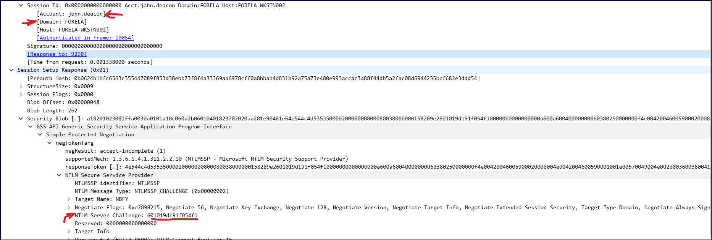
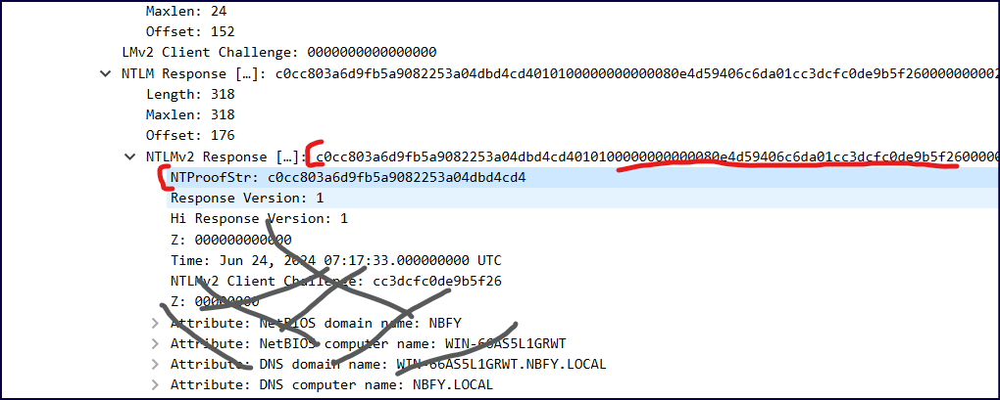
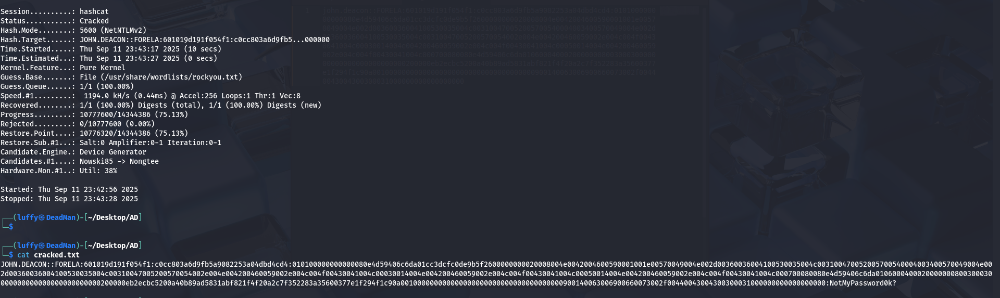

+++
date = '2025-09-12T00:55:36+03:00'
draft = false
title = 'HTB SHERLOCK - NOTORIOUS WALKTHROUGH'
tags = ['Ctf', 'HTB', 'sherlock', 'AD']
+++

##### Sherlock Scenario
*The IDS device alerted us to a possible rogue device in the internal Active Directory network. The Intrusion Detection System also indicated signs of LLMNR traffic, which is unusual. It is suspected that an LLMNR poisoning attack occurred. The LLMNR traffic was directed towards Forela-WKstn002, which has the IP address 172.17.79.136. A limited packet capture from the surrounding time is provided to you, our Network Forensics expert. Since this occurred in the Active Directory VLAN, it is suggested that we perform network threat hunting with the Active Directory attack vector in mind, specifically focusing on LLMNR poisoning.*

[NOTORIOUS](https://app.hackthebox.com/sherlocks/Noxious)

-------

## Initial analysis
first we will look for any  LLMNR and NBT-NS ports (UDP 5355 and 137) or smb (TCP 445) query

and i think i found a story to be told 

- BOB the victim : `172.17.79.136` (_Forela-Wkstn002_)
- Villain:  `172.17.79.135`
- AD: `172.17.79.4` (dc01)
- Midoriya the other user : `172.17.79.129` (_Forela-Wkstn001_)

### ACT0: Introduction
first we need to know who are the good guys and who are the bad ones with our star being the one who cased all this mess cuz it was configured wrong.

To determine the Active Directory (AD) server's IP address in Wireshark, we filter for ports used by a domain controller like: DNS SRV Queries, LDAP / LDAPS, Kerberos or SMB Traffic

```filter
(dns.qry.name contains "_ldap._tcp") || tcp.port == 389 || tcp.port == 636 || tcp.port == 88 || tcp.port == 445
```



and with that we can confirm that dc01.forela.local (172.17.79.4) is our DC as showed from the previous screenshot as it responds to DNS query, Kerberos authentication and smb  

### ACT1: The Victim
now filtering for `llmnr || netbios || mdns || smb || smb2` 

Midoriya was just a kid who just wanted to access the **IPC$ share** on the domain controller (packet 10552).
- **IPC$** = “Inter-Process Communication” share. It’s a special administrative share used for things like:
    - Authentication (NTLM/kerberos handshakes often go over IPC$).
    - Named pipe communication (e.g., talking to services like LSARPC, SAMR, Netlogon).
    - Managing sessions.

Midoriya succeed on (packet 10553) .... THE END





----

Now B0B The victim was trying probably something similar but i think he didn't have a prober breakfast and that lead to  him making a typo specifically he added a c to `dc01` to be `dcc01` and wont you know it ..... there is no host named that .... or is it ?



After realizing the mistake he fixed it and went on his way ignorant of what he have done



### ACT2: The Villain 
Now there was someone with a tool called Responder Waiting in silence for one mistake ...

Responder is an open-source python-based LLMNR/NBT-NS/mDNS poisoner acting in two stages as described above:

1. First, it will listen to multicast NR queries (LLMNR – UDP/5355, NBT-NS – UDP/137) and, under the right conditions, spoof a response – directing the victim to the machine on which it is running.
2. Once a victim will try and connect to our machine, Responder will exploit the connection to steal credentials and other data.

now BOB's machine thought it found the target and tried to connect which lead to his user name and hash being leaked (packet 9291)



the NTLMv2 format is:
```
USERNAME::DOMAIN:SERVER_CHALLENGE:NTProofStr:NTLMv2Response
```

Where:

- **USERNAME** → the account name (`john.deacon`)
- **DOMAIN** → the domain from the NTLM blob (`FORELA`)
- **SERVER_CHALLENGE** → 8-byte challenge sent by server (from NTLMSSP_CHALLENGE)
- **NT_PROOF_STR** → the first 16 bytes of the NTLMv2 response (client HMAC)
- **NTLMv2_RESPONSE** → the rest of the blob after NT_PROOF_STR (client data: timestamp, challenge, target info, etc.)

- **USERNAME** → `john.deacon`
- **DOMAIN** → `FORELA`
- **SERVER_CHALLENGE** → from Frame 9291 → `601019d191f054f1`
- NTLMv2 response



```
c0cc803a6d9fb5a9082253a04dbd4cd4010100000000000080e4d59406c6da01cc3dcfc0de9b5f2600000000020008004e0042004600590001001e00570049004e002d00360036004100530035004c003100470052005700540004003400570049004e002d00360036004100530035004c00310047005200570054002e004e004200460059002e004c004f00430041004c00030014004e004200460059002e004c004f00430041004c00050014004e004200460059002e004c004f00430041004c000700080080e4d59406c6da0106000400020000000800300030000000000000000000000000200000eb2ecbc5200a40b89ad5831abf821f4f20a2c7f352283a35600377e1f294f1c90a001000000000000000000000000000000000000900140063006900660073002f00440043004300300031000000000000000000
```
- **NTProofStr** → first 16 bytes of NTLMv2 Response (in Frame 9292) : `c0cc803a6d9fb5a9082253a04dbd4cd4`
- **NTLMv2Response (rest)** → `010100000000000080e4d59406c6da01cc3dcfc0de9b5f2600000000020008004e0042004600590001001e00570049004e002d00360036004100530035004c003100470052005700540004003400570049004e002d00360036004100530035004c00310047005200570054002e004e004200460059002e004c004f00430041004c00030014004e004200460059002e004c004f00430041004c00050014004e004200460059002e004c004f00430041004c000700080080e4d59406c6da0106000400020000000800300030000000000000000000000000200000eb2ecbc5200a40b89ad5831abf821f4f20a2c7f352283a35600377e1f294f1c90a001000000000000000000000000000000000000900140063006900660073002f00440043004300300031000000000000000000`

now we have 
```
john.deacon::FORELA:601019d191f054f1:c0cc803a6d9fb5a9082253a04dbd4cd4:010100000000000080e4d59406c6da01cc3dcfc0de9b5f2600000000020008004e0042004600590001001e00570049004e002d00360036004100530035004c003100470052005700540004003400570049004e002d00360036004100530035004c00310047005200570054002e004e004200460059002e004c004f00430041004c00030014004e004200460059002e004c004f00430041004c00050014004e004200460059002e004c004f00430041004c000700080080e4d59406c6da0106000400020000000800300030000000000000000000000000200000eb2ecbc5200a40b89ad5831abf821f4f20a2c7f352283a35600377e1f294f1c90a001000000000000000000000000000000000000900140063006900660073002f00440043004300300031000000000000000000
```

and with that we pwnd the pass



## Answer shelock

### Task1
- find the malicious IP Address of the machine.

>ANS : `172.17.79.135`

### Task2
- What is the hostname of the rogue machine?

filtering for dhcp and looking at the request find that it wasn't `dcc01` but
> ANS : `kali`

### Task3
- What is the username whose hash was captured?

> ANS : john.deacon

### Task4
- When were the hashes captured the First time?

in packet (9292)
> ANS : 2024-06-24 11:18:30

### Task5
- What was the typo made by the victim when navigating to the file share that caused his credentials to be leaked?

> ANS : DCC01

### Task6
- What is the NTLM server challenge value?

> ANS : 601019d191f054f1

### Task7
- Now doing something similar find the NTProofStr value.

> ANS : c0cc803a6d9fb5a9082253a04dbd4cd4

### Task8
- Find whether the attacker was able to crack this and how quickly.

> ANS : NotMyPassword0K?

### Task9
- what is the actual file share that the victim was trying to navigate to?

> ANS : \\DC01\DC-Confidential