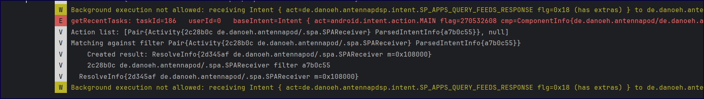
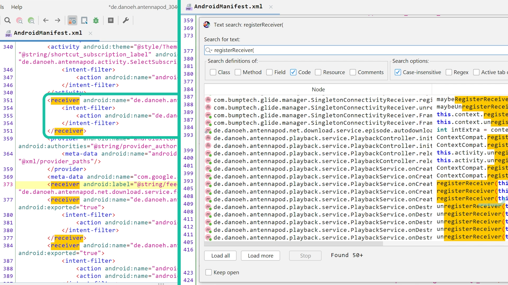

+++
date = '2025-07-30T00:55:36+03:00'
draft = false
title = 'Broadcast'
tags = ['Summary', 'Andorid', 'broadcast']
+++


## Summary
> **Broadcast** and **Broadcast Receivers** are part of a messaging system that allows applications to **communicate with the Android system or with other apps**. Broadcasts can be used as a messaging system across apps and outside of the normal user flow. Like a person shouting a name and who are interested listen and may shout back.

> [!WARNING]
> As part of the Android 8.0 (API level 26) [background execution limits](https://developer.android.com/about/versions/oreo/background#broadcasts), apps that target the API level 26 or higher can't register broadcast receivers for implicit broadcasts in their manifest unless the broadcast is sent specifically to them. However, several broadcasts are exempted from these limitations.

Error:


## How to receive a broadcast?

### 1- Via manifest file with a `<receiver>` tag
```xml
<receiver android:name=".MyReceiver">
    <intent-filter>
        <action android:name="android.intent.action.BOOT_COMPLETED" />
    </intent-filter>
</receiver>
```
```java
public class MyReceiver extends BroadcastReceiver {
    @Override
    public void onReceive(Context context, Intent intent) {
        // Code to run when broadcast is received
        Toast.makeText(context, "Broadcast received!", Toast.LENGTH_SHORT).show();
    }
}
```

### 2- Dynamically registering a receiver using `registerReceiver()`
or **Context-Registered Receivers**

```java
// Step 1: Create a BroadcastReceiver subclass
public class MyReceiver extends BroadcastReceiver {
    @Override
    public void onReceive(Context context, Intent intent) {
        if ("com.example.ACTION_UPDATE".equals(intent.getAction())) {
            String data = intent.getStringExtra("data");
            Log.d("MyReceiver", "Received: " + data);
        }
    }
}

// Step 2: Register/Unregister in an Activity
public class MainActivity extends AppCompatActivity {
    private MyReceiver receiver;

    @Override
    protected void onStart() {
        super.onStart();
        receiver = new MyReceiver();
        IntentFilter filter = new IntentFilter("com.example.ACTION_UPDATE");
        
        // RECEIVER_NOT_EXPORTED: Restrict to app-only (Android 12+)
        ContextCompat.registerReceiver(
            this, receiver, filter, ContextCompat.RECEIVER_NOT_EXPORTED
        );
    }

    @Override
    protected void onStop() {
        super.onStop();
        unregisterReceiver(receiver); // Prevent memory leaks
    }
}
```



### Receive broadcasts with permissions
If you specify a permission parameter when registering a broadcast receiver (either with `registerReceiver(BroadcastReceiver, IntentFilter, String, Handler)` or in `<receiver>` tag in your manifest), then only broadcasters who have requested the permission with the `<uses-permission>` tag in their manifest can send an Intent to the receiver. If the permission is dangerous, the broadcaster must also be granted the permission.

For example, assume your receiving app has a manifest-declared receiver as follows:

```xml
<!-- If this receiver listens for broadcasts sent from the system or from
     other apps, even other apps that you own, set android:exported to "true". -->
<receiver
    android:name=".MyBroadcastReceiverWithPermission"
    android:permission="android.permission.ACCESS_COARSE_LOCATION"
    android:exported="true">
    <intent-filter>
        <action android:name="com.example.snippets.ACTION_UPDATE_DATA" />
    </intent-filter>
</receiver>
```

Or your receiving app has a context-registered receiver as follows:

```java
ContextCompat.registerReceiver(
        context, myBroadcastReceiver, filter,
        android.Manifest.permission.ACCESS_COARSE_LOCATION,
        null, // scheduler that defines thread, null means run on main thread
        receiverFlags
);
```

Then, to be able to send broadcasts to those receivers, the sending app must request the permission as follows:

```xml
<uses-permission android:name="android.permission.ACCESS_COARSE_LOCATION" />
```

### Implicit broadcast exceptions
**Key Exempted Broadcasts**

#### 1. Boot & User Events
- `ACTION_LOCKED_BOOT_COMPLETED`, `ACTION_BOOT_COMPLETED`
    - Needed for scheduling jobs/alarms after boot.
- `ACTION_USER_INITIALIZE`, `USER_ADDED`, `USER_REMOVED`
    - Restricted to privileged apps (e.g., device admin).

#### 2. Time & Locale Changes
- `ACTION_TIME_SET`, `ACTION_TIMEZONE_CHANGED`, `ACTION_NEXT_ALARM_CLOCK_CHANGED`
    - Clock/alarm apps require these.
- `ACTION_LOCALE_CHANGED`
    - Rarely sent; apps may need to update localized data.

#### 3. Hardware Events
- **USB**: `ACTION_USB_ACCESSORY_ATTACHED`, `ACTION_USB_DEVICE_DETACHED`, etc.
    - No alternative for detecting USB state changes.
- **Bluetooth**: `BluetoothHeadset.ACTION_CONNECTION_STATE_CHANGED`, `ACTION_ACL_CONNECTED`, etc.
    - User experience not impacted by background delivery.
- **Storage**: `ACTION_MEDIA_MOUNTED`, `ACTION_MEDIA_EJECT`, etc.
    - Triggered by physical user actions (e.g., SD card removal).

#### 4. Telephony & Accounts
- **Carrier/Subscription**: `ACTION_CARRIER_CONFIG_CHANGED`, `TelephonyIntents.ACTION_*_SUBSCRIPTION_CHANGED`
    - Critical for OEM telephony apps.
- **SMS/MMS**: `SMS_RECEIVED_ACTION`, `WAP_PUSH_RECEIVED_ACTION`
    - Required for SMS-handling apps.
- **Accounts**: `LOGIN_ACCOUNTS_CHANGED_ACTION`, `ACTION_ACCOUNT_REMOVED`
    - Needed to sync data on account changes.

#### 5. Package Management
- `ACTION_PACKAGE_DATA_CLEARED`
    - Rare (user-triggered via Settings).
- `ACTION_PACKAGE_FULLY_REMOVED`
    - Apps may need to clean up data when another package is uninstalled.

#### 6. Other Exemptions
- `ACTION_NEW_OUTGOING_CALL`
    - For call-blocking apps.
- `ACTION_DEVICE_OWNER_CHANGED`
    - Rare; security apps need it.
- `ACTION_EVENT_REMINDER`
    - Calendar provider sends this implicitly.

#### Important Notes
1. **Avoid Overuse**: Even exempted broadcasts should be used sparingly to minimize performance impact.
2. **Alternatives**: For non-exempt broadcasts, use:
    - **Context-registered receivers** (while the app is active).
    - **`JobScheduler`/`WorkManager`** for background tasks.
3. **Deprecated Broadcasts**:
    - `LOGIN_ACCOUNTS_CHANGED_ACTION` → Prefer `ACTION_ACCOUNT_REMOVED`.
    - `ACTION_PACKAGE_REPLACED` → **Not exempted** (use `JobScheduler`).


#### Best Practices
- **Targeted Broadcasts**: Use `setPackage()` or explicit intents where possible.
- **Minimize Manifest Receivers**: Rely on dynamic registration unless exempted.
- **Handle `onReceive()` Quickly**: Use `goAsync()` or `JobScheduler` for long tasks.

## Sending broadcast

>[!Warning]
>Attackers cant send system protected actions 

Bypass the Restriction if :
- You’re building a **system app** (installed on `/system` partition) — only possible on rooted or custom ROM devices.
- You sign your app with the **platform certificate** (only available to OEMs).
- You use **ADB** to broadcast during testing:

```bash
adb shell am broadcast -a android.intent.action.BOOT_COMPLETED
```
 ---
Permissions allow you to restrict broadcasts to the set of apps that hold certain permissions. You can enforce restrictions on either the sender or receiver of a broadcast.

You can also limit a broadcast to a set of apps in the same organization by calling `setPackage(String)` on the intent.

```java
Intent intent = new Intent();  
intent.setClassName("package","classname");    
intent.setPackage("com.example.snippets");
sendBroadcast(intent);  
```

### Send broadcasts with permissions


When you call `sendBroadcast(Intent, String)` or `sendOrderedBroadcast(Intent, String, BroadcastReceiver, Handler, int, String, Bundle)`, you can specify a permission parameter. Only receivers who have requested that permission with the `<uses-permission>` tag in their manifest can receive the broadcast. If the permission is dangerous, you must grant the permission before the receiver can receive the broadcast. For example, the following code sends a broadcast with a permission:

```java
context.sendBroadcast(intent, android.Manifest.permission.ACCESS_COARSE_LOCATION);
```

To receive the broadcast, the receiving app must request the permission as follows:

```xml
<uses-permission android:name="android.permission.ACCESS_COARSE_LOCATION" />
```

You can specify either an existing system permission like `BLUETOOTH_CONNECT` or define a custom permission with the `<permission>` element.

### Non-ordered vs. Ordered Broadcasts

In non-ordered mode, broadcasts are sent to all interested receivers “at the same time”. This basically means that one receiver can not interfere in any way with what other receivers will do neither can it prevent other receivers from being executed. One example of such broadcast is the [ACTION_BATTERY_LOW](http://developer.android.com/reference/android/content/Intent.html#ACTION_BATTERY_LOW) one.

In ordered mode, broadcasts are sent to each receiver in order (controlled by the [android:priority](http://developer.android.com/guide/topics/manifest/intent-filter-element.html#priority) attribute for the [intent-filter](http://developer.android.com/guide/topics/manifest/intent-filter-element.html) element in the manifest file that is related to your receiver) and one receiver is able to abort the broadcast so that receivers with a lower priority would not receive it (thus never execute). An example of this type of broadcast (and one that will be discussing in this document) is the [ACTION_NEW_OUTGOING_CALL](http://developer.android.com/reference/android/content/Intent.html#ACTION_NEW_OUTGOING_CALL) one.

## Various action types
### 1. System-Wide Events
**Use Case**: React to system or device state changes.  
**Importance**: Critical for apps that depend on device state (e.g., network, boot, user sessions).

#### Actions You Can Listen For:
- **Network Connectivity Changes**
    - Importance: High
    - Use Case: Sync data when network is restored.
- **Boot Completion (`BOOT_COMPLETED`)**
    - Importance: High
    - Use Case: Start background services on device reboot.
- **Package Installation/Removal (`PACKAGE_ADDED`, `PACKAGE_REMOVED`)**
    - Importance: Medium
    - Use Case: Detect app installs (e.g., security apps).
- **Screen Lock/Unlock**
    - Importance: Medium
    - Use Case: Security apps (e.g., auto-lock on screen off).
- **Password Events (`ACTION_PASSWORD_FAILED`, `ACTION_PASSWORD_SUCCEEDED`)**
    - Importance: Medium
    - Use Case: Security logging.
- **Device Admin Events (`DEVICE_ADMIN_ENABLED`, `DEVICE_ADMIN_DISABLED`)**
    - Importance: High (for MDM/EMM apps)
    - Use Case: Enterprise device management.
- **User Session Events (`USER_SWITCHED`, `USER_REMOVED`)**
    - Importance: High (for multi-user apps)
    - Use Case: Profile-specific data loading.

### 2. NFC Events 
**Use Case**: NFC-based interactions (payments, tags, card emulation).  
**Importance**: Critical for NFC apps, irrelevant for others.

#### Actions You Can Listen For:
- **Tag Discovery (`ACTION_NDEF_DISCOVERED`, `ACTION_TAG_DISCOVERED`)**
    - Importance: High (for NFC apps)
    - Use Case: Read/write NFC tags.
- **RF Field Detection (`RF_FIELD_ON_DETECTED`)**
    - Importance: Medium
    - Use Case: Detect NFC field presence.
- **APDU/Applet Selection (`APDU_RECEIVED`, `AID_SELECTED`)**
    - Importance: High (for payment apps)
    - Use Case: Host Card Emulation (HCE).

### 3. Application-Specific Broadcasts
**Use Case**: Inter-app communication or background task coordination.  
**Importance**: Depends on app requirements.

#### Actions You Can Create:
- **Custom Broadcasts (e.g., `com.example.APP_DATA_UPDATED`)**
    - Importance: Medium
    - Use Case: Notify other components of data changes.
- **Pending Intents for Notifications**
    - Importance: High
    - Use Case: Handle notification clicks.
- **Permission-Protected Broadcasts**
    - Importance: High (for security)
    - Use Case: Restrict broadcasts to trusted apps.

### 4. Content Provider Interactions
**Use Case**: Access/modify shared data (contacts, media, etc.).  
**Importance**: High if your app integrates with system data.

#### Actions You Can Perform:
- **Query/Modify Contacts/Calendar/Media**
    - Importance: High (for productivity apps)
    - Use Case: Sync user contacts.
- **Grant Temporary URI Permissions**
    - Importance: Medium
    - Use Case: Share file access securely.

## Changes across android version
### Android 16 (Future)
- **Broadcast Priority Changes**:
    - The `android:priority` attribute or `IntentFilter.setPriority()` **no longer guarantees order across different processes**.
    - Priorities are **only enforced within the same app process**.
    - Priority range is restricted to `(SYSTEM_LOW_PRIORITY + 1, SYSTEM_HIGH_PRIORITY - 1)`.
    - Only system components can use `SYSTEM_LOW_PRIORITY`/`SYSTEM_HIGH_PRIORITY`.

### Android 14
- **Cached State Optimization**:
    - System **defers non-critical broadcasts** (e.g., `ACTION_SCREEN_ON`) for apps in a cached state.
    - Apps are temporarily revived from cached state for **manifest-declared important broadcasts**.

### Android 9 (API 28)
- **Wi-Fi Broadcast Restrictions**:
    - `NETWORK_STATE_CHANGED_ACTION` no longer leaks **location/PII data**.
    - SSIDs, BSSIDs, and scan results are **excluded from broadcasts**.
    - Use `WifiManager.getConnectionInfo()` instead.

### Android 8.0 (API 26)
- **Implicit Broadcast Ban**:
    - Apps **cannot register manifest receivers** for most implicit broadcasts (e.g., system-wide events).
    - Exceptions:
        - Broadcasts targeting the app explicitly (via package name).
        - Broadcasts in the [allowlist](https://developer.android.com/guide/components/broadcast-exceptions).
    - Workaround: Use **context-registered receivers** (active app only).

### Android 7.0 (API 24)
- **Removed Broadcasts**:
    - `ACTION_NEW_PICTURE` and `ACTION_NEW_VIDEO` are **no longer sent**.
- **Connectivity Changes**:
    - `CONNECTIVITY_ACTION` must use **dynamic registration** (`registerReceiver()`).
    - Manifest declarations **do not work**.

## Security Consideration
#### 1. Prefer Context-Registered Receivers
- **Issue**: Manifest-declared receivers can cause multiple app launches, hurting performance.
- **Solution**: Use `Context.registerReceiver()` instead where possible (e.g., `CONNECTIVITY_ACTION` requires it).

#### 2. Protect Broadcasts
- **Avoid Implicit Intents**:
    - Sensitive data in implicit broadcasts can be read by any app.
    - **Solutions**:
        - **Restrict with Permissions**:
        ```java
        // Sender side (require permission)
        sendBroadcast(intent, "com.example.PERMISSION");

        // Receiver side (declare permission)
        <uses-permission android:name="com.example.PERMISSION" />
        ```
        - **Limit Scope with `setPackage()`** (API 14+):
        ```java
        intent.setPackage("com.example.myapp"); // Only your app receives it
        ```

- **Receiver Security**:
    - For **manifest-declared receivers**, set `android:exported="false"` if only internal use.
    - For **dynamic receivers**, use:
    ```java
    // Android 12+: Block external apps
    ContextCompat.registerReceiver(..., ContextCompat.RECEIVER_NOT_EXPORTED);
    ```

#### 3. Unique Action Names
- Use a custom namespace (e.g., `com.example.ACTION_DATA_UPDATE`) to avoid conflicts with other apps.

#### 4. Handle `onReceive()` Carefully
- **Main Thread Limitation**:
    - Runs on UI thread—keep it short (<10 seconds).
    - **Solutions for Long Tasks**:
        - **`goAsync()`**: Briefly extend broadcast lifecycle:
        ```java
        public void onReceive(Context context, Intent intent) {
            final PendingResult result = goAsync();
            new Thread(() -> {
                // Background work
                result.finish();
            }).start();
        }
        ```
        - **`JobScheduler`/`WorkManager`**: For heavy work.

#### 5. Avoid Launching Activities
- **Why**: Multiple receivers could spam the user with activities.
- **Alternative**: Show a notification instead.

### Key Takeaways
| **Risk**               | **Solution**                                  |
|------------------------|----------------------------------------------|
| Too many app launches  | Use context-registered receivers.            |
| Data leaks             | Use permissions or `setPackage()`.           |
| Malicious broadcasts   | Set `RECEIVER_NOT_EXPORTED` or `android:exported="false"`. |
| Slow `onReceive()`     | Use `goAsync()` or `JobScheduler`.           |
| Conflicting actions    | Prefix broadcasts with your app's namespace. |

For modern apps: **Dynamic receivers + permissions + `JobScheduler`** is the safest combo.

## Widget
[Widgets](https://developer.android.com/develop/ui/views/appwidgets#drawablemy_widget_background.xml) are a cool feature allowing apps to create small user interfaces that get directly embedded on the home screen. This means the widgets are actually running within another app!

The [`AppWidgetProvider`](https://developer.android.com/reference/android/appwidget/AppWidgetProvider) is actually a wrapper around [`BroadcastReceiver`](https://developer.android.com/reference/android/content/BroadcastReceiver) to update the widget data in the background. It can also handle interactions with the widget such as button presses. But because the widget is running inside the home screen, broadcast `PendingIntents` are used to handle the button presses.

Imagine if app "Z" has a widget that when clicked open an activity in app Z now since the widget is in the home screen (another app) so we want to broadcast to our app with our Z permissions ? so we use pending intent that handles that for us

Notifications can be easily [created](https://developer.android.com/develop/ui/views/notifications/build-notification) using the notification builder. Inside of notifications you can also add button actions by preparing a `PendingIntent`. The reason for that is because the notification is again handled by a different app.

## Common Vulnerabilities

### 1. Unintentionally Exported Receivers

#### Vulnerability

- **Default exported state**: If a receiver includes at least one intent filter, the `android:exported` attribute defaults to `true` if not explicitly set to `false`
- **Missing access control**: No validation of sender or data
- **Sensitive operations exposed**: Critical operations accessible to any malicious app

#### Vulnerable Code Example

```xml
<!-- AndroidManifest.xml -->
<!-- VULNERABLE: Exported by default due to intent filter -->
<receiver android:name=".VulnerableReceiver">
    <intent-filter>
        <action android:name="com.example.SENSITIVE_ACTION" />
    </intent-filter>
</receiver>
```

```java
public class VulnerableReceiver extends BroadcastReceiver {
    @Override
    public void onReceive(Context context, Intent intent) {
        // VULNERABLE: No validation of sender or data
        String sensitiveData = intent.getStringExtra("user_token");
        String userCredentials = intent.getStringExtra("credentials");
        
        // This sensitive data can be accessed by any malicious app
        Log.d("VulnerableReceiver", "Token: " + sensitiveData);
        
        // VULNERABLE: Performing sensitive actions without verification
        if ("com.example.SENSITIVE_ACTION".equals(intent.getAction())) {
            // Delete user data or perform privileged operations
            deleteUserData(context);
            transferMoney(intent.getStringExtra("amount"));
        }
    }
    
    private void deleteUserData(Context context) {
        // Sensitive operation that can be triggered by any app
    }
    
    private void transferMoney(String amount) {
        // Critical operation exposed to any malicious app
    }
}
```

### 2. Insecure Dynamic Registration

#### Vulnerability

- **Public by default**: Dynamically registered receivers are public by default
- **No protection**: Lacks permission-based access control
- **Runtime exposure**: Creates attack surface during app execution

#### Vulnerable Code Example

```java
public class VulnerableActivity extends Activity {
    private BroadcastReceiver dynamicReceiver;
    
    @Override
    protected void onCreate(Bundle savedInstanceState) {
        super.onCreate(savedInstanceState);
        
        // VULNERABLE: Dynamic receiver is public by default
        dynamicReceiver = new BroadcastReceiver() {
            @Override
            public void onReceive(Context context, Intent intent) {
                // Any app can send broadcasts to this receiver
                String sensitiveCommand = intent.getStringExtra("command");
                executeSensitiveCommand(sensitiveCommand);
            }
        };
        
        // VULNERABLE: No protection for dynamic registration
        IntentFilter filter = new IntentFilter("com.example.DYNAMIC_ACTION");
        registerReceiver(dynamicReceiver, filter);
    }
    
    private void executeSensitiveCommand(String command) {
        // Vulnerable to command injection
    }
}
```

### 3. Sensitive Data in Implicit Intents

#### Vulnerability

- **Broadcast interception**: Any app can register matching intent filters
- **Data exposure**: Sensitive information transmitted in clear text
- **Wide delivery**: Implicit broadcasts delivered to all matching receivers

#### Vulnerable Code Example

```java
public class VulnerableDataSender extends Activity {
    public void sendSensitiveData() {
        Intent intent = new Intent();
        intent.setAction("com.example.SHARE_DATA");
        
        // VULNERABLE: Sensitive data in implicit intent
        intent.putExtra("session_token", "abc123xyz789");
        intent.putExtra("user_id", "12345");
        intent.putExtra("credit_card", "4111-1111-1111-1111");
        
        // This broadcast can be intercepted by any malicious app
        sendBroadcast(intent);
    }
}
```

### 4. Message Interception Attacks

#### Vulnerability

- **Broadcast hijacking**: Malicious apps register for same intent actions
- **Data theft**: Sensitive information extracted from intercepted broadcasts
- **System mimicry**: Attackers can mimic legitimate system events

#### Malicious Code Example

```java
public class MaliciousInterceptor extends BroadcastReceiver {
    @Override
    public void onReceive(Context context, Intent intent) {
        // Malicious app intercepts SMS or other sensitive broadcasts
        if ("android.provider.Telephony.SMS_RECEIVED".equals(intent.getAction())) {
            // Extract and steal SMS data
            Bundle bundle = intent.getExtras();
            // Send stolen data to attacker's server
            sendToAttackerServer(bundle);
        }
        
        // Intercept app-specific sensitive broadcasts
        if ("com.banking.app.TRANSACTION_COMPLETE".equals(intent.getAction())) {
            String amount = intent.getStringExtra("amount");
            String account = intent.getStringExtra("account");
            // Steal financial information
            stealFinancialData(amount, account);
        }
    }
    
    private void sendToAttackerServer(Bundle data) {
        // Malicious network request
    }
    
    private void stealFinancialData(String amount, String account) {
        // Exfiltrate sensitive financial data
    }
}
```

## Best Practices and Secure Implementation

### 1. Explicitly Disable Export for Internal Receivers

#### Implementation

```xml
<!-- AndroidManifest.xml -->
<!-- SECURE: Explicitly set exported to false -->
<receiver 
    android:name=".InternalReceiver"
    android:exported="false">
    <intent-filter>
        <action android:name="com.example.INTERNAL_ACTION" />
    </intent-filter>
</receiver>
```

```java
public class SecureReceiver extends BroadcastReceiver {
    private static final String EXPECTED_SIGNATURE = "expected_app_signature";
    
    @Override
    public void onReceive(Context context, Intent intent) {
        // SECURE: Validate the sender
        if (!isValidSender(context)) {
            Log.w("SecureReceiver", "Unauthorized sender blocked");
            return;
        }
        
        // SECURE: Validate and sanitize input data
        String action = intent.getAction();
        if (!isValidAction(action)) {
            Log.w("SecureReceiver", "Invalid action blocked: " + action);
            return;
        }
        
        // SECURE: Sanitize input parameters
        String userInput = sanitizeInput(intent.getStringExtra("user_input"));
        
        if ("com.example.INTERNAL_ACTION".equals(action)) {
            // Safe to process since sender is validated
            processSecureAction(context, userInput);
        }
    }
    
    private boolean isValidSender(Context context) {
        // Verify sender's signature or package name
        try {
            PackageManager pm = context.getPackageManager();
            PackageInfo senderInfo = pm.getPackageInfo(getSenderPackage(), 
                                    PackageManager.GET_SIGNATURES);
            
            // Verify signature matches expected
            return verifySignature(senderInfo.signatures);
        } catch (PackageManager.NameNotFoundException e) {
            return false;
        }
    }
    
    private boolean verifySignature(Signature[] signatures) {
        // Implementation to verify app signature
        return true; // Simplified
    }
    
    private String getSenderPackage() {
        // Get sender package name (implementation depends on context)
        return "com.trusted.sender";
    }
    
    private boolean isValidAction(String action) {
        // Whitelist of allowed actions
        return action != null && action.startsWith("com.example.");
    }
    
    private String sanitizeInput(String input) {
        if (input == null) return null;
        
        // Remove potentially dangerous characters
        return input.replaceAll("[<>\"'&]", "").trim();
    }
    
    private void processSecureAction(Context context, String input) {
        // Safe processing of validated input
    }
}
```

### 2. Secure Dynamic Registration with Permissions

#### Implementation

```xml
<!-- AndroidManifest.xml -->
<!-- Define custom signature-level permission -->
<permission 
    android:name="com.example.CUSTOM_PERMISSION"
    android:protectionLevel="signature" />
```

```java
public class SecureActivity extends Activity {
    private BroadcastReceiver secureReceiver;
    
    @Override
    protected void onCreate(Bundle savedInstanceState) {
        super.onCreate(savedInstanceState);
        
        secureReceiver = new BroadcastReceiver() {
            @Override
            public void onReceive(Context context, Intent intent) {
                // Process only validated and sanitized data
                processSecureData(context, intent);
            }
        };
        
        // SECURE: Register with permission protection
        IntentFilter filter = new IntentFilter("com.example.SECURE_ACTION");
        registerReceiver(secureReceiver, filter, 
                        "com.example.CUSTOM_PERMISSION", null);
    }
    
    private void processSecureData(Context context, Intent intent) {
        // Secure processing with validation
    }
    
    @Override
    protected void onDestroy() {
        super.onDestroy();
        // Always unregister dynamic receivers
        if (secureReceiver != null) {
            unregisterReceiver(secureReceiver);
        }
    }
}
```

### 3. Use LocalBroadcastManager for Internal Communication

#### Implementation

```java
public class SecureInternalCommunication extends Activity {
    private LocalBroadcastManager localBroadcastManager;
    private BroadcastReceiver localReceiver;
    
    @Override
    protected void onCreate(Bundle savedInstanceState) {
        super.onCreate(savedInstanceState);
        
        localBroadcastManager = LocalBroadcastManager.getInstance(this);
        
        // SECURE: Local receiver only receives broadcasts from same app
        localReceiver = new BroadcastReceiver() {
            @Override
            public void onReceive(Context context, Intent intent) {
                // Safe to process - sender is guaranteed to be same app
                String sensitiveData = intent.getStringExtra("internal_data");
                processSensitiveData(sensitiveData);
            }
        };
        
        IntentFilter filter = new IntentFilter("com.example.INTERNAL_BROADCAST");
        localBroadcastManager.registerReceiver(localReceiver, filter);
    }
    
    public void sendSecureInternalBroadcast() {
        Intent intent = new Intent("com.example.INTERNAL_BROADCAST");
        intent.putExtra("internal_data", "sensitive_information");
        
        // SECURE: Broadcast stays within the app
        localBroadcastManager.sendBroadcast(intent);
    }
    
    private void processSensitiveData(String data) {
        // Safe processing of internal data
    }
    
    @Override
    protected void onDestroy() {
        super.onDestroy();
        if (localReceiver != null) {
            localBroadcastManager.unregisterReceiver(localReceiver);
        }
    }
}
```

### 4. Use Explicit Intents and Callbacks

#### Implementation

```java
public class SecureDataSender extends Activity {
    public void sendDataSecurely() {
        // SECURE: Use explicit intent to specific receiver
        Intent intent = new Intent(this, SpecificReceiver.class);
        intent.setAction("com.example.SECURE_ACTION");
        
        // Safe to include sensitive data in explicit intent
        intent.putExtra("session_token", "abc123xyz789");
        intent.putExtra("user_id", "12345");
        
        // Send to specific component only
        sendBroadcast(intent);
    }
    
    public void useCallbackInstead() {
        // SECURE: Better approach - use callback instead of broadcast
        performAsyncOperation(new AsyncCallback() {
            @Override
            public void onComplete(String result) {
                // Handle completion securely
                processSensitiveResult(result);
            }
            
            @Override
            public void onError(String error) {
                // Handle error securely
                handleError(error);
            }
        });
    }
    
    private void performAsyncOperation(AsyncCallback callback) {
        // Perform operation and call callback
    }
    
    private void processSensitiveResult(String result) {
        // Process sensitive result
    }
    
    private void handleError(String error) {
        // Handle error
    }
    
    interface AsyncCallback {
        void onComplete(String result);
        void onError(String error);
    }
}
```

### 5. Comprehensive Input Validation

#### Implementation

```java
public class ValidatingReceiver extends BroadcastReceiver {
    private static final int MAX_INPUT_LENGTH = 256;
    private static final Pattern SAFE_PATTERN = Pattern.compile("^[a-zA-Z0-9\\s-_]+$");
    
    @Override
    public void onReceive(Context context, Intent intent) {
        try {
            // SECURE: Comprehensive input validation
            if (!validateIntentStructure(intent)) {
                Log.w("ValidatingReceiver", "Invalid intent structure");
                return;
            }
            
            String userInput = intent.getStringExtra("user_input");
            if (!isValidInput(userInput)) {
                Log.w("ValidatingReceiver", "Invalid input blocked");
                return;
            }
            
            // Process validated input
            processValidatedInput(context, userInput);
            
        } catch (Exception e) {
            Log.e("ValidatingReceiver", "Error processing broadcast", e);
            // Fail securely - don't expose error details
        }
    }
    
    private boolean validateIntentStructure(Intent intent) {
        // Validate intent has expected structure
        return intent != null && 
               intent.getAction() != null &&
               intent.getAction().startsWith("com.example.");
    }
    
    private boolean isValidInput(String input) {
        if (input == null || input.isEmpty()) {
            return false;
        }
        
        // Length validation
        if (input.length() > MAX_INPUT_LENGTH) {
            return false;
        }
        
        // Pattern validation
        return SAFE_PATTERN.matcher(input).matches();
    }
    
    private void processValidatedInput(Context context, String input) {
        // Safe to process validated input
        Log.d("ValidatingReceiver", "Processing: " + input);
    }
}
```


## Resources
- [Broadcast Receiver in Android With Example](https://www.geeksforgeeks.org/android/broadcast-receiver-in-android-with-example/)
- [Docs Broadcast](https://developer.android.com/develop/background-work/background-tasks/broadcasts)
- [Implicit broadcast exceptions](https://developer.android.com/develop/background-work/background-tasks/broadcasts/broadcast-exceptions)
- 